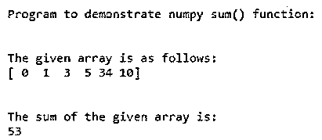
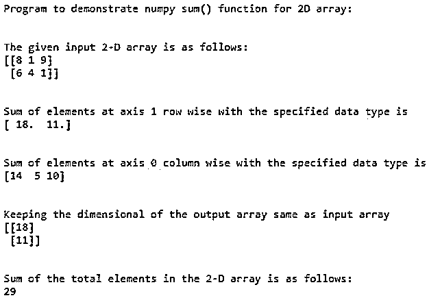

# 数字总和

> 原文：<https://www.educba.com/numpy-sum/>


## NumPy sum 简介

在本文中，Python 中的 NumPy sum 被定义为一个专门为处理多维数组和矩阵而设计的 Python 库，NumPy sum()是 NumPy Python 库提供的一个函数，主要用于计算给定数组中存在的元素的总和，或者每行中元素的总和，以及每列中元素的总和(如果它在给定的矩阵或多维数组中),并且 sum()函数返回的值以数组对象的形式出现。

### Python 中 NumPy sum()函数的使用

本文将看到 NumPy Python 库的函数 sum()。在 Python 中，NumPy sum()函数用于计算给定数组中出现的总项数的总和，这意味着 NumPy 数组中的元素作为数组对象，并对给定数组的项数进行求和。

<small>网页开发、编程语言、软件测试&其他</small>

**语法::**

```
Numpy.sum(in_array, axis, dtype, out, keepdims, initial)
```

**参数:**

*   **in_array:** 该参数用于指定输入数组的数组名，以便元素用于计算总和。
*   **轴:**该值可以是 none 或 int 或 tuple of ints，其中该参数用于定义需要计算总和的轴，指定的默认值为 none，将计算给定数组中所有元素的总和。
*   **dtype:** 该参数用于定义累加器的类型，并指定输出返回的数据类型。
*   **out:** 该参数用于指定另一个额外的数组来存储结果或输出，该数组的大小必须与输入数组的大小相同。
*   **keepdims:** 该选项指定布尔值，该值设置为 true，如果轴减少，则尺寸为 1 的输出结果中保留该值。
*   **initial:** 用于指定计算总和的起始值或初始值。

### 例子

现在让我们看看如何在 python 程序中使用 NumPy sum()函数的演示:

#### 示例#1

**代码:**

```
import numpy as np
print("Program to demonstrate numpy sum() function: ")
print("\n")
in_arr = np.array([0,1,3,5,34,10])
print("The given array is as follows:")
print(in_arr)
print("\n")
print("The sum of the given array is:")
sum_res = np.sum(in_arr)
print(sum_res)
```

**输出:**




在上面的程序中，我们可以看到我们已经导入了 NumPy 模块，然后我们使用 NumPy 对象 np 创建了一个数组，然后使用 sum()函数将给定的数组作为输入数组传递给该函数，并返回给定输入数组中元素值的总和。通常，空数组的和是一个中性值 0。在上面，我们看到了如何添加一维数组的元素。

#### 实施例 2

让我们看看如何在下面的示例中添加二维数组的元素，以及 sum()函数的其他参数，如轴和数据类型。

**代码:**

```
import numpy as np
print("Program to demonstrate numpy sum() function for 2D array: ")
print("\n")
in_arr = np.array( [[8,1,9], [6,4,1]])
print("The given input 2-D array is as follows:")
print(in_arr)
print("\n")
res_arr_1 = np.sum(in_arr, axis=1, dtype=float)
print("Sum of elements at axis 1 row wise with the specified data type is")
print(res_arr_1)
print("\n")
res_arr_2 = np.sum(in_arr, axis=0, dtype=int)
print("Sum of elements at axis 0 column wise with the specified data type is")
print(res_arr_2)
print("\n")
res = np.sum(in_arr, axis=1, keepdims =  True)
print("Keeping the dimensional of the output array same as input array")
print(res)
print("\n")
print("Sum of the total elements in the 2-D array is as follows:")
tot_res = np.sum(in_arr)
print(tot_res)
```

**输出:**




在上面的程序中，我们使用 NumPy 对象 np 声明了一个二维数组。在这种情况下，我们有两行和三列，其中我们将轴值指定为 1，这意味着我们正在计算元素的行和数据类型的总和，因为 float 是在结果的浮点值中指定的。如果我们指定轴值为 0，它将计算列中元素的总和，数据类型为整数值，这也可以在上面的屏幕截图中看到。因此，我们可以在屏幕截图中看到，第一行的元素之和是 18，第二行的元素之和是 11，结果以另一个数组的形式按行打印，如果轴是 0，那么结果将是浮点值的形式[14，5，10]。我们还可以在输出中看到给定数组中所有元素的总和为 29，这是元素相加的总值。

在上一节中，我们看到了如何使用 axis 参数计算元素的行和列的总和。从上面的例子中，我们可以注意到，在通过指定的轴计算 sum()之后，元素将被减少到更小的维度。一般来说，当我们使用 axis 参数时，默认情况下，函数 sum()会折叠或减少输入数组的维数，从而得到更小或更低维的数组。假设我们不希望得到的数组维数减少到输入数组的较小维数，那么我们需要在 sum()函数中使用 keepdims 参数来保持输出数组的维数与输入数组的维数相同。在上面的例子中，我们可以看到在第 20 行我们已经指定了 keepdims 为“True ”,所以只有它显示输出数组也是一个 2-D 数组。

### 结论

在本文中，我们得出结论，Python 中的 NumPy 模块在数据科学领域中用于处理多维数组。在本文中，我们还看到了如何计算给定数组中元素的总和。在这里，我们看到了一维和二维数组的例子，以及 sum()函数参数的使用和它们的用法。

### 推荐文章

这是一个数字求和的指南。在这里，我们通过例子讨论了 python 中 NumPy sum()函数的介绍和工作原理。您也可以看看以下文章，了解更多信息–

1.  num py . dot()
2.  [NumPy 线性代数](https://www.educba.com/numpy-linear-algebra/)
3.  [NumPy 地板()](https://www.educba.com/numpy-floor/)
4.  [NumPy 中的矩阵](https://www.educba.com/matrix-in-numpy/)


