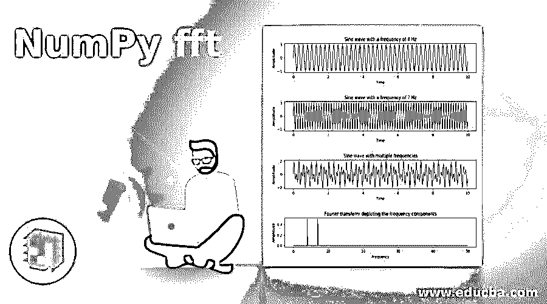

# NumPy fft

> 原文：<https://www.educba.com/numpy-fft/>




## 数字快速傅里叶变换简介

Python 编码语言中使用函数 NumPy.fft()函数，使系统能够通过利用快速边界变换算法来计算一维 n 点 DFT，也称为离散边界变换。这个软件包提供了操作大型数组和制作包含字母数字和数字数据的 cases 所必需的基本功能。为了使用快速前沿变换函数，必须使用另一个包，它是 numpy 包的子集，即 SciPy 包，它有助于实现科学功能，以增加使用范围和计算方法及效用。

### 语法和参数

以下是使用 Python 编程语言编写代码时使用 numpy.fft()的语法:

<small>网页开发、编程语言、软件测试&其他</small>

```
numpy * . * fft *. * fft * (* a1 *, * n1 * = * None *, * axis * = * -1 *, * norm * = * None *) *
```

**参数:**

以下是用 Python 编程语言编写的 numpy.fft()函数使用的参数:
参数:

*   **a1:** **array_like:** 用于表示程序员输入到系统中的数据或用户输入的数据，是使用函数的进一步处理
*   **n1** **int，可选:**用于表示数组在输出中处理后被转换的实际长度。n1 的值小于用户输入的树的实际长度，则输入值被裁剪。如果用户输入的数组长度相对小于输出长度，则输入数组由系统使用 0 提供。如果在编写代码时使用的语法中没有指定参数，则通常使用沿指定轴输入的值的长度。
*   **轴** **int，可选:**该参数表示要执行快速前沿变换的数组的轴。如果代码的语法中没有指定参数，则默认情况下使用输入的最后一次访问
*   **norm** **{None，" ortho"}，可选:**该参数用于表示归一化模式，具体出现在使用 Python 1 . 1 . 1 . 0 及以上版本的系统中。该参数的默认值设置为无
*   **可选:**该参数表示要执行快速边界变换的数组的轴。如果代码的语法中没有指定参数，则默认情况下使用输入的最后一次访问
*   **返回:**该参数用于表示截断的输入或没有填充的输入。沿着最后指定的轴执行转换(在语法中特别提到)

### NumPy fft 如何系统地工作？

使用 SciPy 包功能的 fft 函数的工作方式是，它使用 numpy 数组中使用的基本数据结构，以便创建科学计算和编程所需的模块。该软件包有助于利用涉及使用线性代数和微积分(微分和积分)功能的功能，利用微分方程的复杂性和信令过程的动态多功能性。

利用 fft 或前沿变换包将从时域接收的各种信号转换到频域。此外，用户还可以根据频率检查，并在频域中执行其他功能。

### NumPy fft 示例

显示 Python 中 NumPy.save()用法的示例:

**代码:**

```
# Python code example for usage of the function Fourier transform using the numpy.fft() method
import numpy as n1
import matplotlib.pyplot as plotter1
# Let the basal sampling frequency be 100;
Samp_Int1 = 100;
# Let the basal samplingInterval be 1
# The begin time for the time sampling of the process is taken as 0
Begin_Time1 = 0;
# Let the endtime period be 10 seconds
End_Time1 = 100;
# The final frequency being recorded for the signals
Signal_1Frequency     = 40;
Signal_2Frequency     = 70;
# Time points awarded are
time1 = n1.arange(begin_Time1, end_Time1, samp_Int1);
# Creation of2sinusoidal waves being done
amp1 = n1.sin(2*n1.pi*signal_1Frequency*time1)
amp2 = n1.sin(2*n1.pi*signal_2Frequency*time1)
# Creation of a sub plot being executed
figure1, axis1 = plotter1.subplots(4, 1)
plotter1.subplots_adjust(hspace=1)
# The time domain has a representation for sinusoidal wave 1
axis[0].set_title('Sine wave with a frequency of 4 Hz')
axis[0].plot(time, amplitude1)
axis[0].set_xlabel('Time')
axis[0].set_ylabel('Amplitude')
# Time domain representation for sine wave 2
axis[1].set_title('Sine wave with a frequency of 7 Hz')
axis[1].plot(time, amplitude2)
axis[1].set_xlabel('Time')
axis[1].set_ylabel('Amplitude')
# Add the sine waves
amplitude = amplitude1 + amplitude2
# Time domain representation of the resultant sine wave
axis[2].set_title('Sine wave with multiple frequencies')
axis[2].plot(time, amplitude)
axis[2].set_xlabel('Time')
axis[2].set_ylabel('Amplitude')
# Frequency domain representation
fourierTransform = np.fft.fft(amplitude)/len(amplitude)           # Normalize amplitude
fourierTransform = fourierTransform[range(int(len(amplitude)/2))] # Exclude sampling frequency
tpCount     = len(amplitude)
values      = n1.arange(int(tpCount/2))
time_Period1  = tpCount/samp_Fre1
frequencies1 = values/time_Period1
# Frequency domain representation
Axis1[3].set_title('Fourier transform depicting the frequency components')
Axis1[3].plot1(frequencies1, abs(fourierTransform))
Axis1[3].set_xlabel('Frequency')
Axis1[3].set_ylabel('Amplitude')
plotter1.show()
```

**输出:**

**T2】**


 **使用 fft()函数后生成的输出，即频率分别为 4 Hz 和 7 Hz 的正弦波，被转换为多个频率合并为单一波的正弦波。然后，通过利用表示波的频率和振幅的函数，该波被转换成频率分量，该波的频率和振幅与用于以频率的形式测量波的生命体征的参数有关。

### 结论

NumPy.fft()具有多方面的功能。场合的范围从它被用于处理声音信号和异常信号处理程序，它被用于处理图像，也用于处理音频信号。Bike it 是数字信号处理领域使用最多的概念之一，尤其是在正弦信号处理领域。周期信号和非周期信号都可以通过函数的多功能方法从时域转换到频域。

### 推荐文章

这是 NumPy fft 的指南。在这里，我们也讨论了系统的介绍和 numpy fft 是如何工作的？以及一个示例及其代码实现。您也可以看看以下文章，了解更多信息–

1.  [numpy.linspace()](https://www.educba.com/numpy-linspace/)
2.  [numPy.where()](https://www.educba.com/numpy-where/)
3.  [NumPy.argmax()](https://www.educba.com/numpy-argmax/)
4.  num py . dot()


**