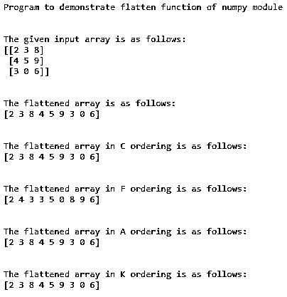

# 数字展平

> 原文：<https://www.educba.com/numpy-flatten/>


## 数字展平简介

在 Python 中， NumPy flatten 函数被定义为将任意二维或任意其他多维数组的给定数组展平为由 Python 模块 NumPy 提供的一维数组，该函数用于将数组的简化副本从任意多维数组返回到一维数组，这被称为展平函数，用于将多维数组展平为一维数组，这也有助于使用 排序参数，如 C 用于将数组按行展平，F 用于将数组按列展平到一维，还有许多其他选项。

### NumPy flatten()函数的工作原理

在本文中，我们将看到 flatten()函数如何在 Python 中使用 numpy 模块和一个由该模块定义的数组对象工作，该数组对象用于表示一个多维数组，该数组中有固定数量的元素。这个 NumPy 模块和作为 ndarray 的数组对象用于演示 flatten()函数。现在在下面的部分让我们看看 flatten 函数的语法和例子。

<small>网页开发、编程语言、软件测试&其他</small>

**语法:**

```
ndarray.flatten(order)
```

在上面的语法中，我们有一个名为 ndarray 的数组对象，它是需要应用 flatten()函数的输入数组。参数“order”被传递给具有不同值的函数，例如 C、F、A 和 K，其中 C 是默认值。此函数返回多维数组展平或折叠为一维的输入数组。

*   “C”用作将给定多维数组按行顺序展平为一个维度的值。
*   “F”用于按列的顺序展平或折叠成一维数组。
*   “A”是可选值，仅当 F 值在内存中有一个连续的按列展开的数组时使用，否则，它将按行展开。
*   “K”还用作 order 参数的值，以便按照项目或元素在内存中出现的顺序展平数组。

### 数字扁平化示例

现在让我们在下面的部分用一个简单的例子来演示 flatten 函数。

**代码:**

```
import numpy as nf
print("Program to demonstrate flatten function of numpy module")
print("\n")
in_arr = nf.array([[2,3,8], [4,5,9], [3,0,6]])
print("The given input array is as follows:")
print(in_arr)
print("\n")
print("The flattened array is as follows:")
print(in_arr.flatten())
print("\n")
print("The flattened array in C ordering is as follows:")
print(in_arr.flatten(order = 'C'))
print("\n")
print("The flattened array in F ordering is as follows:")
print(in_arr.flatten(order = 'F'))
print("\n")
print("The flattened array in A ordering is as follows:")
print(in_arr.flatten(order = 'A'))
print("\n")
print("The flattened array in K ordering is as follows:")
print(in_arr.flatten(order = 'K'))
print("\n")
```

**输出:**




在上面的程序中，我们可以看到我们必须首先导入 NumPy，并将其别名设置为“nf ”,这样就可以很容易地在整个程序中引用它。然后我们使用 NumPy 模块的数组函数创建一个 3*3 维的数组。然后我们可以在给定的输入数组“in_arr”上使用 flatten()函数将这个多维 3*3 数组展平成一维数组。因为 C 是默认值，所以当我们不向 flatten 函数传递任何值时，它将按行排列 3*3 维数组，这意味着第一行附加第二行，然后第二行附加第三行，形成一个数组。同样，当我们指定 order 的值为“C”时，可以将多维数组排列成一维。然后在下一行中，我们将值指定为“F ”,这是 Fortran 风格，用于按列排列给定的输入数组，如上面的屏幕截图所示，例如第一列附加第二列，然后第三列附加第三列，以形成 3*3 维数组到一维数组。因此，正如我们在上面的程序中看到的，我们也使用了“A”值，它也将 3*3 维数组的元素按行排列成一维数组，因为 F 在内存中不包含连续的值。最后，我们将值指定为“K ”,这将把 3*3 维数组的元素展平为一维，因为它们出现在给定的输入数组内存中，并且参数值的所有可能性的输出显示在上面的屏幕截图中。

NumPy 的 flatten()函数用于处理与 convent 等神经网络相关的大量数据，这个函数非常有用。在 Python 中，NumPy 模块提供的另一个函数是 reshape()函数，它也类似于 flatten()函数，也具有相同的参数值，如 C、F、A 和 K，C 默认用于按行对元素进行整形，但 flatten()函数会将多维数组缩减为一维，而 reshape()函数可用于将给定数组缩减或折叠或整形为任意维数组，主要用于从宽到长排列数据。

### 结论

在本文中，我们得出结论，我们正在使用 Python 中 NumPy 模块的 flatten()函数来将给定的多维数组缩减或折叠成一维数组。在本文中，我们讨论了语法以及参数及其值，如 C、F、A 和 K，这些参数用于按行或按列排列数组元素。在本文中，我们还举例说明了如何使用 flatten()函数，并用输出和截图展示了它们不同的参数值。

### 推荐 ed 文章

这是 NumPy 展平指南。这里我们还将讨论 numpy flatten()函数的介绍和工作原理，并给出一个例子。您也可以看看以下文章，了解更多信息–

1.  [NumPy 数组](https://www.educba.com/numpy-arrays/)
2.  [NumPy 数组函数](https://www.educba.com/numpy-array-functions/)
3.  [NumPy 简介](https://www.educba.com/introduction-to-numpy/)
4.  [安装 NumPy](https://www.educba.com/install-numpy/)


