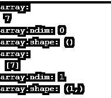
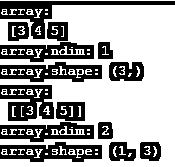
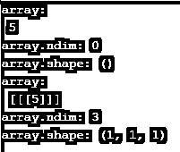
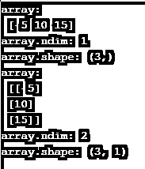
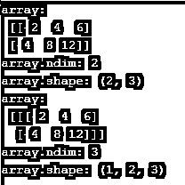
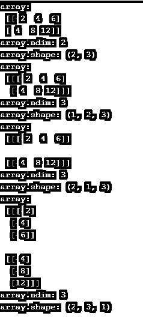

# NumPy Newaxis

> 原文：<https://www.educba.com/numpy-newaxis/>


## NumPy Newaxis 简介

Numpy newaxis 是 python Numpy 库支持的各种函数之一，它允许我们在输入 numpy 数组的位置更改或扩展它的维度。当我们在变量或数组的元组中包含每个 newaxis 对象时，我们将在包含 newaxis 对象的相同位置为数组获得一个新的额外维度。

**语法**

<small>网页开发、编程语言、软件测试&其他</small>

numpy Newaxis 函数的基本语法是，

```
np.array()[numpy.newaxis]
```

Numpy Newaxis 是一个包含在数组中的对象，用于扩展给定数组的维度。维度可以在相对于 newaxis 对象的位置的位置上扩展。

### NumPy Newaxis 的示例

下面是下面提到的例子:

#### 示例#1

让我们讨论一个基本的例子来理解 numpy newaxis 函数是如何工作的。

**代码:**

```
import numpy as np
a = np.array(7)
print('array: \n', a)
print('array.ndim:', a.ndim)
print('array.shape:', a.shape)
b=np.array(a)[np.newaxis]
print('array: \n', b)
print('array.ndim:', b.ndim)
print('array.shape:', b.shape)
```

**输出:**




在上面的例子中，我们为 np.newaxis 函数调用了 numpy 库。我们已经声明了一个数组“a ”,它是一个只有一个元素的一维数组，并且打印了数组“a”的相应值、维度和形状，以确认它是一个零维数组 0-D。现在，为了将 0-D 数组转换为一维数组，我们在新数组“b”中使用了 np.newaxis 函数，并且打印了数组“a”的相应值、维度和形状，以确认 0-D 数组扩展为 1-D 数组。

#### 实施例 2

在这个例子中，我们将讨论如何使用 newaxis 对象将一维数组转换为二维数组。

**代码:**

```
import numpy as np
a=np.array([3,4,5])
print('array: \n', a)
print('array.ndim:', a.ndim)
print('array.shape:', a.shape)
b=np.array(a)[np.newaxis]
print('array: \n', b)
print('array.ndim:', b.ndim)
print('array.shape:', b.shape)
```

**输出:**




在本例中，我们使用 numpy newaxis 函数将一维数组转换为二维数组。我们创建了一个一维数组“a ”,并打印了它的值、维度和形状。数组“b”是数组“a”的扩展，使用元组内的 np.newaxis 对象扩展了维度。如我们所见，生成的数组是一个二维数组，我们打印了它的值、维度和形状。

#### 实施例 3

在本例中，我们创建了一个零维数组，并将其转换为二维数组。

**代码:**

```
import numpy as np
a=np.array(5)
print('array: \n', a)
print('array.ndim:', a.ndim)
print('array.shape:', a.shape)
c=np.array(a)[np.newaxis,np.newaxis]
print('array: \n', c)
print('array.ndim:', c.ndim)
print('array.shape:', c.shape)
```

**输出:**


我们在示例 1 中使用的数组“a”是一个零维(0-D)数组，我们已经打印了它的值、维度和数组“a”的形状。现在使用数组“a”中的 numpy newaxis 对象，我们已经直接将一维数组“a”转换为二维数组“c”。我们已经在 tuple 中声明了 np.newaxis 两次，因此它表示维度扩展为两次。所以我们得到的相应的数组 c 是一个二维数组。

#### 实施例 4

在这个例子中，我们将看到如何将一个零维数组扩展成一个三维数组。

**代码:**

```
import numpy as np
a=np.array(5)
print('array: \n', a)
print('array.ndim:', a.ndim)
print('array.shape:', a.shape)
c=np.array(a)[np.newaxis,np.newaxis,np.newaxis]
print('array: \n', c)
print('array.ndim:', c.ndim)
print('array.shape:', c.shape)
```

**输出:**




我们创建的数组“a”类似于前面的一维数组示例。我们创建的数组“c”是数组“a”到三维数组的扩展，我们在数组“a”中使用了 numpy newaxis 函数三次，得到的数组是 shape (1，1，1)的三维数组。所以使用这种技术，我们可以在一个数组中创建 n 个维度。

#### 实施例 5

在本例中，我们将尝试将一维数组的维度扩展为二维数组，并使用 newaxis 对象更改生成的数组的形状。

**代码:**

```
import numpy as np
a=np.array([5,10,15])
print('array: \n', a)
print('array.ndim:', a.ndim)
print('array.shape:', a.shape)
c=np.array(a)[:,np.newaxis]
print('array: \n', c)
print('array.ndim:', c.ndim)
print('array.shape:', c.shape)
```

**输出:**




在本例中，我们使用了同一个一维数组“a”，并使用 numpy newaxis 函数将其维度扩展为一个二维数组，并且我们已经将形状从(3，)转换为(3，1)。np.newaxis 对象的位置对于确定数组的形状非常重要。这里，我们在第一个<sup>轴和第一个</sup>轴上声明了 newaxis 对象。

#### 实施例 6

**代码:**

```
import numpy as np
a=np.array([[2, 4, 6], [4, 8, 12]])
print('array: \n', a)
print('array.ndim:', a.ndim)
print('array.shape:', a.shape)
c=np.array(a)[np.newaxis,:,:]
print('array: \n', c)
print('array.ndim:', c.ndim)
print('array.shape:', c.shape)
```

**输出:**




在本例中，形状为(2，3)的二维数组“a”已转换为形状为(1，2，3)的三维数组。这可以通过沿第 0 <sup>轴声明 numpy newaxis 函数并将表示数组维数的分号声明为(1，2，3)来实现。通过使用这种技术，我们可以将任何 numpy 数组转换成我们想要的形状和尺寸。</sup>

#### 实施例 7

**代码:**

```
import numpy as np
a=np.array([[2, 4, 6], [4, 8, 12]])
print('array: \n', a)
print('array.ndim:', a.ndim)
print('array.shape:', a.shape)
c=np.array(a)[np.newaxis,:,:]
d=np.array(a)[:, np.newaxis, :]
e=np.array(a)[:, :, np.newaxis]
print('array: \n', c)
print('array.ndim:', c.ndim)
print('array.shape:', c.shape)
print('array: \n', d)
print('array.ndim:', d.ndim)
print('array.shape:', d.shape)
print('array: \n', e)
print('array.ndim:', e.ndim)
print('array.shape:', e.shape)
```

**输出:**




与前面使用一维数组“a”的示例类似，我们转换了三维数组“c”、“d”和“e”。所有这三个结果数组都是三维的，具有不同的形状，即(1，2，3)，(2，1，3)和(2，3，1)，它们向我们显示了与数组一起声明的 newaxis 对象的位置。对于数组“c ”,我们在第一个<sup>位置声明了 newaxis 对象；对于数组“d ”,我们在第二个位置声明了 newaxis 对象；对于数组“e ”,我们在第三个位置声明了 newaxis 对象，这给出了相应的形状。</sup>

### 结论

在本文中，我们使用各种示例详细讨论了 Numpy newaxis 函数，以便清楚地理解 numpy newaxis 函数及其用途。我们还详细讨论了如何使用 tuple 中的 newaxis 对象将数组转换为多维数组，以及如何通过示例改变结果数组的形状。希望这篇文章有所帮助。谢谢你。

### 推荐文章

这是 NumPy Newaxis 的指南。在这里，我们使用各种示例来详细讨论 numpy newaxis 函数，以便清楚地理解 Numpy newaxis 函数。您也可以看看以下文章，了解更多信息–

1.  [NumPy vstack](https://www.educba.com/numpy-vstack/)
2.  [最大数量](https://www.educba.com/numpy-max/)
3.  [NumPy 指数](https://www.educba.com/numpy-exponential/)
4.  [NumPy 空数组](https://www.educba.com/numpy-empty-array/)


