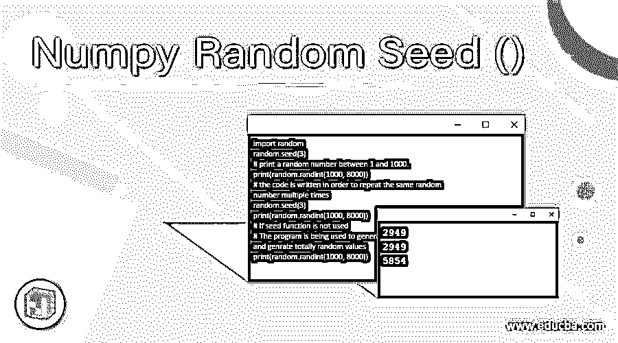

# Numpy 随机种子()

> 原文：<https://www.educba.com/numpy-random-seed/>




## Numpy 随机种子简介()

Numpy。随机的。Python 编码语言中使用了 seed ***** ()函数，这是 random()函数下存在的功能。这有助于保存随机函数的当前状态。这样做是为了当代码在开发它的同一台机器上或在运行它的不同机器上执行多次时，函数能够生成完全相同的随机数(参考指定的种子值)。通过定义种子值，我们在广义上是指代码运行时处理的先前生成的值或数字。必须注意的是，当代码第一次被执行时，没有先前处理过的值，该函数利用当前时刻的系统时间。

### 语法和参数

下面是使用 NumPy 的语法。随机的。在用 Python 编程语言编写代码时，seed ***** ():

<small>网页开发、编程语言、软件测试&其他</small>

```
numpy.random.seed(seed=None)
```

**参数:**

以下是用于 NumPy 的参数。随机的。用 Python 编程语言编写的 seed()函数。random seed 方法由系统初始化的 RandomState 调用。可以进一步调用它，以便再次对生成器进行种子设定

| **参数** | **参数说明** |
| seed: **int or 1-d array_like, optional**这表示输入到机器的输入数据，可以是整数类型的数据，也可以是一维数组类型的对象，尽管用户或编码人员没有必要定义数据类型。这是一个可以使用的可选参数。该参数可用于生成范围在 0 和无限可能性之间的任何整数(最多 2 个 <sup>32 个</sup>包括该数)，生成的数据可以是整数数组(或其他类似序列)，或者该参数可以设置为 None(这是默认的参数标准)。如果种子参数设置为 None(除非代码中另有规定)，则随机状态类将尝试从 Windows analogue 或 dev/urandom 中读取可用的，否则它将种子时钟 |
| **注** | 应当注意，作为最佳实践，建议不要将重新播种位生成器作为一个选项，而是建议重新创建一个全新的位生成器。请注意，传统原因是这些建议背后的核心原则。该示例可用于展示要包含的最佳实践: |

### 如何利用 Numpy 随机种子？

NumPy 随机种子函数可用于生成加密密钥或模式(伪随机的)。这些将在数据和计算机安全领域的发展中发挥非常重要的作用。这些加密密钥将提供一种解决方案，以防止未经授权访问个人设备或以各种形式访问互联网。

NumPy 随机种子函数使编码器能够非常容易地优化代码，其中随机数可以用于测试效用和效率。执行代码时生成的输出完全取决于系统使用的随机数据变量，因此与输入相关。这使得使用随机数来检查基于测试代码的算法的正确性成为一个复杂的过程。由于 NumPy 随机种子函数可以用于在恒定的基础上产生相同的随机数序列的过程中，并且可以被反复调用，这通过实现 NumPy 随机种子方法的使用，整体上简化了使用测试算法的整个测试过程。

### 例子

让我们讨论 Numpy 随机种子()的例子。

#### 示例#1

**代码:**

```
# Python program explaining the use of NumPy.random.seed function import random.
import random
for i in range(10):
# Any number or integer value can be used instead of using '0'.
    random.seed(0)
# Generation of random values will be between 1 to 100.
    print(random.randint(1, 100))
```

**输出:**


#### 实施例 2

**代码:**

```
# Python program explaining the use of NumPy.random.seed function import random.
import random
random.seed(3)
# print a random number between 1 and 1000.
print(random.randint(1000, 8000))
# the code is written in order to repeat the same random number multiple times
random.seed(3)
print(random.randint(1000, 8000))
# If seed function is not used
# The program is being used to generate unpridictible output and genrate totally random values
print(random.randint(1000, 8000))
```

**输出:**


### 结论

NumPy。随机的。seed()函数在使用中非常重要，因为它很容易使系统生成加密密钥或模式(伪随机化)成为可能。这些将在数据和计算机安全领域的发展中发挥非常重要的作用。这些加密密钥将提供一种解决方案，以防止未经授权访问个人设备或以各种形式访问互联网。总的来说，它有助于减少代码的冗长，从而提高正在运行的程序的周转速度。

### 推荐文章

这是 Numpy 随机种子()的指南。这里我们还讨论了 Numpy 随机种子()的引入，Numpy 随机种子是如何被利用的？以及不同的例子。您也可以看看以下文章，了解更多信息–

1.  num py . eye()
2.  [NumPy 格式](https://www.educba.com/numpy-format/)
3.  [NumPy ndarray tolist](https://www.educba.com/numpy-ndarray-tolist/)
4.  [NumPy 外部](https://www.educba.com/numpy-outer/)


