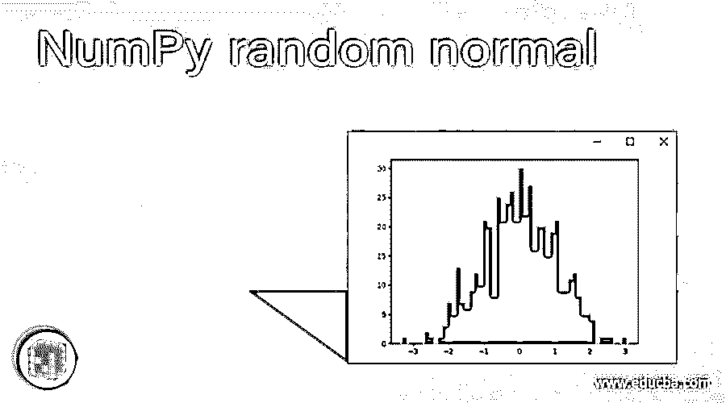
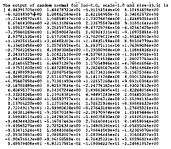
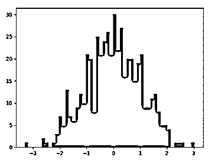

# NumPy 随机正态

> 原文：<https://www.educba.com/numpy-random-normal/>




## 数字随机正态的定义

NumPy random normal()函数用于从正态分布中获取随机样本。NumPy random normal()函数是 python 的 NumPy 包中的内置函数。NumPy random normal()函数从正态分布或高斯分布中生成随机样本，正态分布描述了受大量微小随机分布影响或在自然界中经常出现的样本的常见分布。正态分布也称为钟形曲线，因为它的形状和这些分布样本通常用于数据统计，数据分析，数据相关领域，也可以用于概率，机器学习，贝叶斯统计，等等。这是最重要的分布。

**语法:**

<small>网页开发、编程语言、软件测试&其他</small>

```
NumPy.random.normal(loc = 0.0, scale = 1.0, size = None)
```

**参数:**

*   **loc**–这是一个可选参数，指定分布的平均值(峰值)。默认值为 0.0。
*   **scale**–这是一个可选参数，指定标准偏差或分布图的平坦程度。默认值为 1.0。
*   **size**–这是一个可选参数，它指定了结果数组的形状。默认值为 1。
*   **返回值**–该函数的返回值是来自正态分布的随机样本的 NumPy 数组。

### NumPy 随机正态()函数的工作原理

NumPy random normal()函数接受三个参数(loc、scale、size ),这三个参数都不是强制参数。如果我们不向 normal()函数传递任何东西，它将返回一个样本号。如果我们传递 loc、scale 和 size 的特定值，那么 NumPy random normal()函数从正态分布中生成指定大小、loc 和 scale 的数字的随机样本，并作为 size 中指定的 dimensional 数组返回。

### 例子

用于从正态分布生成样本的 NumPy random normal()函数示例

接下来，我们编写 python 代码，通过以下示例更清楚地理解 NumPy random normal()函数，其中 normal()函数用于从正态分布生成大小为 6 的样本，如下所示

#### 示例#1

**代码:**

```
# import numpy package as np
import numpy as np
# Using normal() method of random class
ndis_no = np.random.normal(size = 6)
print( "The output of random normal for loc=0.0, scale=1.0 and size=6 is : " )
# printing the size 6 normal distribution random samples of the normal() function
print( ndis_no )
print("\n")
ndis_no = np.random.normal( loc=0.5, scale=1.5, size = 6)
print( "The output of random normal for loc=0.5, scale=1.5 and size=6 is : " )
print( ndis_no )
```

**输出:**


同样，当我们运行上述程序时，它将生成另一个样本随机数，如下所示


与上面的程序一样，loc、scale 和 size(一维)值被传递给 normal()函数，因此 normal()函数根据传递的值从正态分布生成随机样本。在上面的输出中，我们看到它每次都生成不同的随机样本。

从正态分布生成多维样本的示例–

接下来，我们编写 python 代码来理解 NumPy random normal()函数，其中 normal()函数用于从正态分布生成大小为(3，5)和(2，5)的多维样本，如下所示

#### 实施例 2

**代码:**

```
# import numpy package as np
import numpy as np
# Using normal() method of random class
ndis_no = np.random.normal(size = (3,5))
print( "The output of random normal for loc=0.0, scale=1.0 and size=(3, 5) is : " )
# printing the size 6 normal distribution random samples of the normal() function
print( ndis_no )
print("\n")
ndis_no = np.random.normal( loc =0.5, scale =1.5, size =(2,5))
print( "The output of random normal for loc=0.5, scale=1.5 and size=(2, 5) is : " )
print( ndis_no )
```

**输出:**


同样，当我们运行上述程序时，它将生成另一个样本随机数，如下所示


与上面的程序一样，loc、scale 和 size(二维(3，5)，其中 3 是行数，5 是列数)值被传递给 normal()函数，因此 normal()函数根据传递的值从正态分布生成随机样本。在上面的输出中，我们看到它每次都生成不同的随机样本。

NumPy random normal()函数的示例，用于从正态分布中生成样本并绘制它们-

接下来，我们编写 python 代码来理解 this 函数，其中 normal()函数用于从正态分布生成大小为 500 的多维样本，并绘制它们，如下所示

#### 实施例 3

**代码:**

```
# import numpy package as np
import numpy as np
# import pyplot as plt
from matplotlib import pyplot as plt
# Using normal() method of random class
mean_value = 0.0
std_value = 1.0
ndis_no = np.random.normal( mean_value, std_value, size = 500 )
print( "The output of random normal for loc=0.0, scale=1.0 and size = 500 is : " )
# printing the size 6 normal distribution random samples of the normal() function
print( ndis_no )
count, bins, ignored = plt.hist( ndis_no, 50)
plt.show()
```

**输出:**




正如我们在下面看到的，超过 500 个数字的图表——




与上面的程序一样，normal()函数根据传递的值从正态分布中生成 500 个随机样本数，如果我们看到样本数的分布是正态分布(因为它具有钟形),则也可以使用上面输出中的 matplotlib 包绘制这些样本数。

### 结论

NumPy random normal()函数是 NumPy 包中的内置函数，用于从正态分布中获取指定维度数组的随机样本。

### 推荐文章

这是一个 NumPy 随机常态的指南。在这里，我们还讨论了 NumPy random normal()函数和不同示例的描述、语法、参数、工作原理及其代码实现。您也可以看看以下文章，了解更多信息–

1.  num py . eye()
2.  [NumPy 格式](https://www.educba.com/numpy-format/)
3.  [NumPy 外部](https://www.educba.com/numpy-outer/)
4.  [NumPy zip](https://www.educba.com/numpy-zip/)


