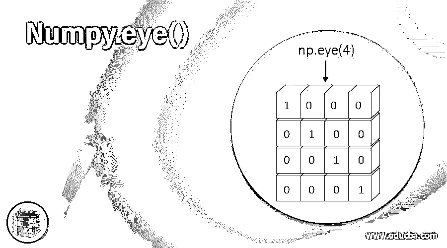
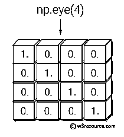
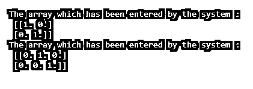
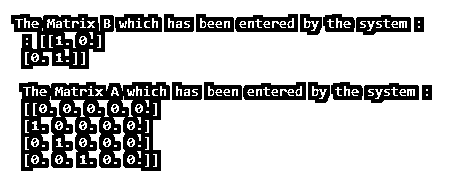

# Numpy.eye()

> 原文：<https://www.educba.com/numpy-eye/>




## Numpy.eye()简介

Numpy.eye()函数通常用在 Python 编码语言中。在函数的帮助下，系统能够返回输出数组，该数组中包含的所有值都等于零，除了第 k <sup>条</sup>条对角线的值等于 1。当使用该功能时，用户能够选择将被分配值 1 的对角线。

### 语法和参数

以下是使用 Python 编程语言编写代码时使用 numpy.eye()的语法:

<small>网页开发、编程语言、软件测试&其他</small>

```
numpy.eye(* N *, * M * = * None *, * k * = * 0 *, * dtype * = * < * class * ' * float * ' * > *, * order * = * ' * C * ' *) *
```

以下是用于 numpy *的参数。用 Python 编程语言编写的 eye()函数:

| **功能中使用的参数** | **参数说明** |
| **N * int** | 参数“N”表示数组中存在的总行数。* * * * * * * |
| **M * int，可选** | 参数“N”表示数组中存在的列的总数。该函数的默认值是列的总数和行的总数相等。这是一个可选参数。* * * * * * * * * * * * * * * * * * * * * * |
| **k * int，可选** | 启用此参数来表示主对角线。k 的默认值为 0。如果值为正(即 k>0)，则代表它是上对角线；而当 k 值为负时，它代表较低的对角线。该参数的默认值假定为零。这是一个可选参数。* * * * * * * * * * * * * * * |
| **d * type 数据类型，可选** | 这是一个可选参数。返回数组的数据类型由参数表示。该参数的默认值是 float 数据类型。 |
| **顺序{'C '，** * **'F'}，可选** | 这是一个可选参数。这可以分配给两个值 C_ contiguous 或 F_ contiguous。该参数建议用户选择输出方向。对于要放入系统内存中的数据的顺序，它应该以 C 风格(即，行主风格)还是 Fortran 风格(即，列主风格)存储。 |
| **Indarray of shape (N,M)** | The output array after the function numpy.eye() is applied on the input array.除了第 k 个元素表示对角线的值之外，输出数组的所有元素都表示为零。对角线的值将等于 1。 |

### Numpy.eye 是如何工作的？




对角线由系统计算，识别主矩阵上元素的位置，然后函数继续用 0 替换除对角线值之外的值。对角线上索引处的所有元素中的 1 值被替换。该图表示对角线如何被 1 <sup>st</sup> 替换，以及矩阵中的剩余元素如何被零值替换。

### 例子

让我们讨论在 NumPy 中实现 eye 函数的例子。

#### 示例#1

**代码:**

```
# importing the numpy class as np1
import numpy as np1
# declaration of a 2x2 matrix with 1 on its main diagonal
o1 = np1.eye(2, dtype = float)
print("The array which has been entered by the system : \n", o1)
# declaration of the array using the matrix with Row set at a value of 2 and Colum set at the value of 3 and the diagonal is equal to 1
o2 = np1.eye(2, 3, k = 1)
print("The array which has been entered by the system : \n", o2)
```

**输出:**




#### 实施例 2

**代码:**

```
# importing the numpy class as np1
import numpy as np1
# declaration of a 2x2 matrix with 1 on its main diagonal
b1 = np1.eye(2, dtype = float)
print("The Matrix B which has been entered by the system : \n :", b1)
# declaration of the array using the matrix with Row set at a value of 4 and Colum set at the value of 5 and the diagonal is equal to 1
a1 = np1.eye(4, 5, k = -1)
print("\n The Matrix A which has been entered by the system :\n", a1)
```

**输出:**




### 结论

眼睛功能提供了一个预先开发的功能，这是一个典型的非常方便的预备步骤。Python 的函数 NumPy eye()是一个内置函数，用于返回一个结果矩阵，即一个二维数组，在矩阵的对角线部分的值为 1，在矩阵的所有其他元素中的值为 0(相对于第 k 个值的特定位置)。该函数有助于创建多个多维数组，并进而导出要在该数组上执行的其他数学和统计相关函数，这有助于解析该函数的完整值。

### 推荐文章

这是 Numpy.eye()的指南。这里我们分别讨论简介、参数、Numpy.eye 的功能和示例。您也可以看看以下文章，了解更多信息–

1.  [NumPy 格式](https://www.educba.com/numpy-format/)
2.  [NumPy ndarray tolist](https://www.educba.com/numpy-ndarray-tolist/)
3.  [NumPy 外部](https://www.educba.com/numpy-outer/)
4.  [NumPy Newaxis](https://www.educba.com/numpy-newaxis/)


