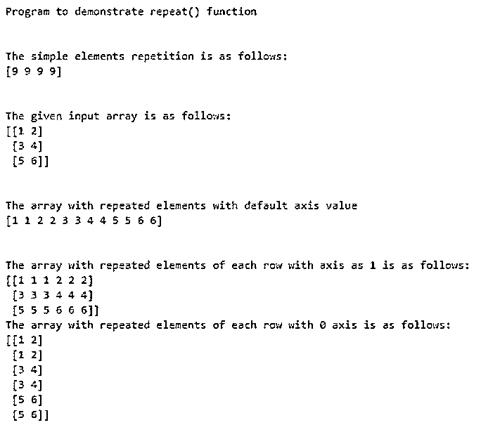

# NumPy 重复

> 原文：<https://www.educba.com/numpy-repeat/>


## NumPy 重复介绍

在 Python 中，NumPy repeat()是一个函数，它被定义为按照 repeat()函数中指定的次数重复数组的给定元素，我们也可以将其定义为与 axis 一起工作。NumPy repeat()函数用于任意次数地显示给定数组的元素，也可以沿轴显示，这意味着按行显示，例如 axis =1，如果我们希望重复第一行的元素，并以相同的形状沿相同的给定轴显示与输入处的数组相同的重复数字数组。

### Python 中 NumPy repeat()函数的工作原理

在 Python 中，NumPy 模块用于处理数组，该模块提供了一个函数，能够显示数组中重复元素的数组，这是通过使用 repeat()函数来完成的。repeat()函数用于显示或返回重复元素的数组，次数由用户在函数参数中指定。

<small>网页开发、编程语言、软件测试&其他</small>

这个函数也可以用来返回或显示数组中的重复元素以及指定的坐标轴，比如坐标轴的值为 0 和 1，在一维数组和一维数组中我们将只有坐标轴的值为 0。因此，当我们考虑使用 repeat()函数操作 NumPy 数组时，我们将轴视为可选参数，但它也很重要。

**语法:**

```
numpy.repeat(in_arr, no_repeat, axis)
```

在上面的语法中，我们可以看到有 3 个不同的参数，它们如下:

*   **in_arr:** 该参数用于指定一个输入数组，得到需要重复的元素。
*   **no_repeat:** 该参数用于指定元素重复的次数。该参数的值总是整数。
*   **轴:**该参数是可选的，用于指定轴，如 1D 阵列有 1 个轴，2D 阵列有 2 个轴，表示阵列维度上的方向。默认情况下，此参数将平面作为一个值，如果它是一维数组到平面输入数组，则返回平面输出数组。

NumPy 的 repeat()函数返回一个数组，该数组包含重复元素，重复次数在上面的函数中指定。我们还可以看到，它将返回一个与给定输入数组具有相同形状和给定轴的数组。

### 例子

现在让我们看看如何在下面的例子中使用 Python 中的 repeat()函数。

**代码:**

```
import numpy as nr
print("Program to demonstrate repeat() function")
print("\n")
print("The simple elements repetition is as follows:")
sim_res = nr.repeat(9, 4)
print(sim_res)
print("\n")
in_arr = nr.array([[1, 2], [3, 4], [5, 6]])
print("The given input array is as follows:")
print(in_arr)
print("\n")
res = nr.repeat(in_arr, 2)
print("The array with repeated elements with default axis value")
print(res)
print("\n")
res1 = nr.repeat(in_arr, 3, axis=1)
print("The array with repeated elements of each row with axis as 1 is as follows:")
print(res1)
res2 = nr.repeat(in_arr, 2, axis=0)
print("The array with repeated elements of each row with 0 axis is as follows:")
print(res2)
```

**输出:**




在上面的程序中，我们可以看到我们首先导入了 NumPy 模块，然后我们使用 NumPy 模块的 array()函数声明了一个数组，然后我们使用 repeat()函数重复给定项的元素数，即“9”打印了 4 次，然后我们声明了一个包含 3 个项的数组，每个项打印了 2 次，其中第一个结果“res”的轴值是默认值 flat，我们可以看到所有元素都平铺在一行中。但是当我们声明另一个结果“res1”时，我们在 repeat()函数中声明了 axis =1，那么我们得到的元素重复是在一行中水平重复 3 次。当我们将 axis 声明为 0 时，每个元素垂直(向下)重复两次，打印在不同的行中，对于给定输入数组中的其余元素也是如此。这些输出结果可以在上面给出的程序的输出截图中看到。

在本文中，我们必须注意，当我们使用一维数组时，它可能只考虑一个元素，很容易知道当我们对一维数组应用 repeat()函数时，它会展平输入数组，但这并不容易理解为什么它会展平。现在，如果我们有一个二维数组，如果我们不指定轴，那么默认情况下，它会将 2D 数组展平为 1D 数组，方法是将所有重复的元素作为一行放在一维数组中。当我们希望通过将轴值保持为 0 来显示多维数组的所有行的副本时，使用这个 repeat()函数，但是这种行的副本在一维中是不可能的，因为它将抛出一个错误，所以为了克服这一点，我们可以使用另一个 NumPy 函数 expand_dims()将数组从 1D 扩展到 2D，然后我们可以使用轴值为 0 来获得行元素副本。因此，还有另一个 NumPy 函数 tile()也用于重复，但不是作为 repeat()用于单个元素，而是用于整个数组。

### 结论

在本文中，我们得出结论，当我们想要显示一个包含重复元素的数组时，那么在 Python 中，我们在 NumPy 模块中使用 repeat()函数。在本文中，我们还了解了语法及其参数，声明了相应的显示，并指定了输入数组、元素重复的次数以及可选的轴规范。在本文中，我们还看到了一个使用带有可选参数的 repeat()函数和带有不同值的 axis 参数的示例。

### 推荐文章

这是一个指南 NumPy 重复。这里我们分别讨论 python 中 NumPy repeat()函数的介绍和工作原理。您也可以看看以下文章，了解更多信息–

1.  [numpy.ravel()](https://www.educba.com/numpy-dot-ravel/)
2.  [Numpy.argsort()](https://www.educba.com/numpy-argsort/)
3.  num py . unique()
4.  [NumPy Ndarray](https://www.educba.com/numpy-ndarray/)


