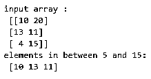
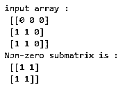

# NumPy 非零值

> 原文：<https://www.educba.com/numpy-nonzero/>


## NumPy 非零值简介

python 中 numpy 模块的非零函数用于查找 numpy 数组中非零元素的索引。函数的作用是:返回数组元组，数组中所有非零元素的索引。对于外行来说，numpy 数组就像一个元素矩阵。在本文中，我们将研究 numpy .非零()函数的语法，然后讨论几个基于它的例子。首先，让我们先试着理解这个函数的一些可能的用法。

### numpy .非零()函数的用法

*   numpy 非零函数的常见用法是查找满足特定逻辑条件的数组元素的索引。例如，查找数组中元素的索引，是大于还是小于 1，偶数等等。
*   这个函数的另一个常见用法是在 numpy 矩阵中寻找非零子矩阵。例如，您有一个包含零点和一些非零元素的大型矩阵，您希望提取矩阵的非零部分。

不用担心，即使你现在不太懂。我们将在示例部分进一步讨论这一点。但是在开始举例之前，让我们先讨论一下这个函数的语法和参数。

<small>网页开发、编程语言、软件测试&其他</small>

**语法和参数**

numpy .非零()函数的基本语法如下:

```
numpy.nonzero(a)
```

**参数:**该函数将一个类似数组的实例作为输入

**Return:** 它返回一个元组，其中包含输入数组中非零元素的索引

讨论了语法之后，让我们讨论几个基于它的例子。

### NumPy 非零的例子

下面给出了 NumPy 非零值的例子:

#### 示例#1

在给定的输入数组中寻找非零元素的索引。

**代码:**

```
#import numpy module
import numpy as np
#input
a = np.array([[0,1],[5,3]])
print('input array :\n',a)
#indices of non-zero elements
np.nonzero(a)
```

**输出:**


在上面的输出中，您将看到 np .非零函数返回一个元组，其中包含数组中每个非零元素的索引。在这个特定的例子中，索引[0，1]，[1，0]，[1，1]。元组的第一个值对应于非零元素的第一个索引，即(0，1，1)，元组中的第二个值对应于每个非零元素的第二个索引，即(1，0，1)。你可以认为它是指数的转置。

#### 实施例 2

从给定的输入数组中找出小于 5 的元素。

**代码:**

```
import numpy as np
#input
a = np.array([[2,8,0],[3,9,1],[1,2,3]])
print("input :\n",a)
#nonzero function with condition
print('indices of non-zero elements:\n',np.nonzero(a<5))
#returning elements less than 5
print('elements less than 5:\n', a[np.nonzero(a<5)])
```

**输出:**


在这个例子中，我们使用了一个条件和 np .非零函数。该函数返回数组中满足指定条件的所有元素的索引。这里，1 被认为是真的，0 被认为是假的。例如，元素(2，0，3，1，1，2，3)满足条件。它们各自的索引分别为[0，0]、[0，2]、[1，0]、[1，2]、[2，0]、[2，1]和[2，2]。

#### 实施例 3

从给定的输入数组中找出大于 5 但小于 15 的元素。

**代码:**

```
import numpy as np
#input
a = np.array([[10, 20],
[13, 11],
[4, 15]])
print('input array :\n',a)
#nonzero function with combinatorial logic
print('elements in between 5 and 15:\n',a[np.nonzero((a > 5) & (a < 15))])
```

**输出:**




这个例子与上一个类似，只是这里我们使用了条件的组合。因此，举例来说，您可以使用由逻辑运算符如' &'(and)和' |'(or)连接在一起的复杂条件。

#### 实施例 4

从给定的输入矩阵中找出并提取非零值的最小子矩阵。

**代码:**

```
import numpy as np
#function using np.nonzero()
def nonzero_submat(a):
#non-zero indices
    x, y= np.nonzero(a)
#the lower and upper bound of the non-zero indices in the array
    x_low_ind = x.min()
    x_high_ind = x.max()
    y_low_ind = y.min()
    y_high_ind = y.max()
    return a[x_low_ind:x_high_ind+1,y_low_ind:y_high_ind+1]
#input
a = np.array([[0, 0, 0],
[1, 1, 0],
[1, 1, 0]])
print('input array :\n',a)
#calling function on input
print("Non-zero submatrix is :\n", nonzero_submat(a))
```

**输出:**




用一个非零函数，你可以随心所欲地发挥创造力。您可以将它用作自定义函数的 feeder 函数，如下例所示。在这个例子中，我们试图从矩阵中提取最小的子矩阵。首先，我们已经找到非零的索引，然后使用这些元素作为最小可能子矩阵的上界和下界。

### 结论

numpy 中的非零函数是一个非常流行的函数，用于查找非零元素的索引或满足数组中的特定条件。

### 推荐文章

这是一个 NumPy 非零指南。这里我们讨论 numpy .非零()函数的用法，以及示例、语法和参数。您也可以看看以下文章，了解更多信息–

1.  [numpy.pad()](https://www.educba.com/numpy-pad/)
2.  [Numpy.argsort()](https://www.educba.com/numpy-argsort/)
3.  [NumPy 数组](https://www.educba.com/numpy-arrays/)
4.  [NumPy 线性代数](https://www.educba.com/numpy-linear-algebra/)


