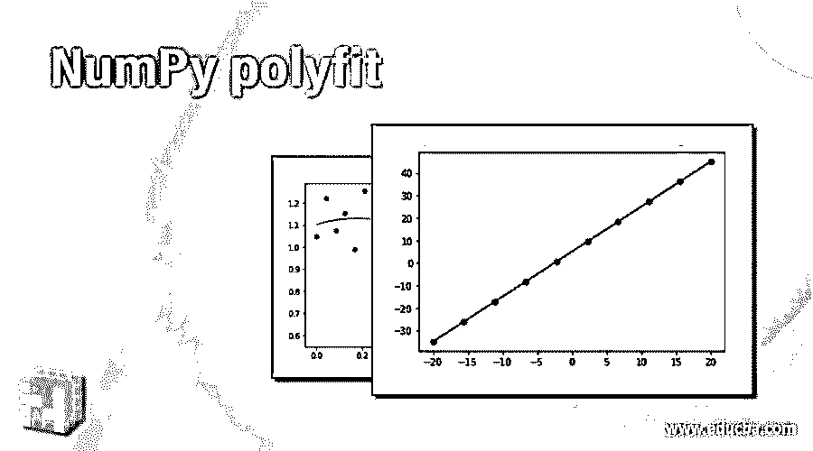
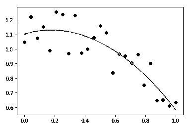
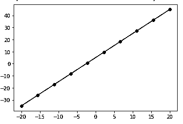

# NumPy polyfit

> 原文：<https://www.educba.com/numpy-polyfit/>




## NumPy polyfit 简介

在 python 中，Numpy polyfit()是一种在多项式函数中拟合数据的方法。也就是说，它最小二乘函数多项式拟合。例如，度的多项式 p(X)拟合坐标点(X，Y)。这个函数返回一个系数向量 p，它减少了 deg，deg-1，…0 阶的平方误差。然而，当最小二乘拟合条件较差时，polyfit 会发出分级警告。这意味着，由于数值误差，最佳拟合没有被正确定义。可以通过用 x-mean(x)代替 x 或者最小化多项式次数来增强结果。

### NumPy polyfit 的语法和参数

下面是 numpy 中 polyfit 方法的语法。

<small>网页开发、编程语言、软件测试&其他</small>

```
numpy.polyfit( x , y , deg , rcond = None , full = False, w = None, cov = False)
```

**参数:**

*   **x:** 该参数为数组状，形状为(M，)大小。

–表示(x[i]，y[i])的 M 样本 x 坐标值。

*   **y:** 该参数为数组状，形状为(M，)或(M，K)大小。

–表示(x[i]，y[i])的 M 样本 y 坐标值。

*   **Deg:** int 值即拟合多项式次数。
*   **rcond:** 被认为是可选的浮点值。

-此参数表示配合的相对条件值。

–可以避免小于最高奇异值相对条件的单数。

-len(x)*ep 是 rcond 的默认值。

-这里，ep 是 float 类型的相对精度。

-在大多数情况下，2e-16 是值。

*   **full:** 布尔值，可选

-这被认为是负责返回值性质的开关。

-如果值为 false，则返回系数。

–如果该值为真，它将从奇异值分解中返回诊断数据。

*   **w:** 该参数为数组状，形状为(M，)大小。

-此参数权重放入采样点的 y 坐标。

-在高斯不确定性的情况下，必须使用 1/sigma 代替 1/sigma**2

*   **cov:** 可选的布尔值

-此参数返回估计值以及估计的协方差矩阵。

-如果 full 的值为 true，则该参数不会返回。

返回值:

*   **p:** 该参数是一个 n 数组，其形状为(deg + 1，)或(deg + 1，K)

-这是首先提到的具有最高幂的多项式系数。

–如果 y 的值是二维的，第 k 个数据集系数将被设置为 p[:，k]。

*   而且，只有当 full 的值为 true 时，才会返回列表[residuals，rank，singular_values，rcond]。这里，残差是最小二乘拟合的残差；Rank 是缩放后的范德蒙系数矩阵秩、奇异值和 rcond 的值。
*   **V:** 该值是一个 n 数组，其形状为 M，M)或(M，M，K)。

–只有当 full 的值为 false 且 cov 的值为 true 时，才会返回此值。

–多项式系数估计的协方差矩阵。

### polyfit 函数如何在 NumPy 中工作？

现在，让我们看看如何借助 numpy 标准库中的 polyfit 函数拟合多项式数据，Python 中提供了该函数。

假设多项式中有一些数据。这是使用 polyfit()函数来拟合多项式中可用的数据。

次数为 1 的多项式是已知最简单的多项式。

它是用公式 y=m*x+c 提到的

类似地，2 次二次方程由以下方程表示

```
Y = ax**2 + bx + c
```

在这种情况下，polyfit 方法将查找 1 度的所有 m，c 系数。这将计算 2 度的 a、b 和 c 系数。

下面是一个简单行的示例代码。

**代码:**

```
import matplotlib.pyplot as mp
import numpy as np
x = np.linspace( -10 , 10 , 5 )
y = 2*x + 5
mp.plot( x , y , 'o' )
```

如果还添加了函数 polyfit()，代码将如下所示进行更改。

```
import matplotlib.pyplot as mp
import numpy as np
x = np.linspace( -10 , 10 , 5 )
y = 2*x + 5
coeff = np.polyfit(x,y,2)
xn = np.linspace(-20,20,100)
yn = np.poly1d(coeff)
mp.plot( xn,yn(xn),x,y,'o')
```

**注:**

在某些情况下，拟合多项式系数本质上是条件恶劣的。例如，在多项式次数较高或采样点间隔居中较差的情况下。此外，在上述情况下，必须始终检查配合质量。如果多项式拟合不令人满意，一个很好的替代将是花键。

### NumPy polyfit 示例

让我们看看 numpy 中 polyfit 函数的更多示例:

#### 示例#1

拟合多项式函数的 Python 程序

**代码:**

```
import numpy as np
import matplotlib.pyplot as mp
np.random.seed(12)
x = np.linspace( 0, 1, 25 )
y = np.cos(x) + 0.3*np.random.rand(25)
p = np.poly1d( np.polyfit(x, y, 4) )
t = np.linspace(0, 1, 250)
mp.plot(x, y, 'o', t, p(t), '-')
mp.show()
```

**输出:**




在这个程序中，首先，导入库 matplotlib 和 numpy。设置 x、y、p 和 t 的值。然后，使用 x、y、p 和 t 的值，通过拟合绘制多项式。

#### 实施例 2

Python 程序拟合简单直线的多项式函数

**代码:**

```
import numpy as np
import matplotlib.pyplot as mp
np.random.seed(12)
x=np.linspace(-20,20,10)
y=2*x+5
coeff = np.polyfit(x,y,2)
xn = np.linspace(-20,20,100)
yn = np.poly1d(coeff)
mp.plot( xn,yn(xn),x,y,'o')
```

**输出:**




在这个程序中，首先导入库 matplotlib 和 numpy。设置 x 和 y 的值。然后，计算多项式并设置 x 和 y 的新值。完成后，使用函数 polyfit()拟合多项式。

### 结论

Numpy polyfit()是 python 中提供的一种方法，用于拟合多项式函数中的数据。这里，它最小二乘函数多项式拟合。也就是说，度数的多项式 p(X)拟合坐标点(X，Y)。在本文中，将详细解释 polyfit()函数的语法、工作原理和示例等不同方面。

### 推荐文章

这是 NumPy polyfit 的指南。这里我们讨论 polyfit 函数如何在 NumPy 中工作，并给出代码和输出的例子。您也可以看看以下文章，了解更多信息–

1.  [安装 NumPy](https://www.educba.com/install-numpy/)
2.  [NumPy 数组函数](https://www.educba.com/numpy-array-functions/)
3.  [NumPy 函数](https://www.educba.com/numpy-functions/)
4.  num py . unique()


