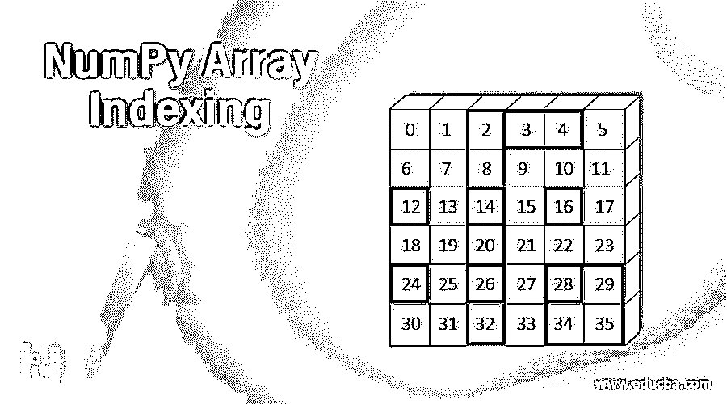

# NumPy 数组索引

> 原文：<https://www.educba.com/numpy-array-indexing/>




## NumPy 数组索引简介

每当我们想要访问给定数组中的任何元素时，我们就利用 python 中称为数组索引的概念。其中索引意味着引用数组中元素的索引号，使用该索引号可以访问数组的元素。NumPy 中任何给定数组的索引从零开始，这意味着给定数组中第一个元素的索引号为零；同样，给定数组中第二个元素的索引号是 1，以此类推，这种使用索引访问给定数组元素的概念在 NumPy 中称为数组索引。

### 句法

Python 中 NumPy 3D 数组索引的语法如下:

<small>网页开发、编程语言、软件测试&其他</small>

#### 1.在一维数组的情况下

```
numpy.arrayname(indexnumberofthearrayelement)
```

其中 arrayname 是数组的名称，可以使用数组的索引从该数组中检索数组元素

indexnumberofthearrayelement 表示由 arrayname 表示的给定数组中每个元素对应的索引号。

#### 2.在二维阵列的情况下

```
numpy.arrayname(dimensionnumber, indexnumberofthearrayelement)
```

其中 arrayname 是数组的名称，可以使用数组的索引从该数组中检索数组的元素，

dimensionnumber 指定了数组的维度

indexnumberofthearrayelement 表示由 arrayname 表示的给定数组中每个元素对应的索引号。

#### 3.在二维阵列的情况下

```
numpy.arrayname(dimensionnumber1, dimensionnumber2, indexnumberofthearrayelement)
```

其中 arrayname 是数组的名称，可以使用数组的索引从该数组中检索数组的元素，

dimensionnumber1 指定数组的第一维，

dimensionnumber2 指定数组的第二个维度

indexnumberofthearrayelement 表示由 arrayname 表示的给定数组中每个元素对应的索引号。

### 在 NumPy 中执行数组索引的步骤

*   每当我们想要访问给定数组中的任何元素时，我们就利用 python 中称为数组索引的概念。
*   索引意味着引用数组中元素的索引号，使用该索引号可以访问数组中的元素。
*   NumPy 中任何给定数组的索引从零开始，这意味着给定数组中第一个元素的索引号为零；同样，给定数组中第二个元素的索引号是 1，依此类推。
*   在一维数组的情况下，可以通过在方括号中指定数组名称，后跟数组中元素的索引号来访问给定数组中的元素。
*   在二维数组的情况下，可以通过在方括号中指定数组的名称，后跟数组的维数和数组中元素的索引号来访问给定数组中的元素。
*   给定数组中的元素可以通过在方括号中指定数组的名称，后跟数组的维数 1、数组的维数 2 和数组中元素的索引号(如果是三维数组)来访问。

### NumPy 数组索引的示例

下面提到了不同的例子:

#### 示例#1

Python 程序，通过创建一维数组并使用索引将数组中的特定元素打印为屏幕上的输出来演示 NumPy 数组索引。

**代码:**

```
#importing the package numpy as pyn
import numpy as pyn
#creating an one dimensional array using the array function and storing it in the variable called onedimarray
onedimarray = pyn.array([1,2,3,4])
#displaying the elements of the newly created one dimensional array followed by an one line space
print 'The elements of the newly created one dimensional array are:'
print onedimarray
print '\n'
#Displaying the second element in the newly created one dimensional array using indexing in numpy
print 'The second element in the newly created one dimensional array is'
print onedimarray[1]
```

**输出:**


在上面的程序中，包 numpy 作为 pyn 导入，以利用 numpy 函数，如数组和索引。然后使用 numpy 中的 array 函数创建一个一维数组。然后，新创建的一维数组的元素显示在屏幕上。然后，通过使用索引的概念，我们从新创建的数组中检索所需的元素。

#### 实施例 2

Python 程序通过创建二维数组并使用索引将数组中的特定元素打印为屏幕上的输出来演示 NumPy 数组索引:

**代码:**

```
#importing the package numpy as pyn
import numpy as pyn
#creating a two dimensional array using the array function and storing it in the variable called twodimarray
twodimarray = pyn.array([[1,2],[3,4]])
#displaying the elements of the newly created two dimensional array followed by an one line space
print 'The elements of the newly created two dimensional array are:'
print twodimarray
print '\n'
#Displaying the first element in the newly created two dimensional array using indexing in numpy
print 'The first element in the newly created two dimensional array is'
print twodimarray[0,1]
```

**输出:**


在上面的程序中，包 numpy 作为 pyn 导入，以利用 numpy 函数，如数组和索引。然后使用 numpy 中的 array 函数创建一个二维数组。然后，新创建的二维数组的元素显示在屏幕上。然后，通过使用索引的概念，我们从新创建的数组中检索所需的元素。

#### 实施例 3

Python 程序通过创建三维数组并使用索引将数组中的特定元素打印为屏幕上的输出来演示 NumPy 数组索引:

**代码:**

```
#importing the package numpy as pyn
import numpy as pyn
#creating a two dimensional array using the array function and storing it in the variable called threedimarray
threedimarray = pyn.array([[[8,9], [3,4]], [[10,9], [8,6]]])
#displaying the elements of the newly created three dimensional array followed by an one line space
print 'The elements of the newly created three dimensional array are:'
print threedimarray
print '\n'
#Displaying the second element in the newly created three dimensional array using indexing in numpy
print 'The second element in the newly created three dimensional array is'
print threedimarray[0,1,1]
```

**输出:**


在上面的程序中，包 numpy 作为 pyn 导入，以利用 numpy 函数，如数组和索引。然后使用 numpy 中的 array 函数创建一个三维数组。然后，新创建的三维数组的元素显示在屏幕上。然后，通过使用索引的概念，我们从新创建的数组中检索所需的元素。

### 推荐文章

这是 NumPy 数组索引的指南。在这里，我们通过定义、语法来讨论 python 中 NumPy 数组索引的概念，并通过编程示例及其输出来检索 Python 中 1D、2D 和 3D 数组的元素。您也可以看看以下文章，了解更多信息–

1.  [NumPy vstack](https://www.educba.com/numpy-vstack/)
2.  [NumPy 回合](https://www.educba.com/numpy-round/)
3.  num py . unique()
4.  [NumPy fft](https://www.educba.com/numpy-fft/)


