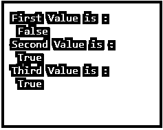
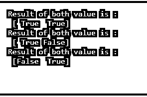
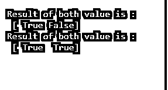
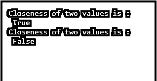

# NumPy isclose

> 原文：<https://www.educba.com/numpy-isclose/>


## 数字的定义是封闭的

Python 为用户提供了不同的功能。为了处理数组，python 库提供了一个 numpy 函数。Numpy 是数字 python 的首字母缩写。Numpy 执行数组的逻辑和数学运算。在 python 中，numpy 比 list 要快。这是因为 numpy 数组可以存储在连续的位置。因此，可以有效地进行处理和操作。Numpy isclose 方法用于检查两个给定值是否接近。isclose 方法的结果返回一个布尔值。这意味着如果给定的值接近，那么它将返回“真”，否则它将返回“假”。isclose 方法使用相对或绝对容差来检查值的接近程度。

**语法:**

<small>网页开发、编程语言、软件测试&其他</small>

```
import numpy as np
import math
math.isclose(p, q, relative_tol=value, absolute_tol=value )
```

**解释:**在上面的语法中，我们首先导入 numpy 类并访问一个作为 np 的 numpy 类，然后导入数学库。通常，在 isclose 方法中，我们使用以下参数。

*   p =这是 isclose 方法的第一个值。此参数对于该方法是必需的。
*   q =这是 isclose 方法的第二个值。它用于检查值的接近程度。这是一个必需参数。
*   relative_tol =这是一个可选参数，称为相对公差。相对公差就是 p 值和 q 值之间允许的最大差值。相对公差的默认值介于 1e-09 之间。
*   absolute_tol =这是一个可选参数，称为绝对公差。绝对公差比较接近 0 的值。绝对公差的值至少应为 0。

### isclose 方法在 NumPy 中是如何工作的？

*   我们必须在您的系统上安装 Python。
*   我们必须使用 pip 命令安装 numpy。
*   我们需要 Python 的基础知识。
*   我们需要关于 numpy 的基本知识。
*   我们可以检查这些值的接近程度。

### NumPy isclose 示例

让我们看看如何用不同的例子实现 isclose 方法。

#### 示例#1

**代码:**

```
import numpy as anp
import math
print("First Value is : \n", math.isclose(2.555,2.3566))
print("Second Value is : \n",math.isclose(2.555,2.555))
print("Third Value is : \n",math.isclose(2.555,2.555000001))
```

**输出:**




**解释**

*   我们导入 numpy 函数并将它们用作 anp。
*   我们导入数学库。
*   我们使用 isclose 方法来检查接近度较大的值的接近度。因此，它将返回一个假值。
*   对于非常接近的值，我们再次使用 isclose 方法。因此它将返回一个真值。
*   此外，对于接近的值，我们使用 isclose 方法。因此它将返回一个真值。

在上面的例子中，我们尝试实现 math.isclose 函数。通过使用下面的快照来说明上述声明的最终结果。

#### 实施例 2

**代码:**

```
#import numpy and math library
import numpy as cnp
import math
#To check closeness of the values
print("Result of both value is : \n", cnp.isclose([2,5.5], [2,5.5]))
print("Result of both value is : \n",cnp.isclose([1e9,1e-7], [1.00001e9,1e-8]))
print("Result of both value is : \n",cnp.isclose([1e6,1e-9], [1.0001e6,1e-8]))
```

**输出:**




**解释**

*   我们导入 numpy 函数并将它们用作 cnp。
*   我们导入数学库。
*   我们使用 isclose 方法来检查两个值的接近程度，这两个值都是真的
*   同样，我们对两个不同的值使用 isclose 方法，第一个值非常接近，第二个值不同。因此，它将返回一个 true 和 false 值。
*   此外，我们对两个不同的值使用 isclose 方法，即第一个值不接近，第二个值接近。因此它将返回一个假值和一个真值。

在上面的例子中，我们试图使用 isclose 和 math 函数来检查多个值是否闭合。通过使用下面的快照来说明上述声明的最终结果。

#### 实施例 3

**代码:**

```
#import numpy and math library
import numpy as cnp
import math
#To check closeness of the values
print("Result of both value is : \n",cnp.isclose([2.1, cnp.nan], [2.1, cnp.nan]))
print("Result of both value is : \n",cnp.isclose([4.1, cnp.nan], [4.1, cnp.nan], equal_nan=True))
```

**输出:**




**解释**

*   我们导入 numpy 函数并将它们用作 cnp。
*   我们导入数学库。
*   我们使用 isclose 方法来检查两个值的接近程度，第一个值接近，第二个值缺失。因此，第一个值为真，第二个值为假
*   类似地，我们试图通过使用具有不同值的相同函数来找出更接近的值，其中第一个值更接近，第二个值缺失，但是这里我们声明 nan 等于 true。因此两个值都为真。

在上面的例子中，我们已经通过使用相同的函数检查了缺失值是否更接近。通过使用下面的快照来说明上述声明的最终结果。

#### 实施例 4

因为绝对公差是有定义的。

**代码:**

```
# Import math library
import math
# check closeness of the two values
print("Closeness of two values is : \n", math.isclose(7.05, 7.06, abs_tol = 0.1))
print("Closeness of two values is : \n",math.isclose(4.666, 4.450, abs_tol = 0.150))
```

**输出:**




**解释**

*   首先，我们导入数学库，并将其作为 math 来访问。
*   然后我们在定义绝对公差时，检查两个值的接近程度。这里绝对容差非常接近，所以它返回 true。
*   在第二种情况下，我们也检查两个值的接近程度，但这里的绝对容差是不同的。因此它返回 false。

在上面的例子中，当给定绝对公差时，我们已经实现了 isclose 函数。通过使用下面的快照来说明上述声明的最终结果。

### 结论

我们希望从这篇文章中你已经了解了 numpy isclose 函数。从上面的文章中，我们已经了解了 numpy isclose 函数的基本语法。我们还通过 isclose 函数的不同示例学习了如何在 python 中实现它们，我们还学习了 Python 中的数学函数。从本文中，我们了解了如何在 python 中处理 numpy isclose 和 math 函数。

### 推荐文章

这是 NumPy isclose 的指南。在这里，我们将讨论在 numpy 中 isclose 方法的介绍和工作原理。以及不同的示例及其代码实现。您也可以看看以下文章，了解更多信息–

1.  [NumPy 连接](https://www.educba.com/numpy-concatenate/)
2.  [NumPy hstack](https://www.educba.com/numpy-hstack/)
3.  [最大数量](https://www.educba.com/numpy-max/)
4.  [NumPy 回合](https://www.educba.com/numpy-round/)


