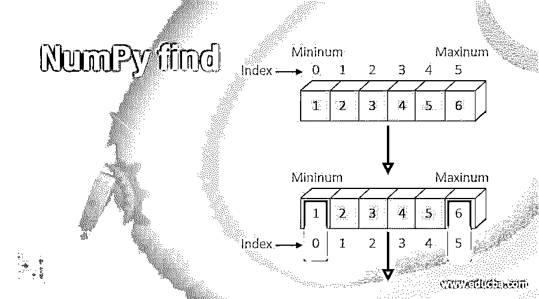

# 数字查找

> 原文：<https://www.educba.com/numpy-find/>




## NumPy find 简介

在 python 中，numpy.core.defchararray.find()是一个函数，它为标识子字符串的每个元素返回字符串中的最小索引。在 python 中，有几个库可用于执行不同的功能，NumPy 就是这样一个对数组功能有帮助的 python 库。除此之外，许多线性代数、矩阵运算和傅立叶变换运算也可以使用这个库。让我们在下面的小节中看到更多关于 find()函数的内容。

**语法**

<small>网页开发、编程语言、软件测试&其他</small>

下面是 numpy 中 find 函数的语法。

```
numpy.core.defchararray.find(arr, sub, start=0, end=None)
```

**该功能的参数有:**

*   **arr:** 需要搜索的字符串或数组。
*   **sub:** 要搜索的子字符串。
*   **开始，结束:** [ int，可选]必须搜索的范围。

**该函数的返回值:**

字符串中标识子字符串的每个元素的最小索引。

如果没有找到子串，将返回-1。

### 如何在 NumPy 找工作？

让我们用一个例子来看看 NumPy Find 的工作原理。

假设有一个字符串“千年”，并将其存储在变量 str 中，如下所示。

```
str= 'thousand years'
```

如果必须找到该字符串中子串的最低索引，请使用 numpy 中的 find()函数，如下所述。

```
a = np.char.find( str , 'world', start=0, end=None)
```

索引存储在变量 a 中，以后可以打印出来。

**注:**

在新的开发中，不推荐使用“chararray”类，因为它在 Numarray 中向后兼容。从 numpy 版开始，如果需要字符串数组，建议使用' string_ '、' dtype '、' unicode_ '、' object_ '数组，并使用模块' numpy.char '中可用的免费函数来执行快速矢量化字符串任务。但是，只有在您使用的 Python 版本中存在匹配的字符串方法时，才能访问一些方法。此外，“numpy.char”是“defchararray”的理想别名。

### NumPy find 示例

如上所述，让我们看看 NumPy find 上的一些示例程序。

#### 示例#1

Python 程序，通过在数组元素中查找子串“ap”来演示查找功能。

**代码:**

```
# Python Program that demonstrates the find function
# import the numpy library and set alias name as np
import numpy as np
# Declare an array with four elements
arr1 = ['Happy' , 'swap', 'Map', ' Laptop']
print ("array is  : ", arr1)
print (" \n find of substring 'ap' ", np.char.find(arr1, 'ap'))
print (" find of substring 'ap' ", np.char.find(arr1, 'ap', start = 0))
print (" find of substring 'ap' ", np.char.find(arr1, 'ap', start = 8))
```

**输出:**


在这个程序中，首先，导入 numpy 库，并将别名设置为 np。之后，用['Happy '，' swap '，' Map '，' Laptop']等四个元素声明一个数组。然后，打印原始数组。完成后，使用不同的起始值打印子字符串的最低索引。因为找不到子字符串，所以也返回-1。

#### 实施例 2

Python 程序，通过查找子字符串“world”来演示查找功能

**代码:**

```
# Python Program that demonstrates the find function
# import the numpy library and set alias name as np
import numpy as np
# Declare a string
str= 'Helloworld'
#find the index of the substring 'world' and store it in a
a = np.char.find( str , 'world', start=0, end=None)
#print the index
print (a)
```

**输出:**


首先，在这个程序中导入 numpy 库，并设置一个别名为 np。然后，声明一个字符串“Helloworld”。一旦完成，就会找到子串“world”索引并存储在变量 a 中。之后，在执行代码时打印出索引。这里，5 是子字符串“world”的索引。

#### 实施例 3

Python 程序，通过查找子字符串“World”来演示查找功能

**代码:**

```
# Python Program that demonstrates the find function
# import the numpy library and set alias name as np
import numpy as np
# Declare a string
str= 'Helloworld'
#find the index of the substring 'World' and store it in a
a = np.char.find( str , 'World', start=0, end=None)
#print the index
print (a)
```

**输出:**


同样在这个程序中，首先导入 numpy 库，并将别名设置为 np。然后，声明一个字符串“Helloworld”。一旦完成，就会找到子字符串“World”索引，并将其存储在变量 a 中。这里，World 中的‘W’是大写字母，在上面的程序中，‘W’是小写字母。由于原始字符串以小写字母“w”表示，并且 python 区分大小写，因此 find()函数无法识别给定字符串中的 World。之后，在执行代码时打印索引。在这里，由于未找到子字符串“World”的索引，因此返回-1。

#### 实施例 4

Python 程序，通过在数组元素中查找子串“al”来演示查找功能。

**代码:**

```
# Python Program that demonstrates the find function
# import the numpy library and set alias name as np
import numpy as np
# Declare an array with four elements
arr1 = ['Walk' , 'Talk', 'Call', ' Small']
print ("array is  : ", arr1)
print (" \n find of substring 'al' ", np.char.find(arr1, 'al'))
print (" find of substring 'al' ", np.char.find(arr1, 'al', start = 0))
print (" find of substring 'al' ", np.char.find(arr1, 'al', start = 2))
```

**输出:**


在这个程序中，用四个元素声明一个数组:['Walk '，' Talk '，' Call '，' Small']。在执行代码时，将使用不同的起始值返回子字符串的最低索引。因为找不到子字符串，所以也返回-1。

### 结论

numpy.core.defchararray.find()是 python 中的一个函数，它为标识子字符串的每个元素返回字符串中的最小索引。本文将详细讨论广播的不同细节，例如工作和示例。

### 推荐文章

这是 NumPy find 的指南。在这里，我们将详细讨论 Find 在 NumPy 和示例中的工作方式，以及代码和输出。您也可以看看以下文章，了解更多信息–

1.  [NumPy hstack](https://www.educba.com/numpy-hstack/)
2.  [numpy.ravel()](https://www.educba.com/numpy-dot-ravel/)
3.  [NumPy 连接](https://www.educba.com/numpy-concatenate/)
4.  [NumPy fft](https://www.educba.com/numpy-fft/)


