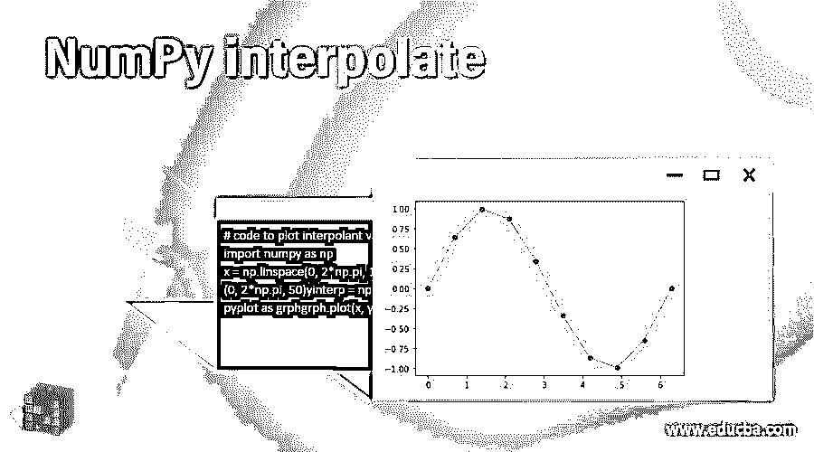
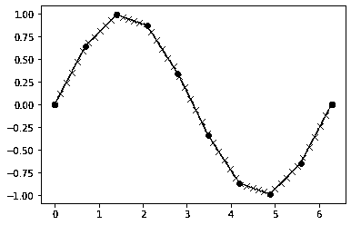

# 数字插值

> 原文：<https://www.educba.com/numpy-interpolate/>




## 数字插值简介

插值从一组不同的数据点创建新的预测数据点。这是已知的，并且存在许多类型的插值，例如分段常数、多项式、线性、基样条和三次样条。在插值中，数据提供近似函数的形状，使用分段或更高阶的多项式方程来精确对应那些给定不同位置的数据点。在这个主题中，我们将学习 NumPy 插值。

### 语法和参数

numpy 中的插值是通过使用函数 numpy.interp 实现的

<small>网页开发、编程语言、软件测试&其他</small>

numpy 插值函数的基本语法是，

```
numpy.interp(x, xp, fp, left=none, right=none, period=none)
```

上述语法用于一维线性插值。

它将把一维分段线性插值值返回给具有不同数据点 xp 和 fp 的函数，该函数在 x 处被求值。

**参数**

*   **x** :这是一个一维数组，我们需要对其进行插值。它包含插值数据点的 x 坐标。
*   **XP**:float 数据类型的一维序列，包含数据点的 x 坐标。这些值应该在增加。
*   **fp** :浮点数据类型的一维序列，包含数据点的 x 坐标。fp 和 xp 的长度应该相同，即 x 坐标的数量应该与 y 坐标的数量相同。
*   **left** :浮点数据类型的可选参数。为条件 x < xp[0]返回的值，默认值为 fp[0]。
*   **右**:浮点数据类型的可选参数。为条件 x > xp[-1]返回的值，默认值为 fp[-1]。
*   **期间**:浮点数据类型的可选参数。为 x 坐标指定了一个周期。该规范允许角度 x 坐标的适当插值。如果指定了周期，参数 right 和 left 将被忽略。
*   **y** :是插值函数的返回值。根据 fp 数据点或 n 维数组，数据类型可以是浮点型，也可以是复杂型。
*   **ValueError:** 如果 xp 和 fp 的长度不同，或者 xp 或 fp 不是一维序列，或者如果 period == 0，将抛出错误

### NumPy 插值示例

下面给出了 NumPy 插值的示例:

#### 示例#1

让我们讨论一个基本的例子来理解 numpy 插值函数是如何工作的。

**代码:**

```
# simple program in python to explain numpy.interp() function
# importing numpy python library as np
import numpy as np
x = 5
xp = [2, 4, 6, 8, 10]
print("x coordinates =", xp)
fp = [1, 2, 3, 4, 5]
print("y coordinates =", fp)
interpolated_value = np.interp(x, xp, fp)
print ("The interpolated value for x = 5 is ", interpolated_value)
```

**输出:**


在上面的例子中，我们声明了两个一维数组 xp 和 fp，其中包含了离散数据点的 x 坐标和 y 坐标。然后我们给一维数组 x 赋值 5，我们需要找到它的 y 坐标。在下一步中，我们打印了两个数组。在下一步中，使用 interp 函数进行插值。在最后一步，我们打印了插值。对于值 x = 5，返回的插值是 2.5。

**重要提示**

x 坐标必须不断增加。但是这不是明确强制的。如果 x 坐标值没有增加，那么插值的结果就没有意义。要检查序列是否连续增加，请遵循以下步骤。

```
np.all(np.diff(xp) > 0)
```

#### 实施例 2

**代码:**

```
# program to check whether x coordinates are strictly increasing.
import numpy as np
xp = [2, 4, 6, 8, 10]
fp = [5, 4, 3, 2, 1]
#check condition
print (np.all(np.diff(xp) > 0))
print (np.all(np.diff(fp) > 0))
```

**输出:**


在上面的例子中，你可以看到 x 坐标不断增加，y 坐标不断减少。为了检查，我们运行上面的程序。在第一个条件中，我们检查 x 坐标，结果为真。在第二个条件中，我们检查 y 坐标，结果是假的。

#### 实施例 3

这个例子将讨论我们如何使用十进制参数来更好地理解插值概念。

**代码:**

```
# simple program in python to explain interpolation
# importing numpy python library as np
import numpy as np
x = [1.5, 2.75, 4.25, 7.35, 9.13]
xp = [2, 4, 6, 8, 10]
print("x coordinates =", xp)
fp = [1, 2, 3, 4, 5]
print("y coordinates =", fp)
interpolated_value = np.interp(x, xp, fp)
print ("The interpolated values are ", interpolated_value)
```

**输出:**


在上面的例子中，我们声明了两个一维数组 xp 和 fp，其中包含了离散数据点的 x 坐标和 y 坐标。然后我们给一维数组 x 赋了五个值，为此我们需要找到 y 坐标。在下一步中，我们打印了两个数组。在下一步中，使用 interp 函数进行插值。最后，在最后一步，我们打印了插值。

#### 实施例 4

让我们试着找出正弦函数的内插值。

**代码:**

```
# code to plot interpolant values for the sine function.
import numpy as np
x = np.linspace(0, 2*np.pi, 10)y = np.sin(x)x_values = np.linspace(0, 2*np.pi, 50)yinterp = np.interp(x_values, x, y)import matplotlib.pyplot as grphgrph.plot(x, y, 'o')grph.plot(x_values, yinterp, '-x')grph.show()
```

**输出:**




在上面的例子中，我们将 x 和 y 坐标声明为正弦函数。然后我们用插值函数来寻找插值值。然后我们导入 matplotlib.pyplot 库来绘制曲线。在最后一步中，我们绘制图表并显示输出。

### 结论

本文使用各种示例详细讨论了 numpy interp 函数，以便清楚地理解 Numpy Interp 函数及其用途。我们还讨论了如何寻找正弦函数的插值。同样，我们可以使用 interp 函数来查找各种函数的未知值。我们希望这篇文章能有所帮助。

### 推荐文章

这是一个数字插值指南。这里我们讨论各种例子来理解 numpy interp 函数及其用途。您也可以看看以下文章，了解更多信息–

1.  [NumPy fft](https://www.educba.com/numpy-fft/)
2.  [NumPy 挤压](https://www.educba.com/numpy-squeeze/)
3.  [numpy.ravel()](https://www.educba.com/numpy-dot-ravel/)
4.  [NumPy 连接](https://www.educba.com/numpy-concatenate/)


