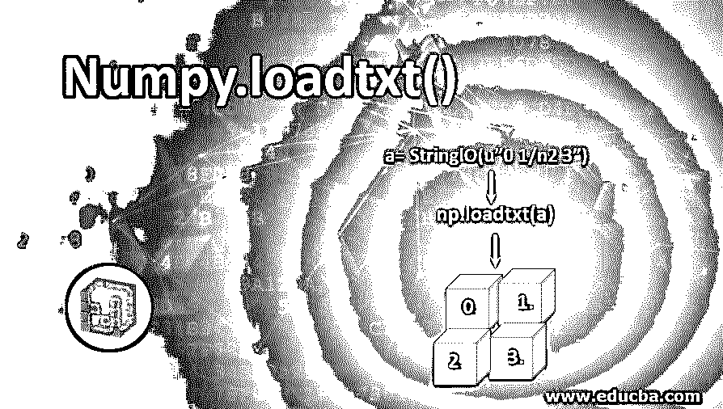
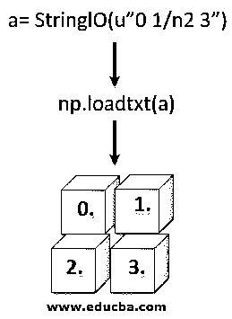

# Numpy.loadtxt()

> 原文：<https://www.educba.com/numpy-dot-loadtxt/>




## Numpy.loadtxt()简介

NumPy.loadtxt 是 Python 核心库的一部分，该核心库旨在对本质上主要是科学的大数据执行大量计算工作。NumPy 库允许程序员结合大数据的逻辑分析进行数学和科学计算分析。

### Numpy.loadtxt()的用法

Python 语言中使用这个函数是为了从各种文本文件中获取数据。主要是充当专门针对统一文本文件的快速文本阅读器。请注意，读取的数据必须在包含的所有行数中具有相同数量的元素。

<small>网页开发、编程语言、软件测试&其他</small>

**语法:**

Python 语言中使用 numpy.loadtxt 的语法

```
numpy.loadtxt (fname ,dtype =' float ', comments =' # ', delimiter = None , converters = None, skiprows = 0, usecols = None, unpack = False, ndmin = 0)
```

### 在 Python 语言中使用 numpy.loadtxt 的参数

| **参数名称** | **参数说明** |
| **f** **姓名** | 

*   Or the file name generator is generated for reading data.
*   In case the file extension becomes .bz2 or. In this case, the processed file must be decompressed first.
*   It must be noted that the generator must be able to return byte equivalent strings compatible with python 3k.

 |
| **d** **型** | 

*   This parameter returns the data type related to the array that is processed by the function.
*   Note: If the structure of the input initial data is processed by a function, the returned result array is one-dimensional.
*   , the default data type returned is not
*   Each row of this data is considered as a result array.

的唯一元素 |
| **d**T2】淘汰者 | 

*   This parameter defines the parameters used to separate data tables
*   Note: the separator of the error value is a space.

 |
| **c** **转换器** | 

*   This parameter represents an organized dictionary that maps different column numbers to specific functions, thus converting the specified columns into floating-point data types.
*   For example, for the column number 0 containing date, it has a string value and the following converter (converter ={0:datestr2num})

 |
| **年代** **腌鱼** | 

*   This parameter is used to skip any line specified by the user. The default value of the parameter is zero.

 |
| **usecols(可选参数)** | 

*   This parameter defines the column number that the program needs to read first.
*   For example, use parameterusecols = (0 0,3,4) to extract the 1st, 4th and 5th columns respectively. The default parameter here is None.
*   For a single column to be read, just specify the integer representing its position (for example, usecols = (4,) will only read the 5th column).

 |
| **解包(可选参数)** | 

*   If the parameter becomes true, the result array is transposed to unpack the parameter.
*   , this is by using a, b, c=loadtxt (...)
*   The default value is false when no parameter is specified.

 |
| **ndmin** | 

*   The _array returned by the parameter setting must be ndmin dimensional.
*   In case it doesn't happen, the one-dimensional axis is squeezed.

 |

**返回** **:** nd_array(运行函数后返回的结果数组)

### Python 语言中使用 numpy.loadtxt 的例子

以下代码展示了 python 中编码人员如何使用 numpy.loadtxt()函数:

#### 示例#1

**代码:**

```
# code written in python displaying the used of numpy.loadtxt() function
import numpy as n1
# Variable String1 defined which behaves as a file-object
from io import StringIO
x=StringIO("10 11 12 \n 13 14 15")
y=n1.loadtxt(x)
print ("The data extracted is:")
print(y)
```

**输出:**


#### 实施例 2

**代码:**

```
#code written in python displaying the used of numpy.loadtxt() function
import numpy as n1
#Variable String1 defined which behaves as a file-object
from io import StringIO
x = StringIO(u"F 54 58\nM 63 74")
ans = n1.loadtxt(x, dtype ={'names': ('sex', 'age', 'weight'),
'formats': ('S1', 'i4', 'f4')})
print("The resultant extracted array is as follow:")
print(ans)
```

**输出:**


### loadtxt()函数是如何工作的？

以下是如何显示包含四个元素 0、1、2 和 3 的字符串的图示。我们可以看到，原来以句子形式出现的字符串被转换成了一个数组，上面的内容构成了单独的元素。




我们可以理解前面提供的数据是一个字符串，因为它包含在双引号中。字符之间的空格将它们区分为数组中不同的元素。“\n”定义数组的维度投影轴。通过这个图，我们可以看到字符串是如何首先被定界并分解成单个元素，然后以有组织的数组的形式被捕获并显示给用户的。这对于 CSV 文件的转换特别有用。

### 结论

Numpy.loadtxt()函数提供了分解数据提取器函数的使用，以显示到数组中。这是用于大数据分析的一个非常重要的过程，它被预先组织到各个列中。这对于基于计算和数据分析的程序来说非常方便，不仅节省了时间，减少了冗长，而且使其他功能的执行更加容易。

### 推荐文章

这是 Numpy.loadtxt()的指南。这里我们讨论在 Python 语言中使用 numpy.loadtxt 以及参数的例子。您也可以看看以下文章，了解更多信息–

1.  [NumPy 函数](https://www.educba.com/numpy-functions/)
2.  [numpy.sort](https://www.educba.com/numpy-sort/)
3.  [NumPy 中的矩阵乘法](https://www.educba.com/matrix-multiplication-in-numpy/)
4.  [NumPy 数组](https://www.educba.com/numpy-arrays/)


