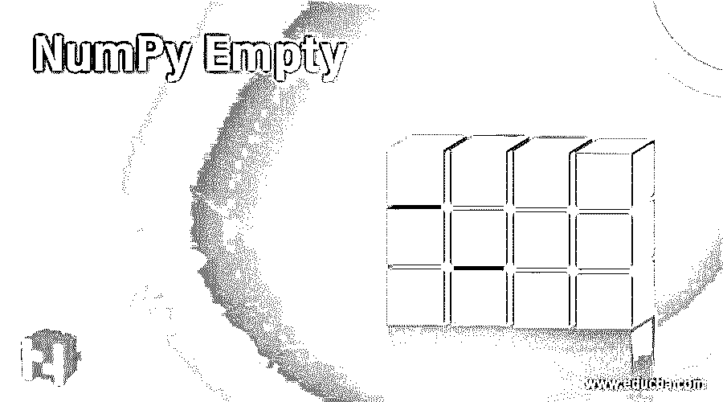
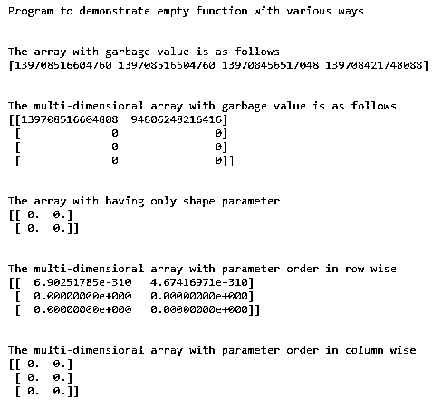

# NumPy 空的

> 原文：<https://www.educba.com/numpy-empty/>




## NumPy Empty 简介

在 Python 中，NumPy 模块用于处理数组并创建新数组，而无需初始化数组的任何条目，这意味着数组中的对象将被初始化为具有给定形状和类型的值“none ”,数组的这种创建是通过使用称为 empty()函数的函数来完成的，该函数具有默认数据类型 float，并且需要用户手动设置数组的值。在 Python 中，NumPy 模块还提供了另一个名为 numpy.zeros()的函数来创建一个新的空，就像 numpy.empty()函数所做的那样。

### NumPy empty()函数的工作原理

在本文中，我们将讨论 NumPy 函数 empty()。NumPy 主要用于处理多维数组或数组，为了处理这些数组，Numpy 模块在 Python 中提供了许多不同的函数。在本文中，我们将详细介绍 empty()函数，该函数用于创建一个新数组，该数组具有给定形状和数据类型的未初始化值和 none 值。这个函数不仅可以创建一个一维数组，还可以创建一个包含行和列的多维数组，其中每个单元格的数据都需要用户手动设置，否则 NumPy 数组对象将返回一些垃圾值，因此它比其他初始化为 0 或 1 的数组函数更快。

<small>网页开发、编程语言、软件测试&其他</small>

### NumPy Empty 的语法

现在让我们在下一节中看看 numpy.empty()函数的语法和示例。

**语法:**

```
numpy.empty(shape, dtype, order)
```

**参数:**

*   **shape:** 该参数是在 int 或 int 的元组中定义数组形状所必需的。
*   **dtype:** 该参数为可选参数，用于定义创建空数组的数据类型，默认情况下，其值设置为 float。
*   **order:** 该参数是一个可选参数，用于对多维数组按行和列进行排列或排序，其中按行排列则该值设置为“C”(C 风格)，如果要按列排列，则必须设置为“F”(Fortran 风格)，默认情况下，该值设置为 C。

此函数返回一个新的空数组，其中包含未初始化的条目或数据，但数组对象使用已定义或给定的形状和数据类型参数初始化为 none。

### NumPy 空示例

现在让我们在下面的简单例子中演示这个函数:

**代码:**

```
import numpy as np
print("Program to demonstrate empty function with various ways")
print("\n")
arr1 = np.empty(4, dtype = int)
print("The array with garbage value is as follows")
print(arr1)
print("\n")
arr2 = np.empty([4, 2], dtype = int)
print("The multi-dimensional array with garbage value is as follows")
print(arr2)
print("\n")
arr3 = np.empty([2,2])
print("The array with having only shape parameter")
print(arr3)
print("\n")
arr4 = np.empty([3,2], order = 'C')
print("The multi-dimensional array with parameter order in row wise")
print(arr4)
print("\n")
arr5 = np.empty([3,2], order = 'F')
print("The multi-dimensional array with parameter order in column wise")
print(arr5)
```

**输出:**




在上面的程序中，我们可以看到；首先，我们导入了一个 numpy 模块，然后我们为 NumPy 编写了一个别名命名为“np ”,并可用于 empty()函数的工作，以使用不同的参数创建一个新的空数组。首先，我们只是创建一个数据类型为“int”的一维数组，该一维数组中的元素数量声明为 4，因此它打印了一个包含 4 个元素的数组，这些元素具有 int 值，但具有垃圾值。然后我们创建一个二维数组，这将再次创建一个 4 行 2 列的数据类型为 int 的矩阵。类似地，我们创建了一个只有 shape 参数的数组，我们可以在输出中看到它被赋值为 0。最后，我们可以看到我们已经用值为“C”的 shape 和 order 参数声明了一个 empty()函数，该函数将以 3 行 2 列的方式显示多维数组，如上面的屏幕截图所示。然后，我们也看到了如何使用上面截图中使用“F”指定的顺序按列显示多维数据，作为上述各种 NumPy 方法的输出。不同的参数以不同的方式使用 empty()函数。

在 Python 中，在 NumPy 模块中，有类似于 empty()函数的另一个函数，例如 zeros()函数，它也用于创建空数组，但它可以初始化为零，而不是使用 empty()函数时初始化的垃圾值。作为 Python 中 NumPy 模块的 empty()和 zeros()函数之间的细微差别(分别使用 zeros()和 empty()函数初始化零和垃圾值)之一。这两个函数具有相似的语法，但是在 zeros 函数中，zero 的初始化不在 empty()函数中完成，因为它显示垃圾值，因为它有未初始化值的条目。因此，它可能更快，并且通常需要用户手动设置值。不过，在 numpy.empty()函数中手动设置值而不是垃圾值时，我们应该小心。

### 结论

在本文中，我们得出结论，Python 可以定义空数组或多维数组；它使用一个 NumPy 模块，该模块提供了一个使用 numpy.empty()函数创建空数组的函数，该函数不会使用给定的形状和数据类型(如 int 和 float)初始化数组中的任何条目作为该函数的默认值。在本文中，我们还看到了带有参数的 empty()函数的详细语法。此外，在本文中，我们还看到了一个简单的例子，其中我们编写了程序来演示所有使用的参数。最后，本文还看到了 zeros()和 empty()函数之间的区别。

### 推荐文章

这是一个指南 NumPy 空。这里我们讨论 NumPy empty()函数的工作原理，并给出例子和输出。您也可以看看以下文章，了解更多信息–

1.  [Numpy.argsort()](https://www.educba.com/numpy-argsort/)
2.  [numpy.diff()](https://www.educba.com/numpy-dot-diff/)
3.  [NumPy 数组](https://www.educba.com/numpy-arrays/)
4.  [numpy.ravel()](https://www.educba.com/numpy-dot-ravel/)


