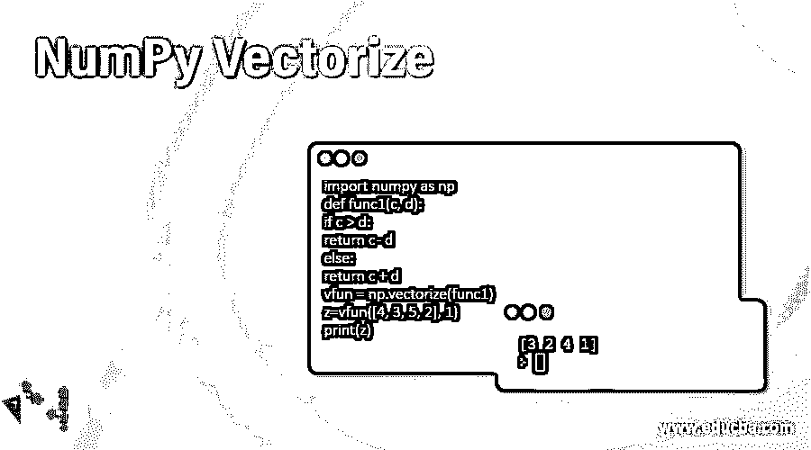
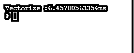
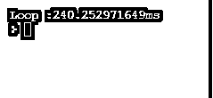

# NumPy 矢量化

> 原文：<https://www.educba.com/numpy-vectorize/>




## NumPy 矢量化简介

Python 为用户提供了不同的功能。为了处理矢量化，python 库提供了一个 numpy 函数。numpy 矢量化接受 numpy 数组或不同对象的层次顺序作为系统的输入，并生成单个 numpy 数组或多个 NumPy 数组。在连续的多个输入数组之后，numpy 矢量化像 python 地图函数一样计算 pyfunc，并帮助定义 NumPy 规则。我们使用 numpy 矢量化代替循环来提高速度。数组在数据科学中扮演着重要的角色，因为速度很重要。基本上，numpy 是一个开源项目。在 python 中，numpy 比 list 要快。因此，可以有效地进行处理和操作。

### NumPy 矢量化的语法

NumPy 矢量化的语法如下:

<small>网页开发、编程语言、软件测试&其他</small>

```
vectorize_funcunction = np.vectorize (function, parameter 1, parameter 2….. parameter N)
```

**解释**

在上面的语法中，vectorize_function 是函数名，np.vectorize 是 numpy 类，function 是带参数的用户自定义函数。我们在 numpy 向量中使用的参数如下。

Numpy 矢量化的不同参数如下。

**1。pyfunc:** 用来定义 python 的函数以及方法，必选。因此，它是一个可调用的参数。

**2。otypes:**otypes 表示输出数据类型，可选。在 otypes 中，它应该被指定为指定的数据类型列表或类型代码字符串。对于每个输出，必须指定一个数据。

**3。doc:**doc 是 docstring 的可选参数。如果 doc 中没有，那么 docstring 将是 pyfunc_doc_str。

**4。排除:**这是一个可选参数。此参数由一组字符串或整数组成，表示将不进行矢量化的函数的位置或关键字参数。一组字符串或整数将被不加修改地直接传递给 pyfunc。

**5。cache:**cache 是可选参数。它将缓存第一个函数调用，如果没有给定 True 和 otypes，它通常决定输出的数量。

**6。签名:**可选参数。它是一个广义的通用函数。例如，(a，b)，(b) - > (a)它用于向量化的矩阵-向量函数乘法。在任何给定的点上，pyfunc 将被调用(并且它必须返回)具有形状的数组，形状由查看焦点估计的大小给定。默认情况下，Pyfunc 应该接受标量作为输入和输出。

### NumPy 中的矢量化函数是如何工作的？

*   我们必须在您的系统上安装 Python。
*   我们必须使用 pip 命令安装 numpy。
*   我们需要 Python 的基础知识。
*   我们需要关于数组的基本知识。
*   我们可以使用 numpy 矢量化函数执行不同的操作。

让我们看看如何在数组上实现 numpy 矢量化函数。但是，首先，我们来看一下矢量化和非矢量化实现之间的区别。

#### 1.矢量化实现

主要和矩阵有关。在矢量化实现中，我们执行庞大的算法，如机器学习算法和神经语言算法。

**例子**

```
import numpy as np
import time
no = 100000
x = np.random.random(no)
y = np.random.random(no)
start = time.time()
z = np.dot(x,y)
end = time.time()
print("Vectorize :" + str((end-start)*1000)+ 'ms')
```

**解释**

在上面的例子中，我们使用数组实现了 numpy 矢量化函数。在这个程序中，我们用了两个数组，x 和 y，都是随机数，然后我们用点积表示 x 和 y 数组的乘积。此外，我们使用矢量化计算了 x 和 y 数组的总执行时间。因此，矢量化函数的执行时间最短。通过使用下面的快照来说明上述声明的最终结果。




#### 2.非矢量化实现

在这个实现中，我们使用一个循环来实现，与矢量化实现相比，非矢量化实现需要更多的时间来执行。

**举例:**

```
import numpy as np
import time
no= 100000
x=np.random.random(no)
y=np.random.random(no)
start = time.time()
z=0
for i in range(no):
    z += x[i] + y[i]
    end=time.time()
print("Loop :" + str((end-start)*1000)+ 'ms')
```

**解释**

在上面的例子中，我们实现了一个非矢量化的 numpy。在这个例子中，我们使用了一个循环来实现。这里我们使用了循环来代替矢量化。因此，非矢量化需要更多时间。通过使用下面的快照来说明上述声明的最终结果。




**示例:numpy 矢量化函数**

```
import numpy as np
def func1(c, d):
    if c > d:
        return c - d
    else:
        return c + d
vfun = np.vectorize(func1)
z=vfun([4, 3, 5, 2], 1)
print(z)
```

**说明:**

在这个例子中，我们实现了 numpy 矢量化。我们已经定义了一个矢量化函数，其中 m 和 n 是自变量。上例中使用的矢量化函数减少了代码的长度。在本例中，vfun 直接对阵列执行操作。通过使用下面的快照来说明上述声明的最终结果。


**示例:numpy 矢量化文档字符串**

```
import numpy as np
def func1(p, q):
    vecfunc.__doc__
vecfunc = np.vectorize(func1, doc="welcome to python")
a=vecfunc.__doc__
print(a)
```

**说明:**

对于矢量化，除非指定了 docstring，否则将从输入函数中获取 docstring。通过使用下面的快照来说明上述声明的最终结果。


**举例:排除**

```
import numpy as np
def pval(x, y):
    _x = list(x)
    res = _x.pop(0)
    while _x:
        res = res*y + _x.pop(0)
    return res
vect_pval = np.vectorize(pval, excluded=['x'])
z=vect_pval(x=[2, 4, 5], y=[1, 2])
print(z)
```

**说明:**

excluded 用于停止对某些参数进行矢量化。在这个例子中，我们实现了 polyval 中的多项式。最后，通过使用下面的快照来说明上述声明的最终结果。


以类似的方式，我们可以实现其余的参数，如 otype 和 signature，并在 numpy 矢量化的帮助下执行不同的操作。

### 结论

我们希望从这篇文章中你已经了解了 numpy 矢量化函数。从上面的文章中，我们已经学习了 numpy 矢量化函数的基本语法。我们还学习了如何用 Python 实现它们，每个参数有不同的例子。借助向量化函数，我们减少了算法的执行时间。从本文中，我们了解了如何在 python 中处理 numpy 矢量化。

### 推荐文章

这是 NumPy 矢量化的指南。在这里，我们讨论了矢量化函数如何在 NumPy 中工作，并给出了示例和解释。您也可以阅读以下文章，了解更多信息——

1.  num py . dot()
2.  [numpy.ravel()](https://www.educba.com/numpy-dot-ravel/)
3.  [NumPy 数组函数](https://www.educba.com/numpy-array-functions/)
4.  [numpy.pad()](https://www.educba.com/numpy-pad/)


