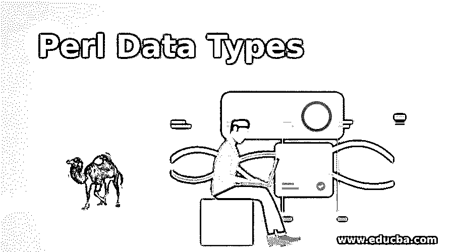
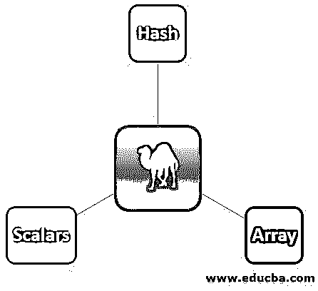
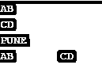
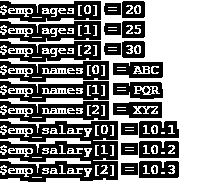
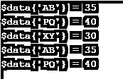

# Perl 数据类型

> 原文：<https://www.educba.com/perl-data-types/>

## Perl 数据类型的定义

Perl 数据类型基本上分为标量、数组和散列数据类型。perl 中的数据类型定义为 perl 变量所保存的[数据的类型，关于数据类型我们已经给变量定义了数据类型。在 perl 语言中，不需要定义数据的类型，解释器会根据数据的类型或上下文自动选择它。如果我们将整数和字符串赋给两个不同的变量，而没有定义任何数据类型，perl 解释器将根据赋给变量的数据进行选择。](https://www.educba.com/perl-variables/)

### Perl 数据类型及示例

下面是我们用 perl 语言编写代码时使用的数据类型。它主要分为以下三种类型。

<small>网页开发、编程语言、软件测试&其他</small>

*   数量
*   排列
*   混杂

标量数据类型以我的包名开始，前面有一个美元($)符号。标量数据类型表示单个单元数据数组数据类型只不过是标量变量的有序列表。数组数据类型以@符号开头。哈希数据类型只不过是一组键或值对。哈希数据类型以%符号开头。

以下是 Perl 数据类型的描述和示例。

#### 1.标量数据类型

*   标量数据类型被认为是一个单一的数据，它可以被认为是整数或字符串，我们也可以认为是浮点数。
*   标量数据类型以＄符号开头，以我的包名开头。标量数据类型是数据类型的单一单元。
*   标量数据类型基本上分为三种。
    *   整数(数字)
    *   线
    *   浮点数。

下面是标量整数、字符串和浮点数数据类型的示例和说明。

##### 标量整数(数字)数据类型

*   标量整数数据类型声明和初始化整数数据类型的状态。但是不需要定义整数，解释器自动把整数数据类型赋给变量。

下面的例子说明了整数标量数据类型。

**举例:**

`my $emp_id = 1;
my $emp_age = 20;          # this is scalar integer data type variable declaration.
my $emp_salary = 10000;
use warnings;
if (0<1)
{
print "$emp_id\n";
print "$emp_age\n";
print "$emp_salary\n";
}`

**输出:**

##### 标量字符串数据类型

*   标量字符串数据类型变量包含在单引号或双引号中。但是引号并不是字符串的实际部分，它只是指定字符串的开始和结束。
*   标量字符串数据类型基本上分为如下两种类型。
    *   单引号
    *   双引号

**单引号**

*   下面是单引号字符串数据类型的例子如下。
*   在以下示例中，单引号字符串数据类型将所有变量都视为字符串。在全名中，我们定义了标签值，但是单引号不能识别它。

**举例:**

`my $emp_fname = 'AB';
my $emp_lname = 'CD';        # this is scalar string data type variable declaration.
my $emp_address = 'PUNE';
my $emp_fullname = 'AB \t CD';
use warnings;
if (0<1)
{
print "$emp_fname\n";
print "$emp_lname\n";
print "$emp_address\n";
print "$emp_fullname\n"
}`

**输出:**

**双引号**

*   下面是双引号字符串数据类型的例子如下。
*   在下面的示例中，双引号字符串数据类型不认为所有变量都是字符串。在全名中，我们已经定义了选项卡值，单引号不会标识它。但是双引号字符串将标识制表符值。

**举例:**

`my $emp_fname = "AB";
my $emp_lname = "CD";        # this is scalar string data type variable declaration.
my $emp_address = "PUNE";
my $emp_fullname = "AB \t CD";
use warnings;
if (0<1)
{
print "$emp_fname\n";
print "$emp_lname\n";
print "$emp_address\n";
print "$emp_fullname\n"
}`

**输出:**

##### 标量浮点数数据类型

*   以下示例显示了整数标量数据类型。
*   标量浮点数数据类型用于定义浮点数。

**举例:**

`my $emp_salary = 100.50;
my $emp_age = 25.6;        # this is scalar floating point number data type variable declaration.
use warnings;
if (0<1)
{
print "$emp_salary\n";
print "$emp_age\n";
}`

**输出:**

#### 2.数组数据类型

*   数组数据类型只是标量数据类型的有序列表。数组数据类型以@符号开头。
*   数组变量的初始化我们需要用一个$符号来显示数组变量的单个元素。
*   下面是数组数据类型的例子。

**举例:**

`@emp_ages = (20, 25, 30);       # integer type variable array declaration.
@emp_names = ('ABC', 'PQR', 'XYZ');   # String type variable array declaration.
@emp_salary = (10.1, 10.2, 10.3);     # Floating point number array declaration.
use warnings;
if (0<1)
{
print "\$emp_ages[0] = $emp_ages[0]\n";
print "\$emp_ages[1] = $emp_ages[1]\n";
print "\$emp_ages[2] = $emp_ages[2]\n";
print "\$emp_names[0] = $emp_names[0]\n";
print "\$emp_names[1] = $emp_names[1]\n";
print "\$emp_names[2] = $emp_names[2]\n";
print "\$emp_salary[0] = $emp_salary[0]\n";
print "\$emp_salary[1] = $emp_salary[1]\n";
print "\$emp_salary[2] = $emp_salary[2]\n";
}`

**输出:**

#### 3.哈希数据类型

*   perl 中的散列数据类型只不过是一组键或值对。哈希变量以%符号开头。
*   散列变量的初始化我们需要使用%符号来显示散列变量的单个元素。
*   下面是散列数据类型的示例。

**举例:**

`%data = ('AB', 20, 'PQ', 25, 'XY', 30, 'AB', 35, 'PQ', 40);
# Hash data type variable declaration.
use warnings;
if (0<1)
{
print "\$data{'AB'} = $data{'AB'}\n";
print "\$data{'PQ'} = $data{'PQ'}\n";
print "\$data{'XY'} = $data{'XY'}\n";
print "\$data{'AB'} = $data{'AB'}\n";
print "\$data{'PQ'} = $data{'PQ'}\n";
}`

**输出:**

### 结论

Perl 数据类型基本上分为三种类型:标量、数组和散列数据类型。perl 中的数据类型定义为 perl 变量持有哪种类型的数据，关于数据类型我们已经给变量定义了数据类型。数据类型非常重要。

### 推荐文章

这是关于 Perl 数据类型的指南。在这里，我们还讨论了 perl 数据的介绍和类型，以及不同的例子和它的代码实现。您也可以看看以下文章，了解更多信息–

1.  [Perl if 语句](https://www.educba.com/perl-if-statements/)
2.  [在 Perl 中拆分](https://www.educba.com/split-in-perl/)
3.  [Perl last](https://www.educba.com/perl-last/)
4.  [Perl 注释](https://www.educba.com/perl-comments/)

