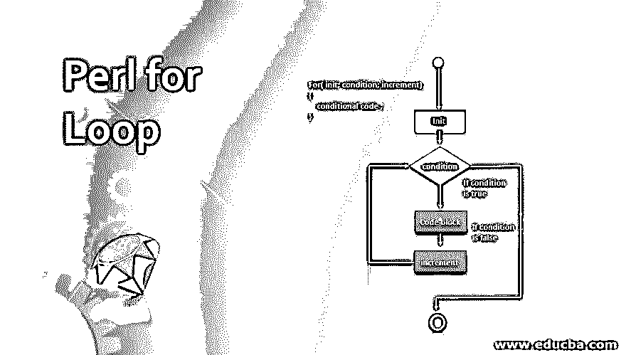
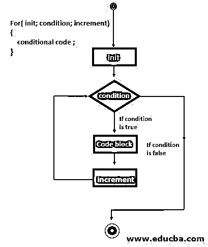
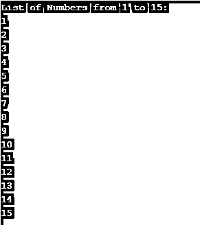
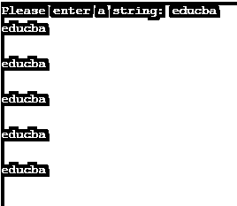
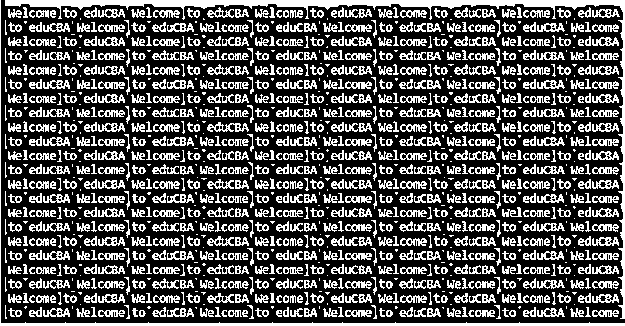

# Perl for 循环

> 原文：<https://www.educba.com/perl-for-loop/>

## Perl for 循环简介

Perl for loop 是多次执行程序的循环，主要用在我们需要多次运行或执行某些任务的情况下，适用于迭代次数有限且固定的少量迭代。Perl for loop 也以 c 风格 for loop 而闻名。For 循环有两部分，头和体，其中头用于指示迭代，体将根据迭代执行语句。

Perl for loop 语句使我们能够遍历一系列元素。您可以在每次迭代中分别处理列表中的每一项。因此，for 循环语句有时被认为是 foreach 循环。Perl 中的 for 和 foreach 循环是可以互换的，所以可以使用 foreach 关键字代替 for 关键字。

<small>网页开发、编程语言、软件测试&其他</small>

### 句法

per for 循环的语法如下

`for(initialization; condition; increment/decrement)
{
Statements to be executed;
}`

### Perl for 循环的参数

1.  **初始化:** for 循环首先执行初始化部分。这个部分首先被初始化，且只执行一次。它用于初始化 for 循环中使用的变量。
2.  **条件:**该部分定义了条件，for 循环的执行基于条件，如果条件为真，循环将执行，否则将停止程序。这意味着循环将迭代直到条件匹配。
3.  **递增/递减:**递增和递减将基于条件和程序的要求。它只是简单地增加或减少变量。

### Perl for 循环流程图

perl for 循环的流程图如下

### Perl 中的 for 循环是如何工作的？

Perl 使用 for 作为关键字来执行循环。为了执行循环，使用了我们在语法部分讨论过的某些参数——初始化、条件、递增和递减。首先将流控制转移到初始化，以初始化声明的变量，然后将控制转移到条件，如果条件为真，将执行循环，否则将停止程序。将根据要求使用增量和减量。第一个循环迭代语句，然后再次检查条件，如果为真，则再次执行循环，重复相同的过程，直到条件变为假。

如果用户没有为循环指定特定的迭代器，Perl 将使用一个名为默认变量$的特殊变量作为迭代器。在每次迭代中，Perl 将数组@a 的每个元素分配给默认变量$_。

### Perl for 循环示例

用 perl 实现 for 循环的例子

#### 示例#1

打印数字 1 到 15 的程序

**代码:**

`print "List of Numbers from 1 to 15:\n";
for($i = 1; $i <= 15; $i++)
{
print "$i\n";
}`

**输出:**

**代码说明**

这里我们编写了一个程序，使用 perl 中的 for 循环打印从 1 到 15 的数字。因为我们需要打印从 1 到 15 的数字，所以我们首先将变量 I 初始化为 1。最后一个数字是 15。所以我们提到了条件 i <= 15。这里我们也可以使用条件 i < 16，这是相同的。这里我们已经将 I 初始化为 1，所以要打印到 15 的值，我们需要增加这个值，所以这里我们使用了 increment。

#### 实施例 2

打印输入字符串的程序

**代码:**

`print "Please enter a string: ";
my $value = <STDIN>;
for($i = 1; $i <= 5; $i++)
{
print "$value\n";
}`

**输出:**

**上述代码的解释**

这里我们写了一个程序，从用户那里得到一个输入字符串，然后打印 5 次。第一个程序将执行第一条语句，并要求用户“请输入一个字符串”。STDIN 用于从用户处获取字符串形式的值。换句话说，我们可以说它使用户能够根据自己的需要输入字符串。这里变量值用于存储用户输入的值。然后将执行 for 循环并打印字符串。这里我们需要将字符串打印 5 次，因此相应地定义了条件。

#### 实施例 3

打印无限循环的程序

**代码:**

`for(;;)
{
print "Welcome to eduCBA";
}`

**输出:**

**上述代码的解释**

这里我们写了一个程序来实现一个无限循环。双分号(；;)用于实现 Perl 中的无限循环。该循环将被执行无限次。如果要停止这个无限循环，需要使用 ctrl + C。

### 推荐文章

这是一个 Perl for 循环的指南。这里我们已经讨论了 Perl for loop 语句来循环遍历列表元素及其编程示例。您也可以看看以下文章，了解更多信息–

1.  [Ruby 中的循环](https://www.educba.com/loops-in-ruby/)
2.  [Perl 版本](https://www.educba.com/perl-versions/)
3.  [Perl 命令](https://www.educba.com/perl-commands/)
4.  [Perl 运算符](https://www.educba.com/perl-operators/)

