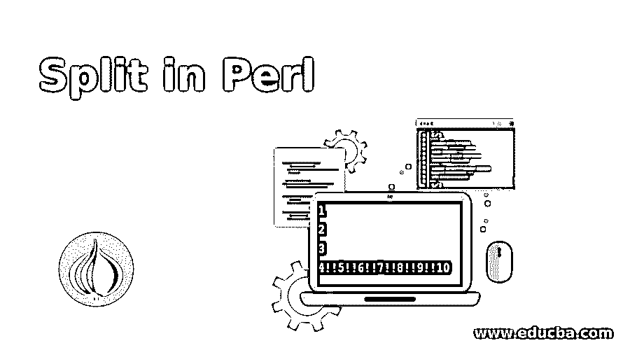

# 在 Perl 中拆分

> 原文：<https://www.educba.com/split-in-perl/>

## Perl 中的拆分是什么？

Perl 中的 Split 用于按照分隔符指定的模式将字符串或表达式拆分成字段，我们在 split 函数中使用了这种模式。如果我们没有指定任何模式[，perl](https://www.educba.com/what-is-perl/) 解释器会自动将空格作为缺省值。我们使用 limit 来限制 split 函数返回的输出数，limit 是 perl 语言 split 函数中使用的可选参数。如果我们定义了限制的负值，那么 split 函数将认为没有限制，并返回所有被拆分的数据。

### Perl Split 的语法和参数

这里我们讨论语法和参数:

<small>网页开发、编程语言、软件测试&其他</small>

**语法:**

下面是 perl 中 split 函数的语法如下。

*   **分裂；** (Split 函数用于拆分字符串。)
*   **Split** (Split 函数用于将一个字符串拆分成子串)/pattern/ (Pattern 用于将字符串拆分成子串)。)
*   **Split** (使用 Split 函数将字符串分割成子串)/pattern/(我们已经使用 pattern 将字符串分割成子串。)、Expression(用于拆分字符串的表达式名称。)
*   Split ( Split 函数将字符串分割成子串)/pattern/(基于模式我们将字符串分割成子串。)、Expression(用于拆分字符串的表达式。)，Limit (Limit 是用来限制 Perl 中使用 split 函数输出返回的次数。)

**参数:**

下面是上述语法的参数说明如下。

*   **Split** :我们在 Split 函数中使用了一个模式，表达式名称，将任意字符串分割成子字符串。我们在 split 函数中使用了 limit 来限制分割输出的数量。
*   **Pattern** : Pattern 用于将字符串分成多个子字符串。基于模式，我们将字符串分成子串。在 perl 语言中，使用 split 函数将字符串分成子字符串时，模式是最重要和最有用的。
*   **表达式**:表达式用于定义字符串的变量名，并显示字符串的输出。
*   **Limit** : Limit 是一个可选参数，在 Perl 语言的 split 函数中使用。在 split 函数中使用 limit 我们已经使用 split 函数限制了输出返回的数量。

### Perl 中的 Split 函数是如何工作的？

下面是 perl 中 split 函数的工作原理。

*   Perl split 函数将一个字符串拆分成一个数组，字符串是根据我们在 split 函数中使用的模式进行拆分的。
*   主要我们在 split 函数中用到的参数如下。
*   表示
*   模式
*   限制
*   模式用于在 split 函数中将字符串分成多个子字符串。
*   根据使用的模式值，我们将字符串分成子串。在 perl 语言中，使用 split 函数将字符串分成子字符串时，模式是最重要和最有用的。
*   表达式用于将变量名定义为字符串并显示字符串的输出。字符串输出将使用 split 函数中的表达式显示。
*   Limit 用于限制 split 函数的输出返回次数。
*   Limit 是 split 函数中的可选参数，已在 perl 语言的 split 函数中使用。
*   如果我们定义了限制的负值，那么 split 函数将认为没有限制，并返回所有被拆分的数据。
*   我们可以将字符串拆分或划分为以下标准。
*   单字符
*   正规表达式
*   字符组
*   在 perl 语言中，我们可以将字符串拆分成若干部分。我们可以使用单个字符、正则表达式和一组字符来拆分字符串。

### Perl 中的拆分示例

下面是 perl 中 split 函数的例子如下。

#### 1.字符分割

请找到下面的例子来分割字符串使用字符。在下面的例子中，我们根据字符分割字符串。我们用逗号来分割。我们已经将多个字符串拆分成多个字符串。

**举例:**

`use strict;
use warnings;
# Here we have used character as comma (,)
my $Char = 'AB, CD, , EF, GH, IJ, KL';
# using split() function and use pattern as comma.
my @Split = split(', ', $Char);
# displaying result using split function
print "@Split";`

**输出:**

#### 2.无限制地拆分字符串

下面的例子显示了没有限制的分裂字符串如下。在 perl 语言中使用 split 函数检索数据结果时，我们没有使用任何限制。

**举例:**

`use strict;
use warnings;
# String which is separated by !! Sign
my $Day = 'SUN!!MON!!TUE!!WED!!THU!!FRI!!SAT';
# using split function without Limit
my @Split = split('!!', $Day);
# displaying string after splitting and split divided string in new line
foreach my $WithoutLimit(@Split)
{
print "$WithoutLimit\n";
}`

**输出:**

#### 3.使用 Limit 拆分字符串

下面的例子显示了使用极限分割字符串如下。我们在 perl 语言中使用 split 函数检索数据结果时使用了 limit。

**举例:**

`use strict;
use warnings;
# string which is separated by !! sign
my $Number = '1!!2!!3!!4!!5!!6!!7!!8!!9!!10';
# using split function with using Limit
my @Split = split('!!', $Number, 4);  # We have used limit as 4.
# displaying string after splitting and split divided string in new line
foreach my $Limit (@Split)
{
print "$Limit\n";
}`

**输出:**

#### 4.对未定义的值进行拆分

以下示例显示了使用未定义的值拆分字符串，如下所示。

**举例:**

`use strict;
use warnings;
# string which is separated by using undefined value
my $Number = '12345678910';
# using split function with undef value
my @Split = split(undef, $Number);
# displaying string after splitting and split divided string in new line
foreach my $undef(@Split)
{
print "$undef\n";
}`

**输出:**

#### 5.空间分裂

以下示例显示了使用空格值拆分字符串，如下所示。

**举例:**

`use strict;
use warnings;
# string which is separated by using space value
my $Number = '1 2 3 4 5 6 7 8 9 10';
# using split function with undef value
my @Split = split(' ', $Number);
# displaying string after splitting and split divided string in new line
foreach my $space(@Split)
{
print "$space\n";
}`

**输出:**

### 结论

Split 函数在 perl 语言中非常重要。Split 函数用于按照分隔符指定的模式将字符串或表达式拆分成字段，我们在 split 函数中使用了这种模式。如果我们没有指定任何模式，perl 解释器会自动将空格作为缺省值。

### 推荐文章

这是一个 Perl 拆分指南。这里我们也讨论 perl 中 split 函数的介绍和工作原理。以及不同的示例及其代码实现。您也可以看看以下文章，了解更多信息–

1.  [Perl if 语句](https://www.educba.com/perl-if-statements/)
2.  [Perl 注释](https://www.educba.com/perl-comments/)
3.  [Perl 下一步](https://www.educba.com/perl-next/)
4.  [Perl chomp()](https://www.educba.com/perl-chomp/)

