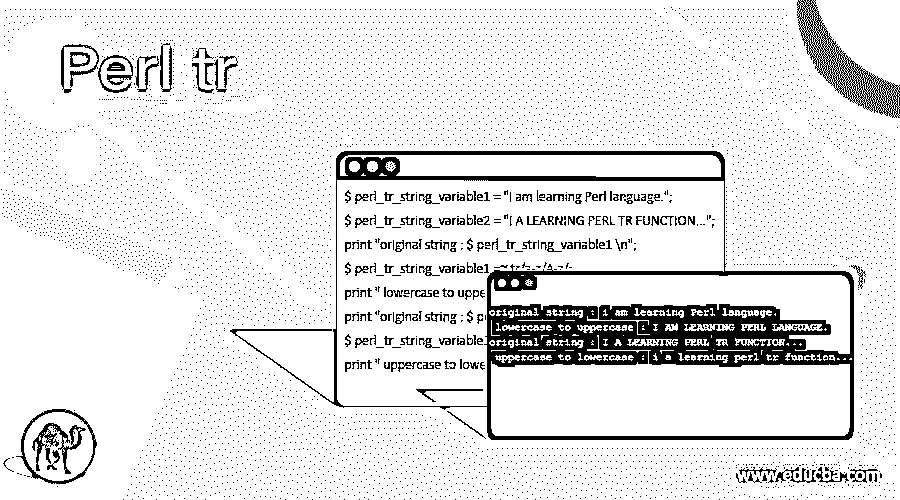

# Perl tr

> 原文：<https://www.educba.com/perl-tr/>

## Perl tr 简介

在 Perl 技术中，Perl tr 函数在所需的字符串列表中充当翻译操作符。此功能是一个翻译功能，用于将可用列表翻译为用户所需列表。tr 函数对于将字符串转换成数字、将小写字母转换成大写字母以及将一个字符串转换成 Perl 语言中所需的另一个字符串非常有用。tr 函数使用 tr 运算符将任何类型的列表替换为用户要求的格式列表或替换列表。

**语法**

<small>网页开发、编程语言、软件测试&其他</small>

*   基本的 Perl tr 函数语法如下。

`tr/available - list/translate - list/`

*   描述:
    *   “tr”操作符用于将字符串替换为所需的字符串格式。
    *   搜索列表中的“available–list”出现在 Perl 字符串变量中。
    *   在 Perl 语言中,“translate-list”是被“available-list”取代的新列表。

*   带有“s”操作符语法的 Perl tr 函数如下。

`$ perl_tr_string_variable =~ tr/available - list/translate - list/s;`

*   描述:
    *   " s "运算符是找出字符串中的重复字符，并用所需的字符或列表替换。
    *   “=~”是绑定操作符，用于翻译所需的列表，并保持列表中剩余的字符不变。
    *   “s”运算符将基本 tr 函数语法置于末尾。
    *   剩下的语法与上面的基本 tr 函数语法相同。

*   带有“c”操作符语法的 Perl tr 函数如下。

`$ perl_tr_string_variable =~ tr/available - list/translate - list/c;`

*   描述:
    *   “c”运算符找出字符之间的空格，用户可以用所需的字符或格式替换空格。
    *   “c”操作符放在了基本 Perl tr 函数语法的末尾。
    *   剩下的语法与上面的基本 Perl tr 函数语法相同。

*   带有“d”操作符语法的 Perl tr 函数如下。

`$ perl_tr_string_variable =~ tr/available - list/translate - list/d;`

*   描述:
    *   “d”运算符正在查找之前删除了多少个字符。
    *   “d”操作符放在基本 tr 函数语法的末尾。
    *   剩下的语法与上面的基本 tr 函数语法相同。

### Perl 中的 tr 函数是如何工作的？

*   下载 Perl 软件并将其安装在设备的操作系统中。

https://www.Perl.org/或 http://strawberryPerl.com/普遍使用 Perl 软件网站。

*   在设备中创建一个扩展名为 Perl 的文件，并将该文件保存在命令行路径中。

例如:helloo.pl 或 first pearl.pl

*   创建字符串变量并用一些字符或列表初始化它。

`$ perl_tr_string_variable1 = "I am learning Perl language.";
$ perl_tr_string_variable2 = "i am learning Perl tr function.";`

*   在 Perl 语言中翻译字符串的基本 tr 函数语法。

`$ perl_tr_string_variable1 =~ tr/a-z/A-z/;`

*   用户可以使用任何运算符，如 s、c、d，以获得更多的便利和可用性。
*   这里我们使用 c 操作符来理解操作符函数的工作原理。

`$ perl_tr_string_variable2 =~ tr/a-z/*/c;`

*   字符串可以使用 Perl 字符串变量返回替换的列表。

`print "$ perl_tr_string_variable1 \n";
print "$ perl_tr_string_variable2 \n";`

*   tr 函数的工作示例如下。

`$ perl_tr_string_variable1 = "I am learning Perl language.";
$ perl_tr_string_variable2 = "i am learning Perl tr function.";
$ perl_tr_string_variable1 =~ tr/a-z/A-z/;
$ perl_tr_string_variable2 =~ tr/a-z/*/c;
print "$ perl_tr_string_variable1 \n";
print "$ perl_tr_string_variable2 \n";`

### 例子

下面提到了不同的例子:

#### 示例#1

带有句子大小写转换的基本 tr 函数示例及输出。

**代码:**

`$ perl_tr_string_variable1 = "i am learning Perl language.";
$ perl_tr_string_variable2 = "I A LEARNING PERL TR FUNCTION...";
print "original string : $ perl_tr_string_variable1 \n";
$ perl_tr_string_variable1 =~ tr/a-z/A-z/;
print " lowercase to uppercase : $ perl_tr_string_variable1 \n";
print "original string : $ perl_tr_string_variable2 \n";
$ perl_tr_string_variable2 =~ tr/A-z/a-z/;
print " uppercase to lowercase : $ perl_tr_string_variable2 \n";`

**输出:**

#### 实施例 2

基本的 tr 函数，带有字符到数字的转换例子和输出。

**代码:**

`$ perl_tr_string_variable1 = "i am learning technical language with online hub.";
$ perl_tr_string_variable2 = "1, 2, 3, 4, 5, 6";
print "original string1 : $ perl_tr_string_variable1 \n";
$ perl_tr_string_variable1 =~ tr/a-z/0-9/;
print " characters to numbers : $ perl_tr_string_variable1 \n";
print "original string2 : $ perl_tr_string_variable2 \n";
$ perl_tr_string_variable2 =~ tr/0-9/a-z/;
print " numbers to characters : $ perl_tr_string_variable2 \n";`

**输出:**

**T2】**

 **#### 实施例 3

带“s”运算符的基本 tr 函数示例和输出。

**代码:**

`$ perl_tr_string_variable1 = "ii aam lleeaarrniinngg nneeww llaannggaauuggee.";
$ perl_tr_string_variable2 = "ii aam lleeaarrniinngg nneeww llaannggaauuggee";
print "original string1 : $ perl_tr_string_variable1 \n";
$ perl_tr_string_variable1 =~ tr/a-z/a-z/;
print " string without s operator : $ perl_tr_string_variable1 \n";
print "original string2 : $ perl_tr_string_variable2 \n";
$ perl_tr_string_variable2 =~ tr/a-z/a-z/s;
print "string with s operator : $ perl_tr_string_variable2 \n";`

**输出:**

#### 实施例 4

带“c”运算符的基本 tr 函数示例和输出。

**代码:**

`$ perl_tr_string_variable1 = "i am learning Perl language.";
$ perl_tr_string_variable2 = "I A LEARNING PERL TR FUNCTION...";
print "original string1 : $ perl_tr_string_variable1 \n";
$ perl_tr_string_variable1 =~ tr/a-z/*/;
print " string without c operator : $ perl_tr_string_variable1 \n";
print "original string2 : $ perl_tr_string_variable2 \n";
$ perl_tr_string_variable2 =~ tr/A-Z/*/c;
print "string with c operator : $ perl_tr_string_variable2 \n";`

**输出:**

#### 实施例 5

带“d”运算符的基本 tr 函数示例和输出。

**代码:**

`$ perl_tr_string_variable1 = "i am learning Perl language.";
$ perl_tr_string_variable2 = "I A LEARNING PERL TR FUNCTION...";
print "original string1 : $ perl_tr_string_variable1 \n";
$ perl_tr_string_variable1 =~ tr/a-z/*/;
print " string without d operator : $ perl_tr_string_variable1 \n";
print "original string2 : $ perl_tr_string_variable2 \n";
$ perl_tr_string_variable2 =~ tr/A-Z/*/d;
print "string with d operator : $ perl_tr_string_variable2 \n";`

**输出:**

#### 实施例 6

具有区分大小写的示例和输出的基本 tr 函数。

**代码:**

`$ perl_tr_string_variable1 = "I Am Learning Perl Language...";
$ perl_tr_string_variable2 = "I AM Learning PERL TR Function...";
print "original string1 : $ perl_tr_string_variable1 \n";
$ perl_tr_string_variable1 =~ tr/a-z/t/;
print " string without d operator : $ perl_tr_string_variable1 \n";
print "original string2 : $ perl_tr_string_variable2 \n";
$ perl_tr_string_variable2 =~ tr/A-Z/T/;
print "string with d operator : $ perl_tr_string_variable2 \n";`

**输出:**

### 结论

*   tr 函数对于处理列表很有用，可以根据用户的需求修改它们。
*   tr 函数使得 Perl 语言中的列表对用户友好且易于理解。
*   tr 函数很容易将给定的列表转换成用户需要的格式。

### 推荐文章

这是一个 Perl tr 指南。在这里，我们讨论 tr 函数在 Perl 中是如何工作的，并给出例子、代码和输出。您也可以看看以下文章，了解更多信息–

1.  [珠光打开](https://www.educba.com/perl-open/)
2.  [Perl 哈希](https://www.educba.com/perl-hash/)
3.  [Perl 不等于](https://www.educba.com/perl-not-equal/)
4.  [Perl 写入文件](https://www.educba.com/perl-write-to-file/)

**