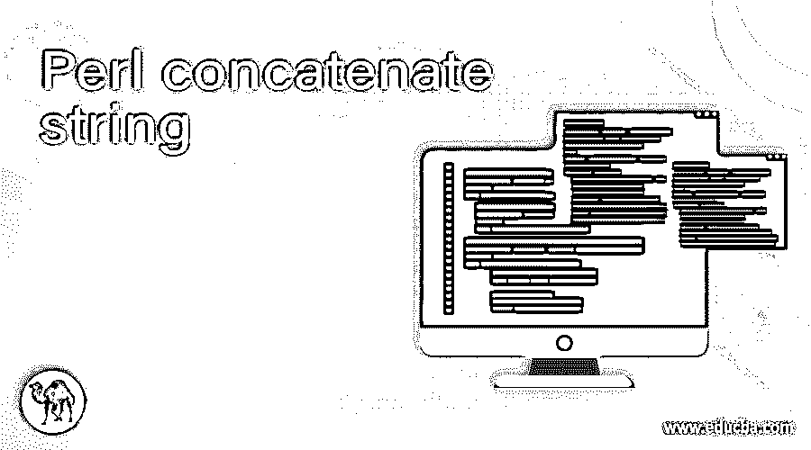
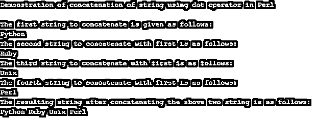

# Perl 连接字符串

> 原文：<https://www.educba.com/perl-concatenate-string/>

## Perl 连接字符串简介

在 Perl 中，字符串连接被定义为使用字符串操作符连接或追加给定的字符串。运算符被符号化为点运算符(。)来连接字符串。一般来说，Perl 中的字符串连接非常简单，只需使用字符串运算符，如点运算符(。)对声明为变量的两个操作数执行串联，这意味着使用串联字符串点运算符(.)用于将两个不同的字符串转换成一个字符串。

### Perl 中字符串连接的工作原理及实例

在本文中，我们将讨论在 Perl 中使用字符串操作符如点操作符(.)放置在两个操作数之间，这两个操作数是 Perl 程序中声明的两个变量，结果存储在另一个变量中，该变量只有一个字符串，这意味着在两个操作数之间放置点运算符后，值被连接起来，并从两个字符串转换为一个字符串。在 Perl 中，字符串概念只有两个操作符可用于字符串，一个是串联和重复字符串操作符。在 Perl 中，字符串连接也可以使用其他方式完成，比如使用点运算符(。)，使用 join()函数，并使用$ {var_name}。

<small>网页开发、编程语言、软件测试&其他</small>

现在让我们用下面的例子来看看字符串连接的语法。

**语法:**

`$res_str = $str1.$str2;`

**参数:**

*   res_str:这是一个标量变量，存储操作数中给定的两个字符串的连接字符串。
*   str1:这是一个标量变量，包含要连接到存储在另一个变量中的另一个字符串的字符串。
*   str2:这也是一个标量变量，包含要连接到前一个变量中存储的第一个字符串的字符串。

上面的语法返回两个给定操作数的组合字符串，其值为字符串。

正如我们所知，可以使用点运算符进行连接，但是我们也可以使用 join()函数和另一个方法＄{ var _ name }进行连接。让我们看几个使用点运算符连接给定字符串的例子。

### 例子

让我们讨论一下 Perl 连接字符串的例子

#### 示例#1

**代码:**

`#!/usr/bin/Perl
print "Demonstration of a concatenation of string using dot operator in Perl";
print "\n";
print "\n";
$str1 = "Educba ";
print "The first string to concatenate is given as follows:";
print "\n";
print $str1;
print "\n";
$str2 = "Institute";
print "The second string to concatenate with first is as follows:";
print "\n";
print $str2;
print "\n";
$res_str = $str1.$str2;
print "The resulting string after concatenating the above two string is as follows:";
print "\n";
print $res_str;`

**输出:**

在上面的程序中，我们可以看到，首先我们在两个不同的变量中声明了两个不同的字符串，如“$str1”和“$str2”，在上面的代码中，我们打印了这两个字符串，然后我们在两个操作数之间实现了点运算符，并将结果存储在变量“$res_str”中，其中该点运算符返回连接的字符串，这意味着它将“$str1”和“$str2”中的给定字符串合并为一个字符串，并生成“$res_str”。输出如上图所示。

现在我们将看到另一个例子，点运算符也可以用于连接两个以上的字符串。

#### 实施例 2

**代码:**

`#!/usr/bin/perl
print "Demonstration of concatenation of string using dot operator in Perl";
print "\n";
print "\n";
$str1 = "Python ";
print "The first string to concatenate is given as follows:";
print "\n";
print $str1;
print "\n";
$str2 = "Ruby ";
print "The second string to concatenate with first is as follows:";
print "\n";
print $str2;
print "\n";
$str3 = "Unix ";
print "The third string to concatenate with first is as follows:";
print "\n";
print $str3;
print "\n";
$str4 = "Perl ";
print "The fourth string to concatenate with first is as follows:";
print "\n";
print $str4;
print "\n";
$res_str = $str1.$str2.$str3.$str4;
print "The resulting string after concatenating the above two string is as follows:";
print "\n";
print $res_str;`

**输出:**

在上面的程序中，我们可以看到我们已经声明了 4 个字符串，并一个接一个地打印所有的字符串，然后我们在这四个字符串之间实现了点运算符，以便我们可以将这些字符串连接成一个长字符串，在上面的代码中，我们可以看到每个字符串在声明时在字符串的末尾已经有了空格，因此当连接的字符串被打印时，它存储在“$res_str”中，当它考虑 Perl 中的“”或“”之间的字符串时，它与空格一起打印。上面程序的结果输出可以在截图中看到。

现在我们将在下面的例子中看到连接字符串的其他方法

#### 实施例 3

**代码:**

`#!/usr/bin/perl
print "Demonstration of concatenation of string using ${var_name} method in Perl";
print "\n";
print "\n";
$str1 = 'Welcome ';
print "The first string to concatenate is given as follows:";
print "\n";
print $str1;
print "\n";
$str2 = 'to Educba';
print "The second string to concatenate is given as follows:";
print "\n";
print $str2;
print "\n";
$res_str = "${str1}${str2}";
print "The concatenated string is as follows:";
print "\n";
print $res_str;`

**输出:**

在上面的程序中，我们可以看到我们再次声明了两个字符串并打印了这些字符串，然后我们使用＄{ var _ name }方法实现了这些字符串的连接，打印了给定字符串的连接字符串，这导致了上面的单个字符串，因为在第一个字符串“$str1”的末尾有空格，因此在生成的字符串中，它会将空格视为字符串的一部分。因此，在上面的截图中，我们可以看到给定字符串连接成一个字符串的输出。

### 结论

在本文中，我们得出结论，字符串的连接是使用字符串操作符定义的，在 Perl 中，只有两个字符串操作符用于连接和重复。在本文中，我们看到字符串的串联使用了三种方法，主要推荐使用点运算符，其他方法是使用 join()函数和＄{ var _ name }。在本文中，我们看到了使用点运算符和${var_name}方法演示字符串连接的示例。

### 推荐文章

这是一个 Perl 连接字符串的指南。在这里，我们讨论 Perl 中字符串连接的工作原理，以及代码实现的例子。您也可以看看以下文章，了解更多信息–

1.  perl eval
2.  [Perl 哈希](https://www.educba.com/perl-hash/)
3.  [Perl join](https://www.educba.com/perl-join/)
4.  [Perl for 循环](https://www.educba.com/perl-for-loop/)

