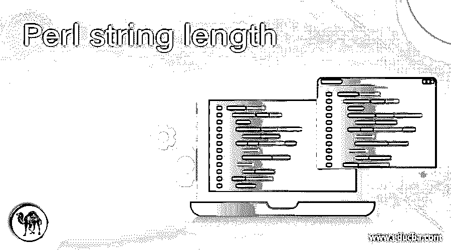

# Perl 字符串长度

> 原文：<https://www.educba.com/perl-string-length/>

## Perl 字符串长度介绍

Perl 字符串长度被定义为字符串类，用于确定用户输入字符串的长度。它计算字符串中的每个字符，并将长度存储在单独的变量中。长度可以是任何整数当我们使用 length()函数来检索字符串字符的长度时，它将是正整数。它也指用户输入字符串值的大小。在循环的帮助下，这些值被迭代并显示在输出控制台上。

**语法:**

<small>网页开发、编程语言、软件测试&其他</small>

Perl 有默认的关键字、函数和变量来创建用户友好和复杂的应用程序。主要是基于 web 的应用程序，Perl 脚本是经常使用的。像其他编程语言一样，字符串是 Perl 脚本中最常见的类之一。使用 length()函数计算字符串长度。

`#! /usr/bin/perl
$var name=””;
$var2=length($var name);
---some perl script logic codes---`

上面的脚本代码是获取用户输入值的字符串长度的基本步骤。

### Perl 中如何计算字符串长度？

我们已经知道 Perl 是一种解释型语言，而不是编译型语言，脚本代码会花费更多的时间来消耗用户控制台上的输出。通过使用字符串 length()，它将返回字符数，正如用户在用户输入中提到的那样，标量字符串值被迭代并检查每个单独的字符，因为我们不能直接使用 length 函数来查找诸如数组等实用类。因为数组长度的计算也更类似于字符串长度，因为当我们计算字符串长度时，索引也需要长度函数是可用的，只需要用于字符，所以它遵循 Unicode 类型的表达式，它可以返回字符数，它不包括字节数。在 Perl 脚本中，字符串数据类型的$character set 允许两组 Unicode，也通过使用一些转义序列，如正斜杠和反斜杠，通过包括花括号，计算字符串字符长度，字节长度不同于字符长度。在长度函数的帮助下，我们可以在排序函数的帮助下以升序和降序排列元素，但是长度将使用长度函数来计算。此外，还遵循排序顺序并使用字符串字符。

### 例子

让我们讨论 Perl 字符串长度的例子。

#### 示例#1

**代码:**

`#!/usr/local/bin/perl
use strict;
use warnings;
my $input = "Welcome To My Domain Have a Nice Day Users";
my $stlength = length($input);
print "Thank you users your input string length is $stlength\n";
my $input1 = "\x{6585}\x{292873}\n{747478}";
{
use bytes;
print "Thank you users you strings are converted into bytes please find the byte lengths is: ", length($input1), "\n";
}
print "Have a nice day users teh length is ", length($input1), "\n";
my $output = "2asgdhvg jasfdh37 jefjdg j hjehrj kerjgh kjerkj jerg ejrgk jertthui jergjk ejrh ejrhj ekjrhb kerljh erkj kerhtg ejrktgt ejr";
my @input2 = split(' ',$output);
my $result=length($output);
print "Thank you users $result\n";`

**输出:**

在上面的第一个例子中，我们讨论了作为不同输入长度集合的字符串字符，它通过使用不同的序列来调用函数。它还使用了相同的排序顺序，可以按顺序排列字符串字符。字符和字节是两组默认的数据类型。将计算长度，字符串字符也使用 split()方法来拆分大变量句子中的字符和字符串的数量。它将用于计算短时间内的长度，并在输出控制台中轻松识别字符串。

#### 实施例 2

**代码:**

`#!/usr/local/bin/perl
use strict;
use warnings;
my $inp = "Welcome To My Domain Have a Good Day Users";
my $stlen = length($inp);
print "Thank you users your input string length is $stlen\n";
my $vars1 = substr($inp, 3, 7);
my $vars2 = substr($inp, -8);
print($vars2,":",$vars1,"\n");
substr($inp, 3, 7, "Violet");
print($inp,"\n");
my $inp1 = "sdvjh jsdfh jsdf jsdfj ekfb jefb ewhfrb wehfrb wehf kjewhf jef ejhfrb jwehrfb jewhrfb jehwrb jehrfb hewrbds7 wey87 ewf87 hehj hef";
{
use bytes;
print "Thank you users you strings are converted into bytes please find the byte lengths is: ", length($inp1), "\n";
}
print "Have a nice day users the length is ", length($inp1), "\n";`

**输出:**

在第二个例子中，我们在基本的字符串字符长度计算中使用了 length()函数，我们还可以计算字符，以及将字符串字符转换为字节。String 类有一些默认方法，如 length()、substr()。计算子字符串是为了减少字符串字符长度，因此运行时用户输入是使用 substr 方法和一些标记化器来分离字符串字符并计算用户输入的长度。

#### 实施例 3

**代码:**

`#!/usr/local/bin/perl
use strict;
use warnings;
print "Welcome To My Domain Have A Nice Day Users gjf h kjjfdh kjehf kjerh jkf\n";
my $vars = <>;
my $vars1="hdjg kwjeh hwekfjr jerhk kerjhkj kjekrh jerhk erkjhgw emrhe9485 nerk798 nkjj5kfjkrfg jrk ajgdv jgve bejh ewbrj whe bjehrgw h4jhr wejhrg";
chomp($vars);
if (lc($vars))
{
print "Have a Nice Weekend and For Your Information the name is $vars !\n ",length($vars), length($vars1);
}
else
{
print "Thanks Users and Your entered data is not $vars!\n";
}`

**输出:**

在最后一个示例中，我们使用了 length()和另外一个默认方法，如 chomp()方法，通过使用该方法将用户输入值作为字符串传递时，它将减少空格，并从输入字符串中删除尾随换行符。通过使用 if 条件，应该对输入进行验证和检查条件，如果满足条件，则执行语句，否则将执行 else 语句。

### 结论

在 Perl 脚本中，字符串类有一些默认的方法来计算和频繁地使用字符串字符。Perl string-length()函数它执行并跟踪用户输入的字节和字符，它将在运行时或之前执行。所以用户输入的字符串中应该有引号字符用于计算长度。

### 推荐文章

这是一个 Perl 字符串长度的指南。这里我们讨论一下 Perl 中的简介、语法、如何计算字符串长度？以及代码实现的例子。您也可以看看以下文章，了解更多信息–

1.  [Perl for 循环](https://www.educba.com/perl-for-loop/)
2.  [Perl 哈希](https://www.educba.com/perl-hash/)
3.  [Perl 写入文件](https://www.educba.com/perl-write-to-file/)
4.  [Perl 正则表达式](https://www.educba.com/perl-regular-expression/)

