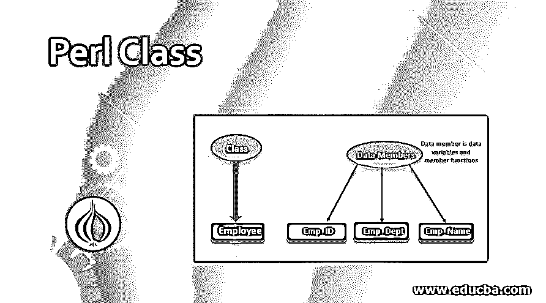
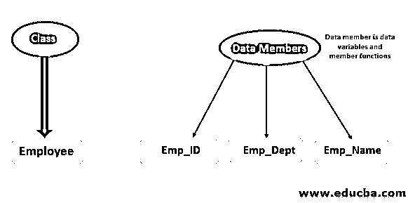

# Perl 类

> 原文：<https://www.educba.com/perl-class/>

## Perl 类的定义

Perl 类很容易定义，perl 中的类以其最简单的形式对应于一个 perl 包。它被定义为一个包，它有构造函数来创建 perl 对象，这个对象有任何类型的变量，但大多数情况下它是对数组或散列的引用。在 perl 中，定义 Perl 对象是最重要和最有用的。要在 Perl 中定义一个类，我们需要首先构建一个包，包就是子程序或者用户定义的变量。

### 如何声明 Perl 类？

程序如下。

<small>网页开发、编程语言、软件测试&其他</small>

*   在 perl 中声明任何类都非常容易和简单。要声明任何类，我们需要在类名前提到 package 关键字。

**语法:**

`Package class_name;`

**参数:**

下面是 Perl 声明语法的参数描述。

*   **Package:** Package 只不过是包含子程序或用户定义变量的 Perl 代码或程序中指定的名称空间。包在声明类的时候很重要。
*   **类名:**我们可以在 Perl 中给程序定义任何类名。但是它是针对我们已经实施的计划的。

**举例:**

`Package declare_perlClass;`

*   在上面的例子中，我们将类名声明为 declare_perlClass。这个类对应于一个包名。
*   在声明 declare_perlClass 类之前，我们首先需要在 Perl 中加载这个包。
*   加载的包在整个程序中使用。包的范围是整个程序，或者直到我们定义另一个包。

### Perl 中的类是如何工作的？

工作过程如下:

*   它被定义为一个包，它有构造函数来创建 perl 对象，这个对象有任何类型的变量，但大多数情况下它是对数组或散列的引用。
*   它只不过是数据结构的一个概念。它定义了 perl 中数据的对象。
*   要在 Perl 中定义一个类，我们需要首先构建一个包，这个包除了子程序或用户定义的变量之外什么也不是。
*   这个对象只不过是 Perl 中类的一个实例。
*   定义起来非常容易和简单，perl 中的类对应于一个最简单形式的 Perl 包。
*   在 Perl 中，定义 Perl 的对象是最重要和最有用的。

Perl 中类如何工作的图示如下:

*   我们要以班级为员工的例子。我们使用类作为雇员来定义成员函数和数据成员。
*   可能有一个雇员有不同的姓名和结构，但他们都有一些共同的特征，如雇员标识、雇员部门和雇员姓名。
*   在这里，我们必须将雇员定义为一个类，其中 emp_id、emp_dept 和 emp_name 作为数据成员。
*   我们还在 perl 类中使用了 bless 函数。

**Perl 中的语法祝福函数:**

`bless name_of_object, name_of_class;`

*   我们也可以通过使用 perl 类来创建一个对象。我们必须根据 perl 中的类名创建一个对象。
*   perl 类中的数据成员只是数据变量，成员函数是操纵变量的函数。
*   在下面的例子中，我们必须将成员变量定义为 emp_id、emp_dept 和 emp_name。
*   我们可以在 perl 中为程序定义任何类名。但是它是针对我们已经实施的计划的。

*   在上面的例子中，我们必须将类名定义为 employee，将数据成员定义为 emp_id、emp_dept 和 emp_name。

### 例子

这些例子如下:

#### 示例#1

在 perl 类中使用 bless 函数:

*   在下面的例子中，我们已经使用 bless 函数创建了 perl 类。我们已经为雇员创建了一个类名。
*   成员变量的类名是'雇员标识'和'雇员薪金'。
*   我们在 perl 类中定义了一个祝福函数。在 bless 函数中，我们必须定义对象名和类名。
*   我们还将 employee 类名的构造函数定义为 new_emp 来定义成员变量。

**代码:**

`use strict;
use warnings;
package employee;
## Constructor of employee class.
sub new_emp{
#the package name 'employee' is in the default array shift.
my $class = shift;
#object of a class.
my $self = {
'emp_id' => shift,
'emp_salry' => shift
};
#blessing with object name and class name
bless $self, $class;
#returning object from constructor
return $self;
} 1;
print "emp_id:- 101\n";
print "emp_salary:- 25000\n"; `

**输出:**

#### 实施例 2

创建类和使用对象的示例:

*   在下面的例子中，我们用一个对象创建了 perl 类。我们已经创建了员工的班级名称。
*   成员变量的类名是“雇员名”和“雇员姓”。
*   我们在 perl 类中定义了一个祝福函数。在 bless 函数中，我们必须定义对象名和类名。
*   我们还将雇员类名构造函数定义为 employee_data，以定义成员变量。

**代码:**

`use strict;
use warnings;
package employee;   ## This is the class of employee.
sub employee_data    ## Constructor of employee class.
{
# Shift is default array will used in 'employee' class and then assign
# it to employee class variables
my $class_name = shift;
my $self = {
'Employee_FirstName' => shift,
'Employee_LastName' => shift
};
# using bless function.
bless $self, $class_name;
# returning object from constructor of employee_data.
return $self;
}
# Object creating name as employee from employee_data and calling a constructor.
my $Data = employee_data employee("Emp_FirstName:- ABC", "Emp_LastName:- PQR");
# printing the data
print "$Data->{'Employee_FirstName'}\n";
print "$Data->{'Employee_LastName'}\n";`

**输出:**

### 推荐文章

这是一个 Perl 类的指南。这里我们还讨论了 perl 中类的定义和工作原理。以及不同的示例及其代码实现。您也可以看看以下文章，了解更多信息–

1.  [Perl 运算符](https://www.educba.com/perl-operators/)
2.  [Perl 注释](https://www.educba.com/perl-comments/)
3.  [Perl 中的文件处理](https://www.educba.com/file-handling-in-perl/)
4.  [在 Perl 中转到](https://www.educba.com/goto-in-perl/)

