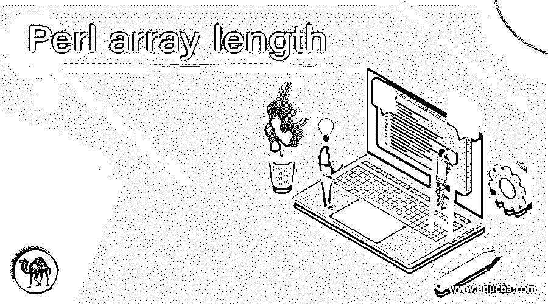

# Perl 数组长度

> 原文：<https://www.educba.com/perl-array-length/>

## Perl 数组长度的定义

Perl 是一种编程语言，其中数组中的 length 函数主要用于本质上是标量的字符串，并通过一些其他方法将数组放在标量上下文中。Perl 数组长度的返回类型将是已定义数组中存在的元素数量，按照惯例，它将始终返回数组的物理大小，而不是有效和准确的元素数量。针对 Perl 数组长度使用 for 循环给出了最清晰的方法，即计算 Perl 已经知道的值。

**语法:**

<small>网页开发、编程语言、软件测试&其他</small>

有两种方法用于计算 Perl 数组长度，表示如下:

`$ arr_length = @fruit;`

这是确定 Perl 数组长度的第一种方法，通过将一个简单的值赋给数组的标量变量，如上所示。

其中，arr_length 是考虑的变量,@fruit 是被赋值的值。

另一种方法是显式地将标量值转换成某个值，该值将决定 Perl 数组的长度，如图所示。

`$ arr_length2 = scalar @fruit`

### Perl 中如何计算数组长度？

Perl 中的数组长度是一个重要的关注点，当计算 Perl 中关于隐式或显式转换的数组长度时。Perl 中计算数组长度的方法有如下几种:

*   有一种使用隐式标量转换来计算数组大小的方法，这种方法还有助于使整个数组大小相链接，从而使数组相对于数组索引是自发的和有序的，因此访问元素变得有点无缝。
*   通常建议使用隐式标量转换来计算数组长度，因为考虑的变量将在模块的内存方面。
*   另一种计算数组大小的方法是通过 Perl 数组大小及其使用显式标量转换的转换，对于隐式标量转换，不太推荐使用这种方法。
*   第三种也是最后一种在 Perl 中转换和计算数组大小的方法是使用最后一个元素的索引，一旦最后一个元素被访问，就需要增加一个值。
*   有时程序员也使用 for 循环，这被认为是访问和操作元素数组长度的一种缓慢的方式，但仍然给出了最清晰的方式，没有太多的复杂性和易于理解的变量和可访问性循环。
*   使用 for 语句被认为是处理和摆弄元素的一个缓慢的过程，但这是不正确的，它给出了适当数量的带有值的元素，尽管速度很慢。
*   还可以获得 Perl 散列中数组的长度，这也是一个经常出现的需求，在这种情况下，非常需要记住数组元素的类型以及在调用函数时需要合并的相关数据类型。
*   autobox:core 是在 Perl hash 中使用 array 的模块，但是不推荐使用该模块本身，它会破坏大量需要有效管理的内存。
*   当 Perl hash 与数组一起用于元素的操作和可访问性时，数组的索引很容易返回。
*   Perl 中的嵌套数组长度也可以操作和计算，在这种情况下，隐式和显式转换都存在解引用语法，尽管在计算数组长度时，前面提到过更推荐使用前者。
*   所有这些方法都可以以任何形式使用，但同样取决于元素的需求和访问速度。

### 例子

让我们讨论一下 Perl 数组长度的例子。

#### 示例#1

此程序演示了数组的声明，然后存储值并执行隐式转换，方法是返回如图所示的值，然后使用显式转换来转换值，这将返回如下所示的输出。

**代码:**

`@arr_p = (10, 8, 14, 20, 86, 60);
$impSize_1 = @arr_p;
$expSize_2 = scalar @arr_q;
print "Size of implicit_sized array $impSize_1\n";
print "Size of explicit_sized array $expSize_2";`

**输出:**

#### 实施例 2

这个程序演示了数组声明，在计算了数组的长度及其大小后，返回数组的物理大小，而不是输出中显示的实际有效元素数。

**代码:**

`#!/usr/bin/perl
@arr_p = (4,8,10,12);
$arr_p[62] = 8;
$arr_size = @arr_p;
$max_indx = $#arr_p;
print "Size_1: $arr_size\n";
print "Max_indx: $max_indx\n";`

**输出:**

#### 实施例 3

这个程序演示了用某个大小声明数组，然后用某个索引值初始化数组，然后通过使用 for 循环在内部删除不必要的元素，并返回所需值的物理大小，如输出**所示。**

**代码:**

`@arr_0 = ("one_1", "two_2", "three_3");
for($lp_indx = 0; $lp_indx <= $#arr_0; $lp_indx++) {
print $arr_0[$lp_indx];
}`

**输出:**

#### 实施例 4

这个程序演示了一种查找和打印 Perl 数组大小的方法，使用定义的数组中最后一个元素的索引+ 1，如输出所示。

**代码:**

`@fruits = qw(orange Kiwi banana);
$size_3 = $#fruits + 1;
printf("The sizes for fruits is : %d,\n", $size_3);`

**输出:**

#### 实施例 5

这个程序演示了使用 Perl 数组大小进行显式标量转换，并输出转换后的值，如输出所示。

**代码:**

`@fruits = qw(orange Kiwi banana guava grapes);
$size_2 = scalar @fruits;
printf("The sizes for fruits is :  %d,\n", $size_2);`

**输出:**

### 结论

Perl 数组长度用于许多事情，但是确定用于操作的数组长度是非常重要的，因为它让程序员了解计算需要遵循的方法类型以及具有正确返回类型的元素的可访问性，因为它应该返回具有正确有效值的数组的物理大小。

### 推荐文章

这是一个 Perl 数组长度的指南。这里我们还讨论了 Perl 中数组长度的定义以及如何计算？以及不同的示例及其代码实现。您也可以看看以下文章，了解更多信息–

1.  [Perl STDIN](https://www.educba.com/perl-stdin/)
2.  [Perl 下一步](https://www.educba.com/perl-next/)
3.  [Perl chomp()](https://www.educba.com/perl-chomp/)
4.  [Perl 开关](https://www.educba.com/perl-switch/)

