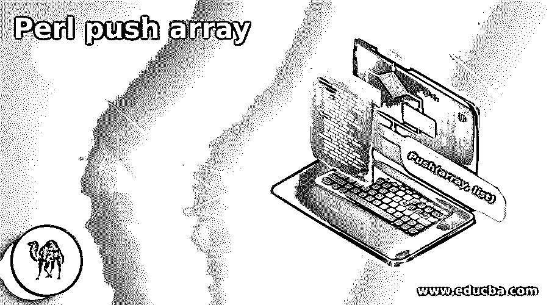

# Perl 推送数组

> 原文：<https://www.educba.com/perl-push-array/>

## Perl 推送数组简介

Perl push array 用于将质量的下降推到展览的终点。push()工作经常被用来执行堆栈。push()工作不依赖于那种被传为破败的品质。这些品质可以是字母数字。Perl push()工作用于将价值或质量推送到集群的终点，从而构建组件的数量。此时的新质量成为集群中的最后一个组件。

**语法和参数:**

<small>网页开发、编程语言、软件测试&其他</small>

`Push(array, list)`

在哪里，

*   该数组表示 push 函数中必须添加的值的序列。
*   该列表表示必须添加到特定序列中的值。
*   它返回新发现的数组的各种元素。

### Perl 中如何推送数组？

下面给出了如何在 Perl 编程中推动数组的例子。

#### 示例#1

**代码:**

`@array = ( 5, 6, 7 );
print "First array: @array \n";
push(@array, (9, 10, 11));
print "Newly Discovered Array: @array \n";`

**输出:**

在上面的程序中，我们首先将一个列表分配给一个数字数组。之后，我们使用 push()函数来推送数组，并提供一个新开发的数组列表。因此，程序被执行，输出如上面的快照所示。

#### 实施例 2

**代码:**

`@array = ( S, P, A );
print "First array: @array \n";`

**输出:**

在上面的程序中，我们使用 push()函数检查字母，而不是数字，程序被执行，输出如上面的快照所示。

不同的容量还用于控制集群。这些使得将 Perl 集群作为一个栈或一行来使用变得简单而有效。Pop 容量消除和恢复了展览的最后一个组成部分。移动工作将整个展品移动到一边。作为展示的主要组件的组件从群集中滚落出来，并变成容量的返回估计。与移动工作相反，非移动工作促使展览开始，将各种各样的部件移到一边。

一个纲要是永久的，所以你不能直截了当地改变它。要更改纲要，您需要将它存储在一个集群变量中。顾名思义，集群是一个变量，它为缩减提供动态储备。在 Perl 中，术语 cluster 和 down 是相互使用的；然而，你需要注意一个重要的区别:纲要是不变的，而展览是可变的。在一天结束时，你可以改变集群的组成部分，开发或反冲展览，但不是精英。标量变量以美元符号($)开始；尽管如此，exhibit 变量还是以 at 符号开始。

如果您仔细研究代码，您会发现我们使用了$days[0]而不是@days[0]。这是因为展示分量是标量；您需要使用标量前缀($)。在 Perl 中，标准是前缀表示您需要得到什么，而不是您拥有什么。Perl 还允许您利用负文件展示组件。Perl 从集群的结尾返回一个由负文件暗示的组件。

例如，$days[-1]返回聚类@days 的最后一个部分。您可以使用与裁减相似的过程一次访问大量集群组件。如果您将一个集群视为一个标量，您将获得图中组件的数量。在任何情况下，如果您真的不想检查它，这段代码都会导致一个错误；然而，巧合地分配一个展品给一个标量。要更改组件的估计值，您可以使用文件访问组件，并为其分配新的值。Perl 同样允许您一次改变各种组件的估计。

### 结论

因此，我们想以 push()工作恢复集群中新的全部数量的组件作为结论。很难将这种能力误认为是 unshift()作品，它在展览的开始添加了组件。push()工作将新的价值或品质推到展品的正确一侧，并构建组件。展览也可以是一个堆栈的概念。想象一堆编号的盒子，从顶部的 0 开始，向下扩展。每一行代码都应该以分号结束。如果没有，它就不会执行。在本文的堆叠模型中，不带分号的行是包含在一个集群中并被封装在外壳中的值。这并不是分号规则的特例，主要是因为堆栈方法。集群中的质量不是单独的代码行。用一种简单的方式来处理编码会更简单。

### 推荐文章

这是 Perl push 数组的指南。这里我们讨论一下 Perl 中 array 的介绍和如何推送？为了更好的理解。您也可以看看以下文章，了解更多信息–

1.  [Perl 祝福](https://www.educba.com/perl-bless/)
2.  [Perl 解包](https://www.educba.com/perl-unpack/)
3.  [Perl unlink](https://www.educba.com/perl-unlink/)
4.  [Perl 卸载](https://www.educba.com/perl-unshift/)

