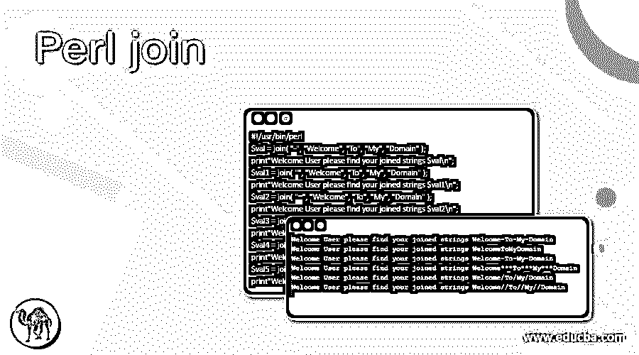

# Perl 连接

> 原文：<https://www.educba.com/perl-join/>

## Perl join 简介

Perl join 是可用于连接列表中元素的函数之一。它可以转换成字符串数据类型。转换后的字符串的数据类型值是单一的，并且它需要在字符串元素中使用表达式。它还被平行地和它的对立概念的字符串分割功能。该表达式用于 join 方法中位置的任何一侧，其基础是列表值相互连接，并形成脚本的单个输出。

**语法:**

<small>网页开发、编程语言、软件测试&其他</small>

Perl join 是内置函数之一，可用于连接多个用户输入值和单个变量值。它有自己的语法和基于列表元素的元素属性，用户输入可能被触发为脚本中的单个字符串值。

`#!/usr/bin/perl
$var = join(Expr, List);`

Expr 是任何类型的表达式，如运算符+、-、/、\，等等。基于这些表达式，输入值相互分离。该列表是任何输入值，它可以是字符串、整数或数字数据类型。

–一些 Perl 脚本代码逻辑—

### Perl 中的 join 函数是如何工作的？

Perl 的 join()函数用于连接单个值中的 n 个元素。它可以是任何数据类型，如字符串、数字或整数等。split 和 join 函数有一些不同之处，正则表达式通过使用一些 de-limiter 概念来占用拆分用户输入值的空间。对于每组值，字符串会相应地彼此拆分，同样，join(，)方法与 split()函数方向相反。它将接受 n 个用户输入值，可能是字符串或整数类型，使用相同的分隔符概念连接在一起。通过使用 join()方法，它首先将字符串值与变量中的某组元素或列表分开，然后需要将单个变量 string 中的每组字符串值连接起来。如果假设用户输入值有时在列表中没有值，则时空是通过使用“\s”计算的，它只匹配元素列表中的单个空白字符。在一些字符串中，当我们使用 split 方法时，值空格会更多。默认的单个空格是通过使用分隔符计算的，但是由于列表中的空字符串值，空格会加倍，所以下一个值会指向列表。它将包括用户输入作为前面的空格，因为用户输入值有时长词根据它们的含义被分割，所以它自动采用那个时间的空格事实上，字符串的空值或 null 值将返回字符串值的列表作为返回类型，所以基于分隔符当我们在字符串中使用更多数量的分隔符运算符时，它将更加指定和灵活地创建空字符串。因此，该列表将占用更多的内存空间，所以应该避免，因为在执行脚本时会出现性能问题。

当字符串值相互连接时，对于基于用户输入的长字符串值，更有效的方法是使用一些操作符，如“-”，它将被用于拆分每个字符，并使用连接功能将它们相互连接。这是一个 perlish 类型的函数，所以应该接受它加入实际的列表集。它不应该放在保存列表值的数组中，因为它会将字符串中的每组单词作为列表提取出来。当我们在分隔符表达式中使用 null 作为值时，值的单引号(')或双引号(")之间没有任何内容。所以正则表达式是 perl 脚本中拆分和连接元素的主要角色。

### 例子

让我们讨论一下 Perl join 的例子。

#### 示例#1

**代码:**

`#!/usr/bin/perl
$val = join( "-", "Welcome", "To", "My", "Domain" );
print"Welcome User please find your joined strings $val\n";
$val1 = join( "", "Welcome", "To", "My", "Domain" );
print"Welcome User please find your joined strings $val1\n";
$val2 = join( "~", "Welcome", "To", "My", "Domain" );
print"Welcome User please find your joined strings $val2\n";
$val3 = join( "***", "Welcome", "To", "My", "Domain");
print"Welcome User please find your joined strings $val3\n";
$val4 = join( "/", "Welcome", "To", "My", "Domain" );
print"Welcome User please find your joined strings $val4\n";
$val5 = join( "//", "Welcome", "To", "My", "Domain");
print"Welcome User please find your joined strings $val5\n";`

**输出:**

#### 实施例 2

**代码:**

`use strict;
use warnings;
use v5.10;
my @var1 = ('siva', 'raman', 'sivaraman', 'jhdvf', 'dfhj', 'jhgf', 'ywuewfy', '874', '9823874', 'jdh', '823', '897237knj', '84fn', '93', 'eiyru87');
my $vr2 = join ':', @var1;
say $vr2;
my $vr3 = join "-", $vr2, "values in teh list";
say $vr3;
$vr2 = join '', @var1, 'Welcome';
say $vr2;`**T2】**

**输出:**

#### 实施例 3

**代码:**

`my $var = 'Welcome 8q6 jgasdjh 789899 jsadhbj** 99** *** uas 8987b87898 jgasvh 23 fd223 23 37 73 jh 9889 jj 998 0 () 7 s y8< >84 99jhhj', 'To my domain';
exit unless $var =~ /(o)/;
my @var1 = $var =~ //;
warn join('=', @var1), "\n";
exit unless $var =~ /(o)/;
my @var2 = split( //, $var );
warn join('-', @var2), "\n";`

**输出:**

在上面的例子中，我们在不同的区域使用了 join 函数，通过使用空分隔符和使用一些有价值的分隔符，脚本将根据这些分隔符执行，并显示输出。

### 结论

In join()函数或运算符，它对 split 函数执行相反的操作，因为连接与其他输入值连接在一起。通过使用正则表达式，我们首先拆分长度输入值，并使用 join()函数将它们连接起来。

### 推荐文章

这是一个 Perl join 的指南。在这里，我们讨论了 join 函数的定义以及它在 Perl 中是如何工作的，并给出了一些例子。您也可以看看以下文章，了解更多信息–

1.  [Perl 哈希](https://www.educba.com/perl-hash/)
2.  [Perl for 循环](https://www.educba.com/perl-for-loop/)
3.  [Perl 写入文件](https://www.educba.com/perl-write-to-file/)
4.  [Perl sort()](https://www.educba.com/perl-sort/)

