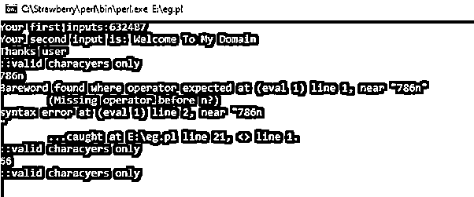
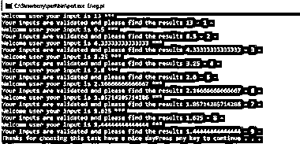

# Perl 评估

> 原文：<https://www.educba.com/perl-eval/>

## Perl eval 简介

Perl eval 被定义为可用于评估给定用户输入的函数之一，它可以是任何数据类型， 主要是整数或数字，它逐行验证字符串字符，评估将是任何用户输入，即使文件处理有一些异常和错误，也通过使用循环，数据或输入值将与可能的一组值迭代，但这需要一些时间对于每组变量值，字符串通过使用一些默认方法进行拆分和连接，它也被评估。

**语法:**

<small>网页开发、编程语言、软件测试&其他</small>

Perl eval 函数有多种用途，它有一组带参数的自变量，这是在 Perl 脚本中验证字符串所必需的。Eval 函数主要用于循环部分，因为输入值要在脚本中逐行进行验证和迭代。

`eval {
--some perl code scripts depends upon the user requirement—
}`

上面的代码是 eval 函数的基本语法，将用所有 perl 脚本函数、变量和关键字进行验证。尽管它会在编译时和运行时处理一些异常和错误。

### Perl 中的 eval 函数是如何工作的？

eval 函数不仅验证字符串和用户输入，还处理编译和运行时脚本的错误和异常。它是 Perl 脚本中内置的、最容易耗尽的函数之一。它可以与其他功能一起使用，如正则表达式、错误处理机制、脚本的必需功能、应用程序和服务器的超时会话以及动态代码生成验证。这些是通过在脚本中使用 eval 函数来评估的各种类别。当我们使用错误处理机制时，它将从编译和运行时两方面捕获一些错误，这些错误是与文件相关的问题，如“文件未找到异常”等。如果我们在字符串变量类型中使用正则表达式，它会同时使用数字、字符、运算符和符号等。无论 eval 块中使用什么输入值，都应该在脚本执行时验证一次。如果我们在脚本中加入正则表达式功能，它实际上减少了代码中的输入行，并且当匹配的字符串或相应的字符在给定的字符串中使用时，它也应该被验证。因此，与正常的脚本会话相比，这段时间需要脚本中更多的行数，执行时间也更长。基本上，通过使用循环条件，可以将列表类型正则表达式的数量放入任何容器或存储区域，如哈希、映射、数组集合等。每个用户输入的值都要逐行验证表达式。如果我们使用散列集合函数，它总是计算并用作函数参数中的键值对。但是当我们使用数组时，它有一个单一的多维数组，每个元素都有一个单独的索引值，它用内存空间创建了存储变量值的内存。这些是我们在脚本中使用正则表达式时要评估的测试用例场景，也是在 eval 块中用于脚本验证目的的测试用例场景。

同时，当我们在 Perl 脚本中使用文件处理功能时，它用于一些陷阱错误，因为每个小类型的错误将执行脚本的执行时间，所以每个编程部分的子例程将导致一些结束时间，因为这些错误或用户定义的函数将在内部和外部被调用。eval 块代码总是被执行，因此块不会携带错误和异常。但是它总是捕获用户定义的错误、编译时的语法错误以及运行时代码片段。当我们使用 eval 函数时，某些类型的错误不会被捕获，如“未捕获的信号错误、存储区内存不足、用户定义的语法错误”。这些错误是编译时错误，因此程序员可以很容易地识别它们的错误，并可以在执行时进行更正。同样，文件处理概念与一些格式，如 zip，tars 等，以及动态代码生成，以便可信和不可信的数据将在脚本中进行评估。

### 例子

让我们讨论一下 Perl eval 的例子。

#### 示例#1

**代码:**

`$var = <>;
%first = (
num => qr/^[0-9]+-$/,
chars => qr/^[a-zA-Z]+$/
);
while( my ($ke,$vals) = each(%first) ) {
if(eval"$var =~ /$vals/") {
print "Welcome users your based on your inputs your result is:$ke\n";
}
else
{
print "Please enter any valid inputs from your end:\n";
}
}`

**输出:**

#### 实施例 2

**代码:**

`$val1 = 632487;
print"Your first inputs:$val1\n";
$val2 = "Welcome To My Domain";
print"Your second input is: $val2\n";
eval{$result=$val1 + $val2;};
if($@){
print "Your input is validated";
}
print "Thanks user\n";
do {
print("::");
print("valid characyers only \n");
chop($_ = <>);
eval($_);
warn() if $@;
} while ($_ ne "Thanks users given inputs are not validated");`

**输出:**

#### 实施例 3

**代码:**

`use File::Slurp;
use strict;
use warnings;
my $userinputs = read_file('E:\\yt.txt');
my $inputcontents = "Welcome To My Domains\n";
eval ($userinputs);
if($@){
print "Thanks user your file is created";
}
my $us;
my $re;
for $us(1..9) {
eval {$re = 13 / $us; print "Welcome user your input is $re ***\n";};
print "Your inputs are validated and please find the results $re - $us - $@\n";
}
print "Thanks for choosing this task have a nice day";`

**输出:**

### 结论

脚本语言和其他面向对象的语言一样，需要对用户输入值进行一些验证。因此，他们需要更多地关注他们的输入值，并且在使用一些默认验证函数和脚本时不会丢失数据。其中 eval()函数执行一些用户输入验证，而不会丢失任何数据。

### 推荐文章

这是一个 Perl 评估指南。这里我们讨论 eval 函数如何在 Perl 中工作，并举例说明其代码实现。您也可以看看以下文章，了解更多信息–

1.  [Perl 哈希](https://www.educba.com/perl-hash/)
2.  [Perl for 循环](https://www.educba.com/perl-for-loop/)
3.  [Perl 正则表达式](https://www.educba.com/perl-regular-expression/)
4.  [Perl 写入文件](https://www.educba.com/perl-write-to-file/)

