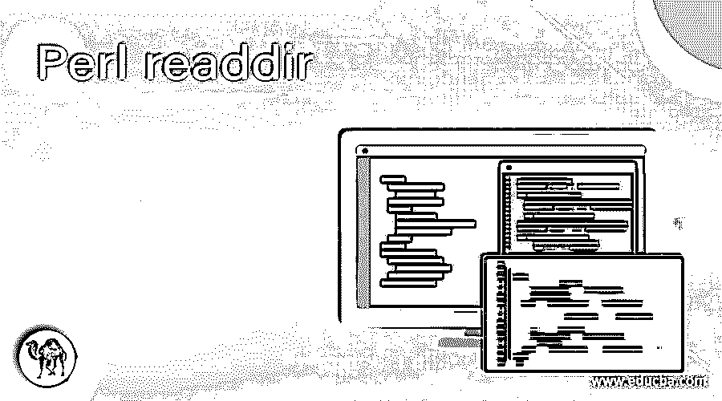

# Perl readdir

> 原文： [https://www.educba.com/perl-readdir/](https://www.educba.com/perl-readdir/)

## Perl readdir 简介

Perl readdir 是可以用来读取目录文件的函数之一，数据的内容是逐行检查和验证的。此外，它将返回已经与同一个目录句柄相关的下一个目录。dir 句柄包含与特定用户、路径或位置创建的目录相关的列表数量。在循环的帮助下使用 opendir()方法打开目录后，目录文件将被迭代，值将使用 readdir()方法进行计算。

**语法:**

<small>网页开发、编程语言、软件测试&其他</small>

在 Perl 脚本文档中，Perl readdir()是 DIRHANDLE 使用用户路径或位置处理的方法之一。使用 open()方法识别和打开目录，并使用 readdir()方法检查目录文件中的数据值。

`#!/usr/bin/perl -w
$var=””;
loops $var name= readdir(DIR)`

—一些基于用户需求的 Perl 脚本逻辑代码—

以上代码是 Perl 脚本中 readdir()方法的基本语法。在此之前，每当我们使用 readdir()方法时，我们都必须使用 opendir(DIR，$ var name)。DIR 是用于 DIRHANDLE 列表获取的下一个目录的参数。

### Perl 中 readdir 函数是如何工作的？

readdir()函数将用于处理用户创建的所有目录。目录由 DIRHANDLE 存储和检索。通过使用 opendir()方法，目录被打开，并且 opendir()本身传递与下一个目录队列相关的参数。通过使用 die 关键字，它将在用户端接收到错误的情况下向应用控制台发送通知。如果我们要列出目录中的文件，也要列出与某些模式匹配的文件，如正则表达式等，或者与目录中表示的某些结束操作符和符号匹配的文件。所有的目录功能都是使用一些符号来操作的，如<>打开和关闭符号，它将使用一些目录处理程序来处理，有时<>这个符号不在与 readdir 功能相关的目录处理程序中使用。实际上，readdir()函数通过使用标量上下文返回下一个目录文件。当使用一些关键字如 undef、def 等返回下一个目录时，就到达了下一个目录。$符号用于识别变量，即上述当前和新目录列表的标识符。

### 例子

让我们讨论一下 Perl readdir 的例子。

#### 示例#1

**代码:**

`#!/usr/bin/perl
use strict;
use warnings;
my $vars = 'E:\\yt';
opendir(DIR, $vars) or die $!;
while (my $vars1 = readdir(DIR)) {
next if ($vars1 =~ m/^\./);
print "Welcome To My Domain \n $vars1\n";
}
closedir(DIR);
my @vars2 = glob("*.pl *.jpg");
foreach my $vars1 (@vars2) {
print "Have a Nice Day User \n $vars1\n";
}
exit 0;`

**输出:**

在上面的例子中，我们在 while 循环中使用了 readdir()函数。主要是 while 循环首先检查条件，如果条件为真，它将执行循环语句。在 while 循环中，使用$ symbol 将变量中名为 DIR 的参数，使用 next if 条件方法，将变量作为参数。使用一些正则表达式，比如/，^,\，这些是传递给 while 循环的操作符。它使用@vars2 变量初始化并调用 glob 方法，它可以接受。pl 和。jpg 使用 foreach 初始化变量并调用参数作为与文件搜索目录相关的新变量。

#### 实施例 2

**代码:**

`#!/usr/bin/perl -w
use strict;
use File::Slurp;
my $vars = "E:/issues";
my $vars1;
opendir ( DIR, $vars ) || die "Error in opening dir $vars\n";
while( ($vars1 = readdir(DIR))) {
print("Welcome User your directory files are listed please find it \n $vars1\n");
}
my @vars2=read_dir($vars);
my $vars3=@vars2;
for(my $i=0;$i<$vars3;$i++){
print"Thanks Users your directory files are listed below \n FileList: $vars2[$i]\n";
}`

**输出:**

在第二个例子中，我们以不同的方式使用 readdir()方法。我们已经初始化并声明了变量，其值为文件中的位置或目录路径。通过使用 for 循环，迭代这些值，并在控制台中列出目录文件夹文件。当我们使用 while 循环时，它首先检查条件，如果条件为真，那么它将使用 opendir()执行语句。使用 read_dir 打开目录。使用如下输入扩展名列出并验证目录文件。pl 等。如果假设我们没有提到任何文件格式，它将检索并显示文件夹的特定目录中提到的所有文件。

#### 实施例 3

**代码:**

`#!/usr/bin/perl -w
opendir(DIR, ".");
@var = grep(/\.txt$/,readdir(DIR));
closedir(DIR);
foreach $vars1 (@var) {
print "Welcome To my Domain the specific text files are listed which is stored in the specific directory thanks $vars1\n";
}`

**输出:**

我们使用的最后一个例子 readdir 和 opendir 是用于特定目录的两个 Perl 函数。我们没有在变量中声明任何特定的目录，也没有提到这些目录在输出控制台的文件夹、文件中列出。我们使用了特定的格式。通过使用 grep Linux 命令，它将获取和检索控制台上的特定格式文件。一般来说，grep 命令是最高级和最常用的命令，用于搜索字符串中的特定字符，或者在大文件或输入空间中查找特定字符。这里我们将使用相同的 grep 命令，该命令将用于列出上述目录文件夹中的特定格式文件。

### 结论

在结论部分，Perl readdir()函数用于读取目录文件，该文件已在输入中的特定目录中提及，也未提及目录名称。脚本将基于脚本文件保存位置执行。因此，当我们使用 readdir 函数时，可以避免手动搜索，使用这个自动化脚本可以节省时间。

### 推荐文章

这是一个 Perl readdir 指南。这里我们讨论 Perl 中 readdir 函数的介绍和工作原理，以及代码实现的例子。您也可以看看以下文章，了解更多信息–

1.  perl eval
2.  [Perl 哈希](https://www.educba.com/perl-hash/)
3.  [Perl for 循环](https://www.educba.com/perl-for-loop/)
4.  [Perl sort()](https://www.educba.com/perl-sort/)

