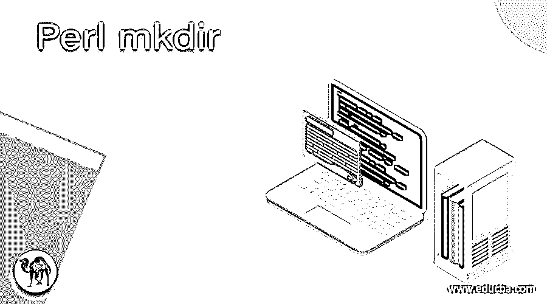

# Perl mkdir

> 原文：<https://www.educba.com/perl-mkdir/>

## Perl mkdir 简介

Perl 中的 mkdir 函数代表指定路径上的 make 目录。如果我们想在系统中的任何路径或网络上的任何地方创建一个目录，我们可以用它来创建。在 Perl 中使用这个函数需要两个参数。在 mkdir 函数中，我们必须指定创建目录的目录名。mkdir 函数将其中一个参数作为我们提到的模式。在下一节中，我们将更多地讨论 Perl 中的 mkdir 函数，以便初学者更好地理解它。

**语法**

<small>网页开发、编程语言、软件测试&其他</small>

我们知道，它是一个函数，使用它的时候需要两个参数作为输入参数。让我们更详细地了解它的语法，以便更好地理解它的用法，见下文；

**1。mkdir 文件名，模式:**这是 Perl 官方文档给出的语法。它采用名为文件名和模式的参数。在下一节中，我们将更详细地看到它的签名。

**2。mkdir FILENAME:** 这也是 Perl 文档给出的官方语法。这里我们只传递目录名，默认为 MODE。在下一节中，我们将更详细地看到它的签名。

让我们来看一个初学者练习语法的例子，以便更好地理解它。

例如:

`mkdir $your_directory_name, MODE;`

因此它将在提到的指定路径中创建目录

### mkdir 函数在 Perl 中是如何工作的？

现在我们已经知道，mkdir 函数代表 make directory，它用于在 Perl 中的指定路径上创建目录。它是 Perl 中的一个内置函数，所以我们不需要包含任何外部库来在我们的程序中使用它。在许多脚本语言中，我们都有这个函数，它的工作方式也和 Perl 一样，“mkdir”通常是指通过编写脚本在系统或网络上创建一个目录。在本节中，我们将根据 Perl 文档更仔细地查看它的签名；更好的用法，见下文；

方法签名；

1.mkdir EXPR，MODE:这个函数接受两个参数作为 Perl 中的输入参数。给定这两个参数值后，它将在作为输入给出的路径上创建一个目录。

a) EXPR /文件名:通过使用这个参数，我们可以指定或定义我们希望在系统上创建目录的路径。我们可以单独创建它，或者在 Perl 中使用""更简单的字符串文字来分配它。让我们看看如何在 Perl 中定义这一点，以使 mkdir 函数按预期工作(见下文);

例如

`$directoryname = "/some/path";`

b) MODE:该参数用于定义 Perl mkdir 函数中的模式。如果没有指定模式，那么它将采用默认模式，这已经在 Perl 中定义了；默认模式是 0755。

2.返回类型:Perl 中的 mkdir 函数在成功和失败时返回布尔值。如果目录创建成功，将返回 TRUE 如果目录创建不成功或失败，它将返回 FALSE。

现在我们将看到一个练习示例，供初学者理解如何在编程时使用该函数；此外，它将解释这个函数的内部工作。见下文；

例如:

`print "Demo to show mkdir function working in perl by using a simple example \n";
$mydir ="/some/path";
$result  = mkdir $mydir, 0755;
print "result is : $result\n";`

这是一个示例，首先我们创建一个名为“mydir”的变量；这个变量将保存应该创建它的目录的路径。在这之后，我们尝试使用带有两个指定参数的 mkdir 函数。我们作为目录路径传递的第一个参数是“mydir”变量。第二个是我们默认传递的模式。此外，我们将它的结果保存到一个“result”变量中，这个变量将告诉我们它是否成功。成功一次将返回 1，失败一次将返回 0。我们可以使用这个结果来根据需求创建任何条件。同样，我们可以在目录创建失败时抛出一个异常，因为它可能在下一段代码中；我们正在用那个目录存储一些文件。在本文的下一部分，我们将看到 Perl 中 mkdir 函数的一些实际例子。

### 例子

在这个例子中，我们试图使用 Perl 中的 mkdir 函数；我们没有导入任何外部库来使用它，因为它是一个内置函数。我们使用这个例子创建了几个目录，并打印了结果，不管是成功还是失败。这是一个简单的例子，适合初学者从 Perl 中的 mkdir 函数开始。

**举例:**

`print "Demo program to show mkdir function in Perl \n";
$mydir1 = "/tmp/directory1";
$mydir2 = "/tmp/directory2";
$mydir3 = "/tmp/directory3";
$mydir4 = "/tmp/directory4";
$mydir5 = "/tmp/directory5";
$mydir6 = "/tmp/directory6";
print "calling mkdir function calls in Perl ... \n";
$result1  = mkdir $mydir, 0755;
$result2  = mkdir $mydir, 0755;
$result3  = mkdir $mydir, 0755;
$result4  = mkdir $mydir, 0755;
$result5  = mkdir $mydir, 0755;
$result6  = mkdir $mydir, 0755;
print "Prinitng result after mkdir function calls in Perl ... \n";
print "Result one is : $result1\n";
print "Result two is : $result2\n";
print "Result three is : $result3\n";
print "Result four is : $result4\n";
print "Result five is: $result5\n";
print "Result six is : $result6\n";`

**输出:**

### 结论

通过使用 mkdir 函数，我们可以在编程时轻松地创建一个目录。它很容易写，可读性强，也容易理解。这个函数并不复杂，因为它只接受我们希望创建它的目录的路径和名称。如果未指定模式，将采用默认模式。

### 推荐文章

这是一个 Perl mkdir 的指南。这里我们讨论了 mkdir 函数在 Perl 中是如何工作的，并给出了例子和输出。您也可以看看以下文章，了解更多信息–

1.  [Perl 祝福](https://www.educba.com/perl-bless/)
2.  [Perl 解包](https://www.educba.com/perl-unpack/)
3.  [Perl 字符串长度](https://www.educba.com/perl-string-length/)
4.  [Perl 哈希](https://www.educba.com/perl-hash/)

