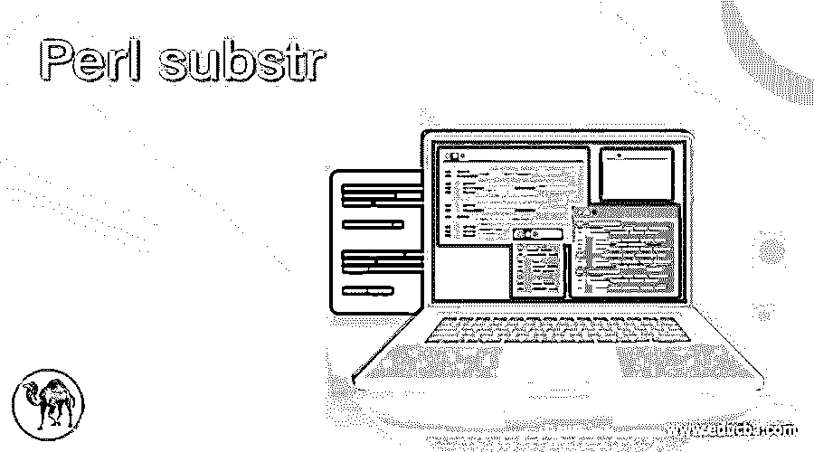

# Perl 基底

> 原文：<https://www.educba.com/perl-substr/>

## Perl substr 简介

在 Perl 中，substr 是一个函数，用于在给定或指定的字符串中查找字符串的一部分，它需要每个字符的索引来查找字符串的子串，其中字符串的长度是从给定的字符串中访问子串所需要的。一般来说，substr()是 Perl 中的一个字符串函数，用于获取给定或指定字符串的一部分，其中该函数返回指定长度的子字符串作为该函数的参数，如果没有指定长度，则默认情况下它将从给定字符串的开头打印字符串。

### 在 Perl 中使用 substr()

在本文中，我们将讨论 Perl 编程语言的 substr()函数。在 Perl 中， substr()是一个字符串函数，这意味着基本上应用于字符串，该函数将字符串作为参数，需要子字符串以及字符串的长度，例如从一个字符到另一个字符的字符串索引，也作为参数传递，但如果没有指定，它将默认从给定字符串的索引开始打印字符串，如果提供了 字符串可以是正数或负数，表示字符串中索引计数的方向，其中负索引从右向左读取字符串，正索引规范从左向右读取字符串的索引。 这个函数也可以通过传递必须被替换的字符串来用另一个字符串替换一个字符串。要被替换的字符串的其他部分也被传递给这个函数，并且只有该部分字符串被替换。

<small>网页开发、编程语言、软件测试&其他</small>

现在让我们看看下面部分中的语法和示例:

**Perl 中 substr()的语法:**

`substr(string, indx_str, len_str);`

**用于替换字符串的 substr()的语法如下:**

`substr(string, indx_str, len_str, str_replace);`

在上述语法中，参数是:

*   **string:** 该参数用于指定要从中删除并显示子串的字符串。
*   **indx_str:** 用于指定给定字符串从正或负开始的索引。
*   **len_str:** 用于指定需要从指定字符串中提取的子串的长度。该参数也可以是可选的。
*   **str_replace:** 只有当我们想要用另一个指定的子字符串替换给定字符串的任何部分时，才使用这个选项。所以这个参数是可选的。

### 例子

在下面的例子中，我们将看到演示 substr()函数的简单 Perl 代码。

#### 示例#1

**代码:**

`#!/usr/bin/perl
print "Demonstration of substr() function in Perl \n";
print "\n";
$str1 = "Educba";
print "The given string is: ";
print $str1;
print "\n";
$res_substr = substr($str1, 3);
print "The substring obtained from the given string is :";
print $res_substr;
print "\n";
$res_substr2 = substr($str1, 2, 4 );
print "The substring using len_str parameter in substr(): ";
print $res_substr2;
print "\n";
$res_substr3 = substr($str1, 1, -2);
print "The substring using negative index in substr() function: ";
print $res_substr3;`

**输出:**

在上面的程序中，我们可以看到，首先我们用变量“str1”声明了一个字符串，以“$”符号开始，字符串是“Educba”。首先，我们打印了已定义的字符串，然后我们使用 substr()函数，其中我们只传递两个参数第一个参数是在开始时定义的字符串(str1 = "Educba ")，第二个参数作为" 3 "传递，这是给定字符串的索引，它将打印从索引 3 到字符串中剩余字符的所有字符或子字符串，子字符串的结果存储在" $res_substr "中。然后，我们再次使用 substr()函数，其中我们传递了三个参数，第一个参数是指定的字符串，第二个参数是“2 ”,它是给定字符串的索引，因此在索引 2 处，我们有从给定字符串的字符“u”到指定为 4 的第三个参数的“u ”,这是索引“2”之后的子字符串的长度，因此从索引 2 开始，它将打印指定字符串后面的 4 个字符作为子字符串，该结果存储在“$res_substr2”中。最后，我们在第三个参数中指定了负值，该参数将从字符串的右到左开始索引，因此在索引“-2”处，我们有“b ”,但我们必须从右到左获取在字符“-2”之后的字符“c ”,因此它将从索引“1”作为“d”打印到索引-2 作为“c ”,结果存储在“$res_substr3”中。输出如上图截图所示。

现在我们将看到一个在 Perl 中使用 substr()函数进行字符串替换的例子:

#### 实施例 2

**代码:**

`#!/usr/bin/perl
print "Demonstration of substr() function used in replacement of string in Perl \n";
print "\n";
$str = "Educba Institute for Java";
print "The given string is: ";
print $str;
print "\n";
$res = substr($str, 21, 4, "Python");
print "The string that needs to be replaced is: ";
print $res;
print "\n";
print "After replacement of the string the new string is: ";
print $str;`

**输出:**

在上面的程序中，我们声明了一个字符串“Educba Institute for Java ”,它首先被打印出来，然后我们应用 substr()函数，在这里我们传递四个参数，第一个是指定的字符串，第二个是 21，它是字符串需要被替换的索引，第三个是 4，它是需要被替换的字符串的长度，第四个是替换前面的子字符串后需要被打印出来的子字符串。结果存储在“$res”中，输出可以在上面的截图中看到。

### 结论

在本文中，我们得出结论，Perl 中的 substr()函数是一个字符串函数，它从给定的字符串中提取部分字符串。通常，这个函数使用子串的字符串索引和长度从给定的字符串中返回子串。在本文中，我们看到了一个使用字符串索引和字符串长度显示子字符串的示例，该示例可以有正索引和负索引。在本文中，我们还通过一个例子看到了 substr()函数如何用于字符串的替换。

### 推荐文章

这是一个 Perl substr 的指南。这里我们还讨论了 Perl 中的 Perl substr 的定义和工作，以及不同的例子和它的代码实现。您也可以看看以下文章，了解更多信息–

1.  [Perl while 循环](https://www.educba.com/perl-while-loop/)
2.  [Perl sort()](https://www.educba.com/perl-sort/)
3.  [Perl chop()](https://www.educba.com/perl-chop/)
4.  [Perl 类](https://www.educba.com/perl-class/)

