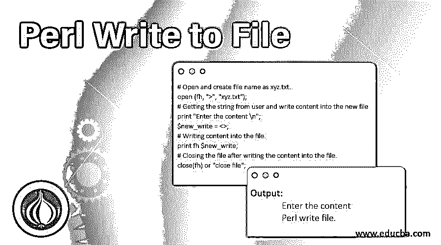
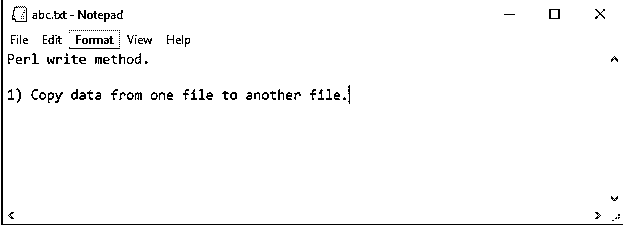
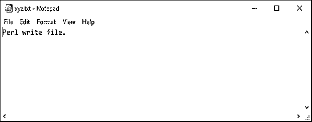

# Perl 写入文件

> 原文：<https://www.educba.com/perl-write-to-file/>

## Perl 写入文件简介

Perl write to file 是用来把内容写到一个文件中的，我们可以从一个文本文件中复制内容，然后写到另一个文本文件中。我们使用了一个文件处理程序变量来写一个文件，这个文件处理程序与文件相关联。如果我们想在文件中写入任何记录，就必须以写模式打开文件。如果文件已经包含数据，那么它将删除旧数据并将新内容写入文件，否则将创建新文件并添加内容。

### 如何用 Perl 写文件？

*   Perl 中有各种方法可以将内容写入文件。文件写操作在 Perl 中非常重要和有用，可以将内容写入文件。
*   这个写文件是用来把内容写入文件的，在 Perl 中我们有赋值文件处理程序来对文件执行各种文件操作。
*   如果我们想用 Perl 写一个文件，就必须用 Perl 的写模式打开文件。下面是以写模式打开文件的语法说明如下。

#### 以写模式打开文件的语法

`Open (FH, ‘>’, “filename.txt”);`

<small>网页开发、编程语言、软件测试&其他</small>

*   在上面的语法中，open 关键字用于以写模式打开文件。在 Perl 中写一个文件，打开一个文件是很重要的。
*   Filename 状态以写模式打开指定文件，以将任何内容写入文件。
*   Print()函数在 Perl 中将内容写入文件中非常重要。我们已经使用打印功能将内容写入文件。

下面是打印功能的语法如下。

#### 打印函数的语法

`Print filehandle_string;`

*   filehandle_string 在将内容写入文件时在打印函数中使用。
*   我们使用了一个文件处理程序变量来写一个文件，这个文件处理程序与文件相关联。
*   如果我们想在文件中写入任何记录，就必须以写模式打开文件。

### 使用 Perl 写入文件的方法

下面是将数据写入文件的可用方法如下。

*   使用与文件相关联的文件处理程序在打开文件时将字符串保存的内容写入文件。
*   将内容从一个文件复制到另一个文件。
*   将内容写入新创建的文件。

我们已经使用文件处理程序将内容写入文件。文件处理程序对于将内容写入文件非常重要。在 Perl 中，我们从一个文件中复制数据，也将数据写入另一个文件。我们还创建了一个新文件，并用 Perl 将内容写入新创建的文件中。也可以将内容写入已经创建的文件。

下面是我们在 Perl 中用来将内容写入文件的方法。

#### 方法 1–使用相关的文件处理程序

在打开保存要写入文件的内容的文件字符串时，使用与文件相关联的文件处理程序。

下面的例子显示了将内容写入已经创建的文件。我们已将内容写入 abc.txt 文件。这个文件包含数据。在下面的示例中，我们已经覆盖了 abc.txt 文件的数据。

**代码:**

`# Opening file abc.txt write mode in Perl.
open (fh, ">", "abc.txt");
# Getting the string from user and write content into the file
print "Enter the content \n";
$write = <>;
# Writing content into the file.
print fh $write;
# Closing the file after writing the content into the file.
close(fh) or "close file";`

**输出#1**

**输出#2**

**将数据写入文件后，输出#3** 。

下面的步骤显示了程序的逐步执行。

*   以写入模式打开 abc.txt 文件。
*   从用户那里获得输入。
*   在$FH 指向的写变量中存储输入。
*   关闭 abc.txt 文件。

#### 方法 2–将内容从一个文件复制到另一个文件。

我们已经使用 abc.txt 源文件将数据复制到 pqr.txt 文件中。abc.txt 文件中的数据如下。

**代码:**

`# Source File name as abc.txt
$source_file = 'abc.txt';
# Destination File name as pqr.txt
$destination_file = 'pqr.txt';
# open abc.txt file for reading
open(FHR, '<', $source_file);
# open pqr.txt file for writing
open(FHW, '>', $destination_file);
print("Copying $source_file to $destination_file\n");
while(<FHR>)
{
print FHW $_;
}
close(FHR);
close(FHW);`

打印"复制成功。\ n "；

将内容从 abc.txt 文件复制到 pqr.txt 文件。

下面的步骤显示了程序的逐步执行。

*   以读取模式打开 abc.txt 文件，以写入模式打开 pqr.txt 文件。
*   从 abc.txt 文件中读取内容并写入 pqr.txt 文件。
*   使用打印功能复制文件内容。
*   读取完成后关闭 abc.txt 文件。

#### 方法 3——创建一个新的写文件。

在下面的例子中，我们创建了一个名为 xyz.txt 的文件名，并将内容写入该文件。在将数据写入文件时，我们接受了用户的输入。

**代码:**

`# Open and create file name as xyz.txt.
open (fh, ">", "xyz.txt");
# Getting the string from user and write content into the new file
print "Enter the content \n";
$new_write = <>;
# Writing content into the file.
print fh $new_write;
# Closing the file after writing the content into the file.
close(fh) or "close file";`

**输出:**

新文件将名称创建为 xyz.txt，并将数据写入文件。

下面的步骤显示了程序的逐步执行。

*   以写模式打开并创建 xyz.txt 文件。
*   从用户那里获得输入。
*   在$FH 指向的写变量中存储输入。
*   关闭 xyz.txt 文件。

### 结论

Perl write to file 是用来将内容写入一个文件的，我们可以从一个文件中复制内容并写入另一个文本文件。我们使用了一个文件处理程序变量来写一个文件，这个文件处理程序与文件相关联。

### 推荐文章

这是一个 Perl 写文件的指南。这里我们讨论一个 Perl 用适当的语法写入文件的介绍，如何用三种不同的方法详细地写入文件。您也可以浏览我们的其他相关文章，了解更多信息——

1.  [Perl if 语句](https://www.educba.com/perl-if-statements/)
2.  [Perl 数据类型](https://www.educba.com/perl-data-types/)
3.  [在 Perl 中拆分](https://www.educba.com/split-in-perl/)
4.  [Perl 版本](https://www.educba.com/perl-versions/)

