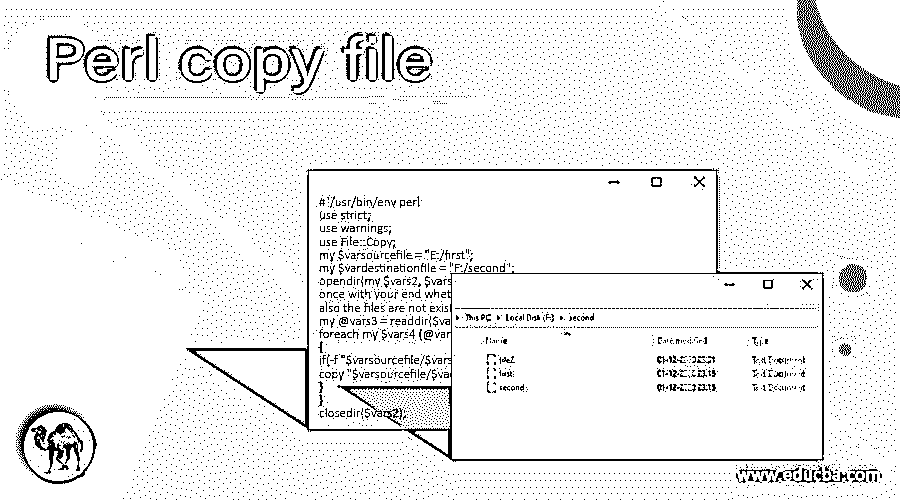
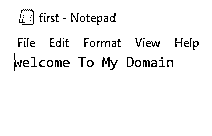
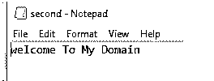
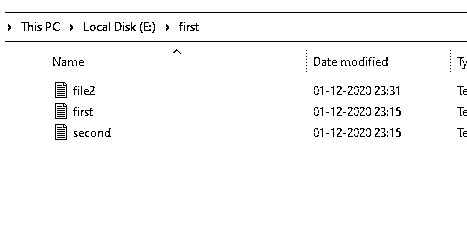
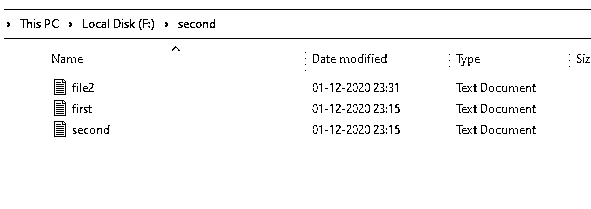
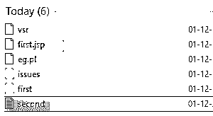

# Perl 复制文件

> 原文：<https://www.educba.com/perl-copy-file/>

## Perl 复制文件简介

Perl 复制文件是其中的一个功能，它主要通过使用 copy()函数来处理，其中有一个模块用于将用户输入及其内容从一个地方复制到另一个地方。这里我们最有可能在文件中使用它作为存储和从服务器检索数据的中间桥梁。Perl 复制文件有两组参数，它们被传递到方法中，如文件复制自和文件复制到这些参数集，这些参数集在脚本中具有字符串数据类型。

**语法:**

<small>网页开发、编程语言、软件测试&其他</small>

在 Perl 脚本中，copy 是用来将用户输入的内容从一个地方复制到另一个地方的函数之一。通过使用这些功能，如果要求与应用程序相同，则可以节省时间。在备份期间，备份将是最终用户的主要任务。

`use File::Copy “reference string”;
copy(“user input datas sourcefile”, “same userinputs which is copied from the source it’s a destination datas”);
$variable = FileHandle or any other type of Exception -> new(“path”, “r or w”);
cp($variable,””);`

上面的代码是在文件模块中使用的 copy()函数的基本语法，这些 copy 函数在文件中会被处理并抛出一些错误和异常，这些错误和异常在最终用户中已经发生了。

### 如何在 Perl 中复制文件？

在 Perl 脚本中，如果其中一个函数和它在不同的模块中使用，则该函数会传入两组参数，一组是要从源数据复制的文件，另一组是要存储在目标路径中的数据。这两组参数与字符串数据类型有关，它会抛出一些异常，如文件句柄引用等。因为这些异常主要发生在源路径中，当用户给出错误的路径或没有与路径相关的数据时，如文件名无效文件没有内容或数据。我们使用“r ->read”，“w>write”来表示这些字符，这在复制功能中指出了文件是否可读、可写。通常，复制功能不会覆盖文件上的只读数据，如果假设文件的目标路径已经存在，并且其名称是一个目录，则通过使用源路径上的实际文件名将源文件路径复制到目标路径。

### 例子

让我们讨论 Perl 复制文件的例子。

#### 示例#1

**代码:**

`use File::Copy;
$varsourcefile = 'first.txt';
$vardestinationfile = 'second.txt';
copy($varsourcefile, $vardestinationfile) or die "Sorry User your file datas are not copied kindly check once with your end the file is in the correct source path: $!";`

**输出:**

在上面的例子中，我们对基础层的文件模块使用了复制功能。这里我们使用了两个变量，如$varsourcefile 和$ vardesinationfile。var source file 用于指向位于用户端的源文件或原始文件路径。目标路径用于处理名为$vardestinationfile 的变量，该变量将接收来自实际源数据的用户输入内容，而不会中断文件数据从一个位置复制到另一个位置。同时，我们只有源文件名“first.txt”和目标文件名“second.txt”。我们没有创建目标文件。它会自动创建新文件，并将数据插入到该文件中。在这里，我们在运行时没有收到任何异常或错误。

#### 实施例 2

**代码:**

`#!/usr/bin/env perl
use strict;
use warnings;
use File::Copy;
my $varsourcefile = "E:/first";
my $vardestinationfile = "F:/second";
opendir(my $vars2, $varsourcefile) || die "User kindly check once with your end whether the files are there in the source also the files are not exists on the destination $!";
my @vars3 = readdir($vars2);
foreach my $vars4 (@vars3)
{
if(-f "$varsourcefile/$vars4" ) {
copy "$varsourcefile/$vars4", "$vardestinationfile/$vars4";
}
}
closedir($vars2);`

**输出:**

在第二个示例中，我们在文件模块中使用了相同的复制功能，但这里我们有一些细微的变化，即我们有一个名为“first”的文件夹名称，因为创建了三个文件，每个文件都有一些输入内容或数据。通过使用上述脚本复制功能，文件夹数据从源驱动器复制，并以相同的名称和文件数据不间断地粘贴到目标驱动器。此外，该驱动器上的日期和时间也不会更改，确切的源数据会复制到目标驱动器中。这里，文件复制功能被用作目录级或文件夹级。我们还在目标驱动器上创建了“第二个”作为文件夹名称，然后只将源驱动器文件夹(第一个)复制并粘贴到目标(第二个)驱动器上。而且这里不止一个文件被从一个地方拷贝到另一个地方。

#### 实施例 3

**代码:**

`use File::Copy;
copy("first.jsp", "second.txt")
or die "Sorry user your jsp file datas are copied to the destination please check the file formats: $!";
print "Thank you user your jsp file datas are copied to the text file format successfully \n";`

**输出:**

**T2】**

 **

在最后一个示例中，我们在文件概念中使用了相同的复制功能，但这里我们使用了不同的文件格式，如源文件为“first.jsp ”,目标文件为“second . txt”。JSP 文件内容被复制为 txt 文件格式。所以 Perl 脚本中的 copy 函数也接受不同的文件格式，这是我们在 Perl 脚本中使用 copy()函数的一个优点。

### 结论

在 Perl 脚本中，复制功能是将源文件复制到目标文件而不会中断和丢失数据的主要概念之一。当我们使用 copy()时，它还有一些其他类型，如 rmscopy、syscopy 和 move，这些函数也包括在内，而 copy 函数是在脚本上执行的，这取决于用户需求。

### 推荐文章

这是一个 Perl 复制文件的指南。这里我们还讨论了 Perl 中文件的定义以及如何复制文件？以及不同的示例及其代码实现。您也可以看看以下文章，了解更多信息–

1.  [Perl 写入文件](https://www.educba.com/perl-write-to-file/)
2.  [Perl 哈希](https://www.educba.com/perl-hash/)
3.  [Perl sort()](https://www.educba.com/perl-sort/)
4.  [Perl for 循环](https://www.educba.com/perl-for-loop/)

**