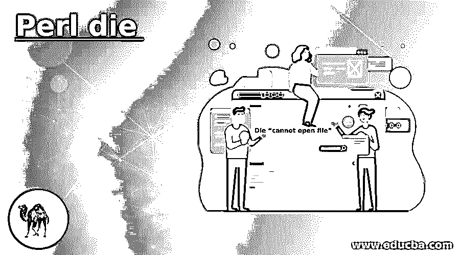

# Perl 模具

> 原文：<https://www.educba.com/perl-die/>

## Perl die 简介。

Perl die 函数发出致命错误事件的信号，因为被引用的程序不应该被允许继续运行。Perl 中的错误处理是对由于代码或编译器中的某些错误而导致执行中出现问题的程序采取适当措施的方法。周期容易出错。例如，如果打开一个不存在的文档会引发一个错误，或者访问一个没有发音的变量会引发一个错误。如果出现错误，程序将会停止，因此利用错误处理，我们可以采取适当的措施，而不是完全停止程序。错误处理是任何容易出错的语言的重要前提。

**语法和参数:**

<small>网页开发、编程语言、软件测试&其他</small>

`Die “cannot open file”`

这是骰子功能出现的错误，因此控制台会给出上述消息。

### Perl 中的 die 函数是如何工作的？

现在我们将看到骰子功能的几个例子:

#### 示例#1

利用 if-else 语句。

**代码:**

`if(-e $span)
{
print "There is a file";
}
else
{
die "Not able to open. $!"
}`

**输出:**

在上面的程序中，我们用 if 和 else 语句检查骰子错误。首先，我们检查适当的文件名是否存在，如果存在，我们要求它打印语句，否则使用 die 函数，它打印 else 语句，说明它无法打开任何这样的文件。因此程序从控制台退出。

#### 实施例 2

利用除非语句。

**代码:**

`unless(-e $span)
{
die "Not able to open this file $!";
}`

**输出:**

在上面的程序中，与前面的程序类似，这里我们使用了 unless 语句并检查 die 函数。程序被执行，错误伴随着 die 函数而来，输出如上面的快照所示。

而在简单的内容中，它在很大程度上并没有什么不同；大败确实是一个特例。在简单的内容中，您可能没有任何独特的代码来获得这些特殊情况。在这种情况下，你基本上是用“一命呜呼”,而不是“事后警告>退出”。当您开始在更大的应用程序中组合模块时，您可能需要真正地抛出豁免，然后利用 eval 来捕获它们。Perl 提供了一个符号句柄，以一种略微进一步开发的方式传递，类似于它为谨慎起见而完成的。巨大的反差是，收集了踢桶电话的标志监督并没有阻止你的内容死亡。到目前为止，在你遇到特殊情况(例如利用 eval)的情况下，这是非常有趣的，你热衷于发现有人遇到特殊情况但没有很好处理的情况。

此外，在不同的地方有大量的 Perl 内容和应用程序，它们既不使用警告，也不在 sh-blast 行使用–w。添加使用警告可能会产生一系列警告。事实上，即使从长远来看，类似地，因为你不能绝对没有错误代码，你不能保证你的应用程序永远不会打印警告。Perl 有一个名为%SIG 的底层散列，其中的键是您的工作框架中可访问的符号的名称。质量是子程序(所有子程序的更明确的引用),当特定的符号出现时将被考虑。尽管您的工作框架有标准的标志，Perl 还是添加了两个内部“信号”。其中一个名为 warn，每当一些代码调用 caution() work 时就会被触发。另一个叫骰子，调用 pass on()的时候设置关。

我确信不同的操作系统也有自己固有的日志组件。邻域对于限制我们的更改对您在模块内使用该代码的可能性的影响是至关重要的，尤其是在您散布它的可能性很小的情况下。如果没有限制，所有应用程序都会受到影响。尽可能远，它到装箱块。

### 结论

因此，我们想总结一下，当你需要标记某件事情变得很糟糕，你需要退出的时候，你打电话来踢水桶。阅读 Perl 代码的人都非常熟悉 pass on。其中一个实现的清晰度是打开或大败风格的代码打开一个文件。调用 kick the bucket 将把提供的字符串打印到标准错误(STDERR)中，然后退出程序。它还有一个类似于 caution 的附加元素，如果您传递给它的字符串没有以新行结束，Perl 会合并记录的名称和调用 bite the dust 的行号。这有助于以后找到问题的根源。

### 推荐文章

这是一个 Perl die 的指南。这里我们讨论 Perl 中的介绍和 die 函数是如何工作的？为了更好的理解。您也可以看看以下文章，了解更多信息–

1.  [Perl unlink](https://www.educba.com/perl-unlink/)
2.  [Perl readdir](https://www.educba.com/perl-readdir/)
3.  [珠联体](https://www.educba.com/perl-json/)
4.  [Perl for 循环](https://www.educba.com/perl-for-loop/)

