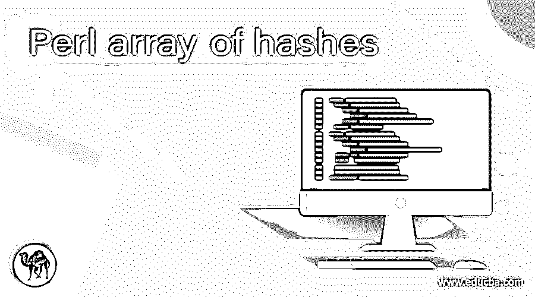
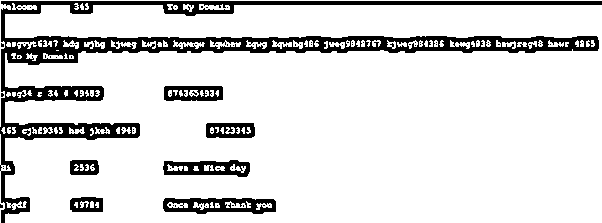
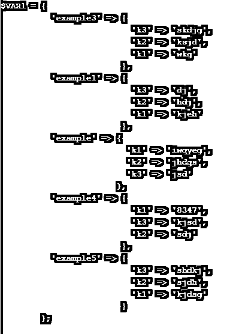

# Perl 散列数组

> 原文：<https://www.educba.com/perl-array-of-hashes/>

## Perl 散列数组简介

在 Perl 中，散列数组是与散列映射技术相关的特性和概念之一，它有一组可以按顺序访问的数据；此外，每组绑定的数据将包含与哈希映射技术相关的键-值对，主要是在哈希数组中以不太频繁的方式访问和使用。键将是唯一的，因此它不能接受重复的键，因为每组键都有单独的值，所以它将指出具有值的单个键。

**语法:**

<small>网页开发、编程语言、软件测试&其他</small>

Perl 脚本散列是将用户密钥转换成另一个值的过程和技术之一；在散列函数的帮助下，散列值被生成。该阵列是存储器中的顺序数据存储器；变量的散列类型用百分号(%)表示，以便于识别；此外，数组变量有自己的前缀和唯一的一组键。如果密钥存在，它将在内存中被自动覆盖。

`#! /usr/bin/perl
my %vars = ( key1 => value1, key2 => value2 ….);
my @vars1 = ({ key1 => value1, key2 => value2 ….});
---some perl script logics depends upon the requirement------`

上面的代码是从数组创建散列的基本语法。我们使用 Perl 变量和数组方法以及散列技术将数据分配到内存位置。

### Perl 中的散列数组是如何工作的？

每当我们想把散列放到数组上时，它们将被存储为数组变量的引用。因此每个数组元素集都有自己的引用，与原始散列变量相同。我假设我们想要改变散列存储的值；所有数组元素的值都会自动改变，所以每当我们想要改变散列存储中的值时，这些改变都会反映在数组中。所以所有变量的引用都是相同的哈希值。假设我们想要创建一个新的散列值，它将在匿名散列存储中尝试同样的操作。

这样，每次散列变量值初始化时，变量的引用将被推送。有时我们希望不止一次地将散列技术应用到数组中；当我们改变散列时，它将改变数组元素内部的所有引用。就像在 Perl 脚本应用程序中很少使用散列数组一样，这个过程将花费更多的时间，并且它将通过使用散列数组技术来处理单个变量中的大量数据。

### Perl 散列数组的例子

以下是下面提到的例子

#### 示例#1

**代码:**

`#!/usr/bin/perl
my %vars = ( k1 => 'jhd ajds jdjg wkj kwe kwej kweh wkeb kweb wkqeb kwqjeh wkejb ',
k2 => 'Welcome',
k3 => 'To',
k4 => 'My Domain',
k5 => 'Have a Nice Day' );
@vars1 = keys %vars;
$varsizes = @vars1;
print "Welcome To My Domain $varsizes\n";
$vars2{'k3'} = 'To';
@vars1 = keys %vars;
$varsizes = @vars1;
print "Have a Nice Day $varsizes\n";
delete $vars2{'k3'};
@vars1 = keys %vars;
$varsizes = @vars1;
print "After Deleting the key your array size is: $varsizes\n";
$vars2{'k1'} = 'jhd ajds jdjg wkj kwe kwej kweh wkeb kweb wkqeb kwqjeh wkejb';
for(keys %vars){
print("Your Total key size for $_ is $vars2{$_}\n");
}`

**输出:**

在上面的例子中，我们将变量值声明为数组格式。它将声明并将其存储在称为键-值对的哈希映射技术中。在这种情况下，我们希望通过使用默认方法来添加或删除键。这里我们想借助 for 循环使用 delete 关键字删除键；移除操作后，这些键会被迭代并显示。

#### 实施例 2

**代码:**

`my %vars = (
k1 => 'Welcome',
k2 => 345,
k3 => 'To My Domain'
);
my %vars1= (
k1 => 'jasgvyt6347 hdg wjhg kjweg kwjeh kqwegw kqwhew kqwg kqwehg486 jweg9848767 kjweg984386 kewg4838 hewjreg48 hewr',
k2 => 4865,
k3 => 'To My Domain'
);
my %vars2 = (
k1 => 'jasg34 r 34 4',
k2 => 49483,
k3 => 8743654934
);
my %vars3 = (
k1 => '465 cjhf9345 hsd jkeh',
k2 => 4948,
k3 => 87423345
);
my %vars4 = (
k1 => 'Hi',
k2 => 2536,
k3 => 'have a Nice day'
);
my %vars5 = (
k1 => 'jkgdf',
k2 => 49784,
k3 => 'Once Again Thank you'
);
my @vars7 = (\%vars,\%vars1,\%vars2,\%vars3,\%vars4,\%vars5);
my $vars8 = "%-13s %-17s %-237s %-16s %-13s %-23s\n";
foreach my $vars6 (@vars7) {
printf $vars8, @$vars6{qw(k1 k2 k3)};
}`

**输出:**

在第二个例子中，我们对变量 vars1 到 vars5 使用了基本的键-值对技术。使用 foreach 循环，值被迭代并使用 qw default 关键字存储在新变量中，并在输出控制台上打印这些值。

#### 示例 3

**代码:**

`# !/usr/bin/perl
use strict;
use warnings;
use Data::Dumper qw(Dumper);
my %vars = ('example1' =>    {
'k1' => 'kjeh',
'k2' => 'hdj',
'k3' => 'dj',
},
'example' =>  {
'k1' => 'iwqyeg',
'k2' => 'jhdgs',
'k3' => 'jsd',
},
'example3' => {
'k1' => 'wkg',
'k2' => 'ksjd',
'k3' => 'skdjg',
},
'example4' => {
'k1' => '8347',
'k2' => 'sdj',
'k3' => 'kjsd',
},
'example5' => {
'k1' => 'kjdsg',
'k2' => 'sjdh',
'k3' => 'shdkj',
},
);
print Dumper(\%vars);`

**输出:**

在最后一个例子中，我们对数组元素使用了相同的散列技术。但是我们使用了一个额外的 Dumper 函数来引用数据结构元素，这样这些元素就以一些默认的顺序排列，并带有一个名为“$VAR1”和“\”的预定义变量。通过使用反斜杠运算符，它计算每个键和值对元素的空间。

### 结论

我们在 Perl 脚本中使用了很多功能，其中散列数组是其中一个概念，在应用程序中使用频率较低。它主要用在大型企业数据应用程序中，用来处理大量数据，在堆内存中存储和检索数据。

### 推荐文章

这是一个关于 Perl 散列数组的指南。在这里，我们讨论了 Perl 中的散列数组是如何工作的，并给出了代码和输出。您也可以看看以下文章，了解更多信息–

1.  [Perl 祝福](https://www.educba.com/perl-bless/)
2.  [Perl 复制文件](https://www.educba.com/perl-copy-file/)
3.  [Perl unlink](https://www.educba.com/perl-unlink/)
4.  [Perl for 循环](https://www.educba.com/perl-for-loop/)

