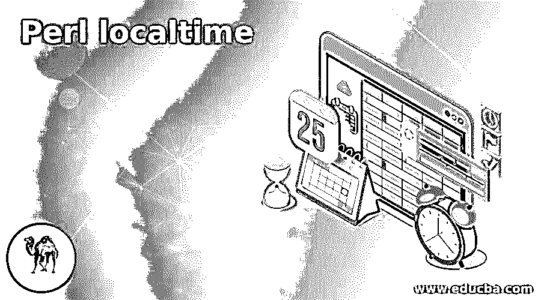
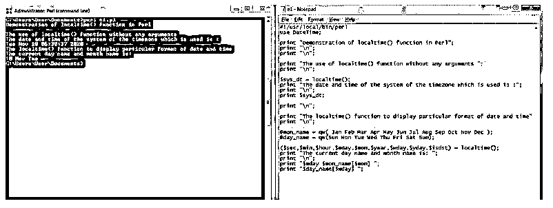

# Perl 本地时间

> 原文：<https://www.educba.com/perl-localtime/>

## Perl localtime 简介

在 Perl 中，localtime 被定义为一个时间函数，它显示本地时区的日期和时间，通常将指定的时间转换为特定的时间元素列表，这些时间元素是 Perl 中 local time()函数返回的列表中所有元素的数字数据类型。通常，localtime()函数被定义为一个函数，用于返回包含秒、小时、分钟等元素的元素列表。，通常是这个 localtime()函数返回的列表中的 9 个元素，用于显示与系统的日期和时间相关的信息，这个函数不强制使用任何参数。

### Perl 中 localtime()函数的使用及实例

在本文中，我们将看到名为 localtime()的 Perl 时间函数，它被定义为返回与系统或程序的日期和时间相关的时间元素的函数。在 Perl 中，日期和时间代码通常需要一个称为 DateTime 模块的 Perl 模块，它包含日期和时间表示的各种组合，其中；本模块使用一种新样式的日历，称为地理日历。

<small>网页开发、编程语言、软件测试&其他</small>

在 Perl 语言中，显示已分析当前时区时间的日期和时间，这是通过将给定的时间表达式转换成一组时间元素来完成的，这些时间元素是一个时间元素数组，该数组中至少包含 9 个元素，包括当前时区的时间和日期，如秒、分、小时、日、月、年、星期、年中的某一天、isdst。

现在让我们看看 localtime()函数的语法和示例:

**语法:**

`Use DateTime;
localtime();`

在这种情况下，如果没有传递参数，那么 localtime()函数将返回时区的当前日期和时间。

`or with expression :
locatime expr;`

在这种情况下，我们可以编写 expr 任何只显示与时间元素相关的结果。

在上面的语法中，两者都可以使用，其中第一个显示一组时间元素，该组时间元素具有定义时区时间的 9 个不同元素。那么第二种语法可以只显示那些在语法中被指定为 expression (expr)的时间元素，如上面的语法部分所示。

#### 示例#1

**代码:**

`#!/usr/local/bin/perl
use DateTime;
print "Demonstration of localtime() function in Perl";
print "\n";
print "\n";
print "The use of localtime() function without any arguments ";
print "\n";
$sys_dt = localtime();
print "The date and time of the system of the timezone which is used is :";
print "\n";
print $sys_dt;
print "\n";
print "The localtime() function to display particular format of date and time";
print "\n";
@mon_name = qw( Jan Feb Mar Apr May Jun Jul Aug Sep Oct Nov Dec );
@day_name = qw(Sun Mon Tue Wed Thu Fri Sat Sun);
($sec,$min,$hour,$mday,$mon,$year,$wday,$yday,$isdst) = localtime();
print "The current day name and month name is: ";
print "\n";
print "$mday $mon_name[$mon] ";
print "$day_name[$wday] ";`

**输出:**

在上面的程序中，我们可以看到我们首先导入了一个用于日期和时间的 Perl 模块“use DateTime ”,这样我们就可以使用 Perl 的 locatime()内置函数。在上面的代码中，我们声明了一个存储系统当前日期和时间的变量，我们将该变量赋值给存储 locatime()函数的值，并使用 print 命令显示。在这种情况下，我们没有向函数传递任何参数，所以它将只打印当天的日期和当前的时间(小时、分钟和秒)以及当前的年份。

然后，我们尝试使用 localtime()函数来显示特定的日期和时间格式，这是我们在 print 命令中指定的，在代码中，我们使用 localtime()函数仅打印当前日期和当前月份。因此，我们可以两种方式使用这个函数。我们已经写下了我们想要显示的月份和日期名称，并且这些名称存储在变量“mon_name”和“day_name”中，这样我们就可以用这里定义的相同名称来显示；我们也可以在这里用全名来显示。在上面的屏幕截图中可以看到输出，它显示了系统的当前日期和时间。

现在让我们看另一个例子，我们将一些参数传递给 locatime()函数。

#### 实施例 2

**代码:**

`#!/usr/local/bin/perl
use DateTime;
print "Demonstration of localtime() fucntion with argument in Perl";
print "\n";
print "\n";
$cur_dt = localtime();
print "The current date and time is as follows: ";
print "\n";
print $cur_dt;
print "The elapsed time and date can be represented using time() function";
print "\n";
$epoc = time();
$epoc = $epoc - 24 * 60 * 60;
print "The elapsed time in seconds to display  yesterday's date and time is ";
print "\n";
print $epoc;
print "\n";
$cur_dt = localtime($epoc);
print "The epoc passed as argument for displayng yesterday's date and time:";
print "\n";
print $cur_dt;`

**输出:**

在上面的代码中，首先，我们导入“use DateTime”模块以使用 localtime()函数。在这段代码中，我们首先声明了一个显示当前日期和时间的变量，该变量显示系统的当前日期和时间，然后我们使用另一个变量“$epoc”，在该变量中，我们使用 time()函数存储到当前日期和时间为止经过的秒数。因此，我们可以看到，我们已经将这个$epoc 传递给了 localtime()函数，它显示了昨天的日期和时间。这段代码的输出可以在上面的屏幕截图中看到。

### 结论

在本文中，我们得出结论，localtime()函数是一个时间函数，用于显示系统使用的时区的日期和时间。此函数返回时间元素的集合或数组，其中包含 9 个不同的日期和时间元素，如小时、分钟、秒等。在本文中，我们看到了一个使用 localtime()不带参数并显示特定日期和时间元素的简单示例，我们还看到了另一个示例，其中我们传递运行时间来显示作为参数传递给 localtime()函数的运行日期。

### 推荐文章

这是 Perl localtime 的指南。这里我们分别用例子讨论 Perl 中 localtime()函数的介绍和工作原理。您也可以看看以下文章，了解更多信息–

1.  [Perl 哈希](https://www.educba.com/perl-hash/)
2.  [Perl for 循环](https://www.educba.com/perl-for-loop/)
3.  [Perl sort()](https://www.educba.com/perl-sort/)
4.  [Perl 子程序](https://www.educba.com/perl-subroutine/)

