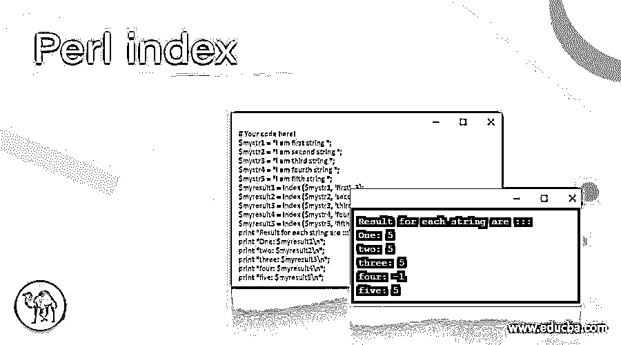
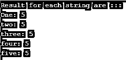
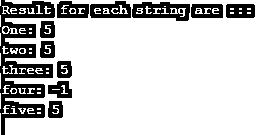

# Perl 索引

> 原文：<https://www.educba.com/perl-index/>

## Perl 索引简介

index 是 Perl 中可用来获取索引的函数。如果我们想知道索引或者子串的位置，那么我们可以使用这个函数来获取值。通过使用 index 函数，我们还可以得到字符在字符串中的位置。在短索引中，函数用于获取子串或字符在给定字符串中所处的位置或索引；在索引方法中，我们只需要传递我们的参数。在下一节中，我们将更详细地讨论这种方法，以便更好地理解要使用的方法。

**语法**

<small>网页开发、编程语言、软件测试&其他</small>

我们可以在程序中直接使用这个函数，而不包括任何库，因为它是 Perl 中可用的处理字符串的内置函数。让我们看看它的语法，以便更好地理解如何在编程中使用它。

**1。index(文本，子串，索引):**用索引计算。

在上面的语法中，我们传递三个参数作为输入。最后一个参数不是必须传递的。

**2。index(text，substring):** 不传递索引。

在上面的语法中，我们传递两个参数作为输入来计算并返回给我们值。

`index(“String to find from”, “string to search”);
index(“some string”, “some”,0)`

上面，您可以看到在 Perl 编程中使用的 index 方法的示例语法。

### Perl 中的索引是如何工作的？

到目前为止，我们知道 index 用于获取元素在字符串中的位置。这个方法可以接受两个或三个参数。在某些情况下，我们希望知道字符或任何子串在字符串中的实际位置，这样我们就可以调用这个方法并获得位置。通过使用这个方法，我们甚至可以指定子串的索引，我们希望它们从这个索引开始计算位置。在这一节中，我们将首先讨论索引和返回类型的方法签名。让我们详细看看这个方法的签名，见下文；

**1。index(text，substring，index):** 这个方法以三个参数作为输入。通过使用这种方法，我们可以获得字符或子串在字符串消息中的实际位置。我们来详细讨论一下它的签名；

*   **text:** 该参数用于传递我们想要从中计算字符或子串位置值的实际字符串。我们可以在 Perl 中创建一个普通的字符串，并在方法内部传递它。
*   **substring:** 这个参数是我们希望 index()方法计算其值并返回该元素在给定字符串中的位置的原始子字符串。
*   **index:** 这是该方法中的可选参数。如果想要设置子字符串的起始索引，那么在 Perl 中调用 index()方法时要提到这个参数。如果我们不提及它，它只是占用默认值' 0 '。

**2。index(text，substring):** 这个方法也用于获取子串的索引。但它与上面的一个不同之处在于，这里我们没有提到子字符串的索引或起始索引，因此它将默认为“0”。

**3。返回类型:**该方法在字符串中成功找到字符或子串时返回一个整数值；否则，如果失败，它将返回-1 作为值。

除此之外，在 Perl 中可用的两种方法中，所有的事情都是相似的。这些是 Perl 的内置方法，所以在使用它之前，我们不需要在项目中提到或导入任何库。让我们看一个初学者如何在编程中使用它的例子，见下文；

**举例:**

`# Your code here!
$mystr = "Hello to find !!";.
$myresult = index ($mystr, 'find');`

在上面几行代码中，我们试图在字符串中找到一个子串。首先，我们创建了一个 string 对象，并给它赋值。在这之后，我们调用“index”方法，并在其中传递我们的字符串和要搜索的值，作为字符串中的“find”。所以它会返回一个整数值以及它在字符串中的实际位置。

### 例子

下面提到了不同的例子:

#### 示例#1

在这个例子中，我们使用不带 index param 的 index 方法来获取 Perl 中的子串位置。

**代码:**

`# Your code here!
$mystr1 = "I am first string ";
$mystr2 = "I am second string ";
$mystr3 = "I am third string ";
$mystr4 = "I am fourth string ";
$mystr5 = "I am fifth string ";
$myresult1 = index ($mystr1, 'first');
$myresult2 = index ($mystr2, 'second');
$myresult3 = index ($mystr3, 'third');
$myresult4 = index ($mystr4, 'fourth');
$myresult5 = index ($mystr5, 'fifth');
print "Result for each string are :::\n";
print "One: $myresult1\n";
print "two: $myresult2\n";
print "three: $myresult3\n";
print "four: $myresult4\n";
print "five: $myresult5\n";`

**输出:**

#### 实施例 2

在这个例子中，我们使用带有 index param 的 index 方法来获取 Perl 中子串的位置。

**代码:**

`# Your code here!
$mystr1 = "I am first string ";
$mystr2 = "I am second string ";
$mystr3 = "I am third string ";
$mystr4 = "I am fourth string ";
$mystr5 = "I am fifth string ";
$myresult1 = index ($mystr1, 'first', 3);
$myresult2 = index ($mystr2, 'second', 2);
$myresult3 = index ($mystr3, 'third', 1);
$myresult4 = index ($mystr4, 'fourth'. 1);
$myresult5 = index ($mystr5, 'fifth', 0);
print "Result for each string are :::\n";
print "One: $myresult1\n";
print "two: $myresult2\n";
print "three: $myresult3\n";
print "four: $myresult4\n";
print "five: $myresult5\n";`

**输出:**

### 结论

在一些场景中，我们需要知道字符串中子串的实际位置，这样我们就可以在 Perl 中使用 index()方法。我们也可以通过在 Perl 中使用相同的方法来评估字符的位置。此外，这可以帮助我知道字符或子串是否存在于字符串中。

### 推荐文章

这是一个 Perl 索引指南。在这里，我们讨论了索引在 Perl 中是如何工作的，并给出了代码和输出。您也可以看看以下文章，了解更多信息–

1.  [Perl 哈希](https://www.educba.com/perl-hash/)
2.  [Perl sort()](https://www.educba.com/perl-sort/)
3.  [Perl last](https://www.educba.com/perl-last/)
4.  [在 Perl 中拆分](https://www.educba.com/split-in-perl/)

