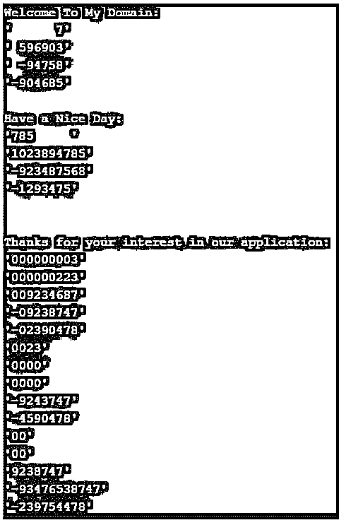
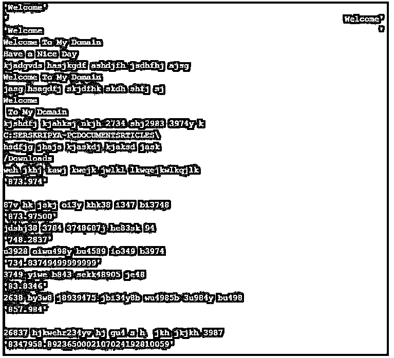

# Perl printf

> 原文：<https://www.educba.com/perl-printf/>

## Perl printf 简介

Perl printf 被定义为可用于打印值列表的函数。它可以通过使用一些格式来解释，并指定输出。虽然我们已经将文件处理成可以打印的文件，但是用户输入到屏幕上的带有格式的数据可以是任何类型的字符串。它与 sprint 函数相同，但是 printf 函数的输出结果并不意味着实际的输出结果。printf 格式化程序可以是任何说明符，尤其是 printf 函数不会通过在屏幕上自动追加新行到输出屏幕上。

**语法:**

<small>网页开发、编程语言、软件测试&其他</small>

Perl 脚本有默认的关键字、函数和标量变量，这意味着变量只接受单个值。它可以是任何数字、字母、字符、带运算符的数字，但变量的第一个字符必须是字母或符号；像下划线运算符一样，它不是一个数字。

`$ variable name = value;
printf(“ “, $variable name);
---some Perl script logics---`

上面的代码是在 Perl 脚本中使用 printf()函数的基本语法。虽然我们在脚本中使用了 printf 函数，但它可能在函数的字段说明符上使用了一些高级属性。

### Perl 中的 printf 函数是如何工作的？

*   Perl 脚本 printf()方法在屏幕上只打印带有指定格式说明符的用户数据。实际上，该函数只打印值，这些值通过使用一些格式说明符使用列表数据来解释，并将当前结果作为输出。filehandle 的概念在 printf 函数中占有更多的空间，printf 函数通过使用异常类和模块来处理错误和异常，而 printf()函数通过使用一些格式说明符来打印输出。通常，printf 函数使用一些与其字段和属性相关的属性。
*   就像这个函数一样，许多属性都与脚本中的打印函数相同。这就是它显示更好的输出格式的方式，这已经与他们的用户输入相关联。这更类似于字段说明符，与其文本字符串格式说明符相关，带有一些分隔符，如逗号、分号、下划线等。使用一些正则表达式概念，用户输入将在后端代码中进行验证和评估，并在用户屏幕上显示输出。

### Perl printf 的例子

下面给出了 Perl printf 的例子:

#### 示例#1

**代码:**

`$var = 1562.45;
$strn = ("Welcome To My Domain");
printf("Hi user your input is \$%6.3f and converted output is %s\n\n", $var, $strn);`

**输出:**

**说明:**

*   在上面的示例中，我们使用了两个变量，如$var 和$strn，这两个变量都与一些格式一起使用，如$var 变量分配的值只是浮点类型的数字，因此一旦给定变量在脚本上执行，结果的小数点将会显示在用户屏幕上。
*   同时，下一个变量$strn 只接受字符串值，如“欢迎使用我的域”，所以它是一个字符串格式，它指定了用户信息的 printf 函数，该函数已将调用传递给字符串，字段也指定给变量，然后它将插入到单独位置的内存位置。

#### 实施例 2

**代码:**

`printf("Welcome To My Domain:\n");
printf("'%7d'\n", 7);
printf("'%7d'\n", 596903);
printf("'%7d'\n", -94758);
printf("'%7d'\n", -904685);
printf("\n");
printf("Have a Nice Day:\n");
printf("'%-8d'\n", 785);
printf("'%-8d'\n", 1023894785);
printf("'%-8d'\n", -923487568);
printf("'%-8d'\n", -1293475);
printf("\n");
printf("\n");
printf("Thanks for your interest in our application:\n");
printf("'%09d'\n", 3);
printf("'%09d'\n", 223);
printf("'%09d'\n", 9234687);
printf("'%09d'\n", -9238747);
printf("'%09d'\n", -2390478);
printf("'%04d'\n", 23);
printf("'%04d'\n", 'Welcome');
printf("'%04d'\n", 'Welcome34');
printf("'%04d'\n", -9243747);
printf("'%04d'\n", -4590478);
printf("'%02d'\n", 'Tyujk');
printf("'%02d'\n", 'udg 4857 sdhfg');
printf("'%02d'\n", 9238747);
printf("'%03d'\n", -93476538747);
printf("'%02d'\n", -239754478);`

**输出:**

**说明:**

*   在第二个例子中，我们以不同的方式使用了同一个 printf 函数。我们可以传递整数、浮点数、小数、短整型、长型和双精度型的输入；它可以是传递给函数的任何类型，并且被转换成所需的输出格式。
*   一些格式将遵循规则并控制具有一些高度、宽度的字段，甚至其他字段，如打印存储在变量中的左对齐、右对齐和填零的数字，用于计算它们的函数并存储在内存位置。它既接受正数，也接受负数，后跟它的签名及其用法的相关性。

#### 实施例 3

**代码:**

`printf("'%4s'\n", "Welcome");
printf("'%76s'\n", "Welcome");
printf("'%-76s'\n", "Welcome");
printf("Welcome To My Domain\n");
printf("Have a Nice Day\n");
printf("kjadgvds hasjkgdf ashdjfh jsdhfhj ajsg\n");
printf("Welcome\tTo My Domain\n");
printf("jasg hsagdfj skjdfhk skdh shfj sj\n");
printf("Welcome\n To My Domain\n");
printf("kjshdfj kjahksj nkjh 2734 shj2983 3974y k\n");
printf("C:\Users\Kripya-PC\Documents\articles\\\n");
printf("hsdfjg jhajs kjaskdj kjaksd jask\n");
printf("/Downloads\n");
printf("weh jkhj kawj kwejk jwlkl lkwqejkwlkqjlk\n");
printf("'%.3f'\n\n", 873.974);
printf("87v hk jskj oi3y khk38 i347 bi3748\n");
printf("'%.5f'\n", 873.975);
printf("jdshj38 3784 3748687j he83sk 94\n");
printf("'%6.4f'\n", 748.28374);
printf("u3928 oiwu498y bu4589 io349 b3974\n");
printf("'%7.14f'\n", 734.837495);
printf("3749 yiwe b843 sekk48905 je48\n");
printf("'%06.4f'\n", 83.8346);
printf("2638 hy3w8 j8939475 jbi34y8b wu4985b 3u984y bu498\n");
printf("'%-6.3f'\n\n", 857.98374);
printf("26837 hjkwehr234yv hj gu4 s h  jkh jkjkh 3987\n");
printf("'%-5.25f'\n", 8347958.892365);`

**输出:**

**说明:**

*   在 printf()函数中，我们在各种格式说明符中使用了数字和字符串字符，甚至使用了一些比较运算符，并使用相同的引用名进行调用。因为 printf 函数使用了字符串格式所允许的一些运算符，并且它生成了带有格式的报告，即使格式化后的报告也包含一些数字，这些数字可以在一些转换的帮助下调用。
*   这些转换将使用一些运算符，如字符末尾的%符号，即使在转换过程中分配了相同数量的字符。printf 函数需要使用一些指数符号。

### 结论

总之，它们必须有一些内置的方法，用于在屏幕上打印每种编程语言的输出。同样，每种方法都有自己的属性和特性，用于从用户的角度显示所需的结果。在 Perl 中，printf 函数使用一些格式说明符在用户屏幕上显示输出。

### 推荐文章

这是一个 Perl printf 指南。这里我们讨论引言；Perl 中的 printf 函数是如何工作的？和示例。您也可以看看以下文章，了解更多信息–

1.  [Perl join](https://www.educba.com/perl-join/)
2.  [Perl for 循环](https://www.educba.com/perl-for-loop/)
3.  [Perl chomp()](https://www.educba.com/perl-chomp/)
4.  [Perl 中的文件处理](https://www.educba.com/file-handling-in-perl/)

