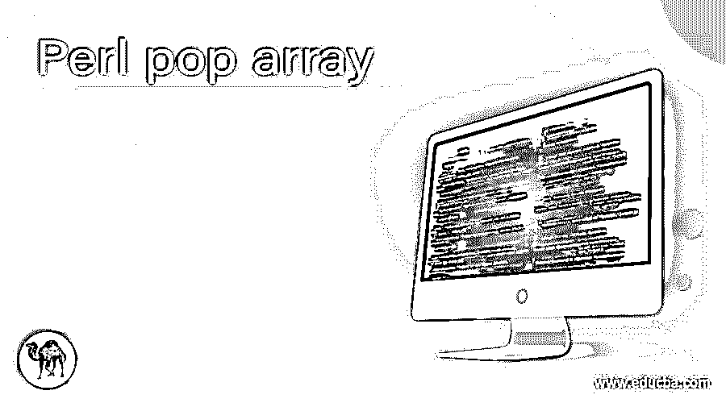

# Perl pop 数组

> 原文：<https://www.educba.com/perl-pop-array/>

## Perl pop 数组简介

Perl pop 数组是移除数组列表最后一个元素的数组方法。Perl 函数的作用是修改 Perl 数组列表，并返回数组列表中被删除的元素。该数组有助于提取 Perl 数组列表中的最后一个值并返回到输出屏幕。pop 数组返回最后一个数组元素作为参数，并将其从数组列表中取出。数组正在传递并消除最后一个值，该值必须是数组列表，而不是简单的列表。

**语法**

<small>网页开发、编程语言、软件测试&其他</small>

*   Perl pop 数组语法如下。

`@Perl_pop_array = pop(@Array_list);`

*   返回 Perl pop 数组值的语法如下。

`print " Perl pop array value is @Perl_pop_array " ;`

**描述:**

*   @Array_list 是初始 Perl 数组的变量，值为。
*   @Perl_pop_array 是使用 pop()方法的 pop 数组函数的变量。
*   pop(@Array_list)是在 Perl 数组中运行 pop 数组函数的方法。
*   该数组是使用 print 关键字和 poped 数组变量返回的数组列表的最后一个元素。

### Perl 中的 pop 数组函数是如何工作的？

下载并安装 Perl 最新版本到你的设备的操作系统中。

https://www.Perl.org/或 http://strawberryPerl.com/大多使用 Perl IDE 网站链接。

**第一步:**

用。pl 扩展名，并将文件保存在所需的命令行路径中。

**举例:**

`helloo.pl or first pearl.pl`

**第二步:**

创建初始数组变量并用所需的数组列表进行初始化。

`@prl_intial_ary = ('learning', 'Perl', 'technology', 'with', 'me');`

**第三步:**

创建一个数组变量，并使用 pop array 方法删除数组列表中的最后一个元素。

`@prl_pop_ary = pop (@prl_intial_ary );`

**第四步:**

在输出屏幕中返回数组值。

`print "Perl poped array element is here: @prl_pop_ary  \n ";`

将以上所有步骤结合起来，创建一个 Perl pop 数组。

`File name: my_perl.pl
@prl_intial_ary = ('learning', 'Perl', 'technology', 'with', 'me');
@prl_pop_ary = pop (@prl_intial_ary );
print "Perl poped array element is here: @prl_pop_ary  \n ";`

### 例子

下面举几个例子

#### 示例#1

这个数组用字符串数组列出例子并输出。

`@prl_intial_ary = ('learning', 'Perl', 'technology', 'with', 'me');
@prl_pop_ary = pop (@prl_intial_ary );
print "Perl poped array element is here: @prl_pop_ary  \n ";
@prl_pop_ary = pop (@prl_intial_ary );
print "Perl poped array element is here: @prl_pop_ary  \n ";
@prl_pop_ary = pop (@prl_intial_ary );
print "Perl poped array element is here: @prl_pop_ary  \n ";
print "array element is here: @prl_intial_ary  \n ";`

**输出:**

**描述:**

*   Perl 数组列表用字符串值创建变量和初始值。
*   数组变量创建并使用 pop 方法移除数组列表的最后一个元素。
*   该数组使用 print 关键字返回弹出的字符串元素。

#### 实施例 2

带有字符串数组的 Perl pop 数组列表示例和输出。

**代码:**

`@prl_intial_ary = ('42', '129', '54', '79', '136');
@prl_pop_ary = pop (@prl_intial_ary );
print "Perl poped array element is here: @prl_pop_ary  \n ";
@prl_pop_ary = pop (@prl_intial_ary );
print "Perl poped array element is here: @prl_pop_ary  \n ";
@prl_pop_ary = pop (@prl_intial_ary );
print "Perl poped array element is here: @prl_pop_ary  \n ";
print "array element is here: @prl_intial_ary  \n ";`

**输出:**

**描述:**

*   Perl 数组列表用数值创建变量和初始值。
*   数组变量创建并使用 pop 方法移除数组列表的最后一个数字元素。
*   该数组使用 print 关键字返回弹出的数字元素。

#### 实施例 3

数组列表中的数组示例和输出。

**代码:**

`@prl_intial_ary = ('42', 'perl', '54', 'technology', '136');
@prl_pop_ary = pop (@prl_intial_ary );
print "Perl poped array element is here: @prl_pop_ary  \n ";
@prl_pop_ary = pop (@prl_intial_ary );
print "Perl poped array element is here: @prl_pop_ary  \n ";
@prl_pop_ary = pop (@prl_intial_ary );
print "Perl poped array element is here: @prl_pop_ary  \n ";
print "array element is here: @prl_intial_ary  \n ";`

**输出:**

**描述:**

*   Perl 数组列表用字符串和数值创建变量和首字母。
*   数组变量创建并使用 pop 方法移除数组列表的最后一个元素。
*   该数组使用 print 关键字返回弹出的元素。

#### 实施例 4

Perl pop 数组中最后一个元素的数组列表示例和输出。

**代码:**

`@prl_intial_ary = ('perl', 'technology');
@prl_pop_ary = pop (@prl_intial_ary );
print "Perl poped array element is here: @prl_pop_ary  \n ";
@prl_pop_ary = pop (@prl_intial_ary );
print "Perl poped array element is here: @prl_pop_ary  \n ";
@prl_pop_ary = pop (@prl_intial_ary );
print "Perl poped array element is here: @prl_pop_ary  \n ";
print "array element is here: @prl_intial_ary  \n ";`

**输出:**

**描述:**

*   空数组列表不返回任何值，并且对于 pop 方法是未定义的。
*   弹出数组列表中的最后一个元素后，初始数组变为 null。

#### 实施例 5

数组列表中包含计数元素的数组示例及输出。

**代码:**

`@prl_intial_ary = ('learning', 'Perl', 'technology', 'with', 'me');
$pop_ary = scalar @prl_intial_ary;
print "initial array element value $pop_ary \n";
@prl_pop_ary = pop (@prl_intial_ary );
print "Perl poped array element is here: @prl_pop_ary  \n ";
@prl_pop_ary = pop (@prl_intial_ary );
print "Perl poped array element is here: @prl_pop_ary  \n ";
print "array element is here: @prl_intial_ary  \n ";
$pop_ary = scalar @prl_intial_ary;
print "perl popped array element value $pop_ary \n";`

**输出:**

**描述:**

*   Perl 初始数组在数组列表中有五个元素。
*   在有效的弹出方法之后，数组列表中还有三个元素。
*   对于数组列表中移除的最后两个元素，使用了两次 pop 方法。

### 结论

*   该数组对于修改数组列表中的数组元素很有用。
*   此方法帮助数组列表消除最后的元素。
*   array 方法返回输出屏幕上最后一个可移除的值。

### 推荐文章

这是 Perl pop 数组的指南。在这里，我们讨论了 pop 数组函数在 Perl 中是如何工作的，并给出了代码和输出。您也可以阅读以下文章，了解更多信息——

1.  [Perl 文件存在](https://www.educba.com/perl-file-exists/)
2.  [Perl for 循环](https://www.educba.com/perl-for-loop/)
3.  [Perl 读取文件](https://www.educba.com/perl-read-file/)
4.  [Perl chop()](https://www.educba.com/perl-chop/)

