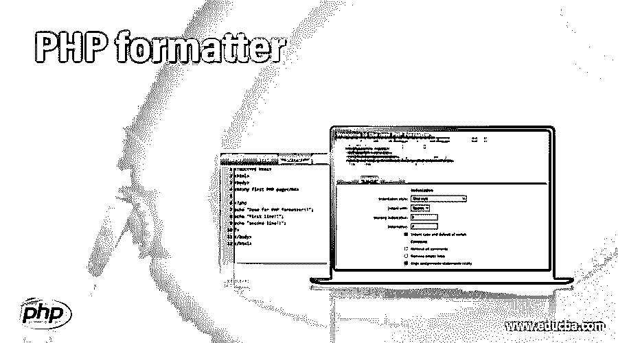
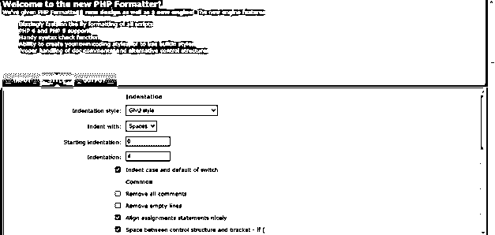

# PHP 格式化程序

> 原文：<https://www.educba.com/php-formatter/>

## PHP 格式化程序介绍

在每一种编程语言中，我们都有一个需要遵循的代码结构，它保持了代码对其他开发人员的可读性。这就是通常所说的编码标准。像其他编程语言一样，我们有许多在线工具，我们可以通过对它们应用一些样式来格式化我们的代码。格式化程序只不过是用来格式化我们的代码，通过遵循语言的编码标准，使新程序员易于理解和阅读。在这个主题中，我们将学习 PHP 格式化程序。

### PHP 格式化程序是如何工作的？

我们知道，我们知道 formatter 是用来格式化我们的代码的，网上可以找到很多 formatter。我们可以使用一个 visual studio 来实现这一点，也可以使用任何为 PHP 提供良好支持的在线格式化程序。首先，我们将了解如何使用 visual studio 格式化我们的代码，以及我们需要什么样的设置来实现这一点。

<small>网页开发、编程语言、软件测试&其他</small>

1) Visual Studio: Visual Studio 为 PHP 提供了很好的支持，我们可以通过应用一些样式来格式化我们的代码，但为此，我们需要对它进行一些设置。通过使用它，我们可以执行方法或类的括号匹配；我们还可以突出语法，删除多余的空格，并在需要的地方对齐代码。此外，这将迫使我们遵循适当的缩进，并使我们的代码看起来更美化，更适合其他人。

visual studio 使用 PHP linter 来提供改进。但是要使用它，我们有三种不同的设置来控制 PHP 的 liner:

*   php.validate.run:该设置将在保存 Visual Studio 中的任何文件时触发验证。这意味着一旦我们保存文件，它将开始验证。我们也可以禁用这个设置，但是它的默认值是 onSave only。它可以在键入 od 代码或保存文件时触发验证。在大多数编辑器中，它只是被键入。
*   php.validate.enable:我们可以说这个键启用了 linter，如果我们检查的话，这个键在编辑器中是默认启用的。
*   php.validate.executable.path:这个键检查 php 的可执行文件是否在磁盘上。它一直在监测。

在 visual studio 中，为 PHP 提供一些可用的代码片段来检查这一点；像任何其他编辑器一样，我们有一个快捷键 ctrl+space，在这里我们可以看到可用的选项。

像 visual studio 一样，我们有许多其他的格式化程序可用于 PHP。现在我们将讨论在线格式化，只需复制粘贴代码即可轻松使用。

http://www.phpformatter.com/——为了更好地理解，这是一个在线可用的格式化程序。我附上这个格式化程序的截图。见下文；

**图像:**

正如我们在这里看到的，这个格式化程序为我们提供了三个选项来根据各种参数格式化我们的代码。让我们详细讨论一下它们:

**1。input:** 这是输入参数，它接受输入并给我们一些输出。这个输入基本上是我们的代码，我们希望根据编码标准对其进行格式化。喜欢它将删除不必要的空间，未使用的软件包，如果有的话，和更多可用的选项。因此，在本节中，我们将只是复制粘贴我们想要格式化的代码。

**2。风格:**顾名思义，它给，或者我们可以说，给我们的代码或文件添加风格，并安排其适当的格式。在这一部分，我们可以为代码选择不同类型的样式。像见下文；

*   缩进样式:有不同类型的样式可供选择，其中一些在下面提到；

| K&R 风格(一个真正的括号风格) | Allman &style (BSD 样式) | 铁匠风格 |
| GNU 风格 | 梨子风格 | 钠 |

*   开始缩进:在这个块中，我们可以给一个整数值。
*   缩进:在这个块中，我们可以默认给 PEAR 样式的值为一个整数；现在是 4 点。

除此之外，我们还可以执行许多操作，比如括号、开关操作、函数、高亮关键字等等。

**3。Output:** 这是最后一个可用的选项卡，它基本上向我们显示了输出。它将包含我们在对特定代码进行格式化时应用的所有样式。因此，从这里，我们可以复制我们的代码，并将其放入我们的工作区，而无需任何额外的设置。

我们可以从 visual studio marketplace 下载一些扩展来根据需要格式化我们的代码。我们也可以为此使用一个快捷键(ctrl+shift+X)；这将给出所有可用扩展名的列表。我们只需要根据我们的密钥过滤掉它们。例如，只需输入“PHP”，您将看到所有扩展名的列表，并将它们添加到您的工作区。

visual studio 中可用于格式化代码的扩展列表如下:

| 代码运行程序 | 较美丽 | HTML CSS 支持 |
| PHP 智能感知 |  |  |

### PHP 格式化程序示例

以下是 PHP 格式化程序的示例:

#### 示例#1

在这个例子中，我们使用 PEAR 样式来格式化我们的代码。在输出中，您会看到一些突出显示的代码，并在它们之间留有适当的空间。

**代码:**

`<!DOCTYPE html>
<html>
<body>
<h4>demo for formatting PHP code </h4>
<?php
echo "Demo for PHP formatter!!";
echo "first line!!";
echo "second line!!";
?>
</body>
</html>`

**输出:**

#### 实施例 2

在这个例子中，我们使用不同的样式来格式化代码。此外，我们将删除代码中的所有注释。所以在实际的程序中，你会看到注释，但是在格式化的程序中看不到注释。这很快。

**代码:**

`<!DOCTYPE html>
<html>
<body>
<h4>demo for formatting PHP code </h4>
<?php
//commenting code here
echo "demo to use different style in code formatter !!";
?>
</body>
</html>`

**输出:**

### PHP 格式化程序的使用:

1.  格式化程序非常需要理解代码。
2.  这使得我们的代码非常可读。
3.  我们可以用这个来突出主要的关键词，这样也可以增加可见性。
4.  我们可以删除程序中不必要的注释和空格。我们不需要为每个文件删除每一行；它会自动为我们做这件事。
5.  我们也可以删除代码中的空行。

### 结论

在 PHP 中，我们有许多可用格式化程序；也有来自 visual studio 的扩展。如果您想遵循一种简单的方法，那么我们可以通过复制粘贴代码来使用任何在线格式化程序。它使我们的代码看起来非常漂亮和专业。

### 推荐文章

这是一个 PHP 格式化程序的指南。在这里，我们讨论了 PHP 格式化程序的工作原理和例子，以及代码和输出。您也可以看看以下文章，了解更多信息–

1.  [PHP 拆分字符串](https://www.educba.com/php-split-string/)
2.  [PHP 反射](https://www.educba.com/php-reflection/)
3.  [安装 phpMyAdmin](https://www.educba.com/install-phpmyadmin/)
4.  [PHP 拆分数组](https://www.educba.com/php-split-array/)

