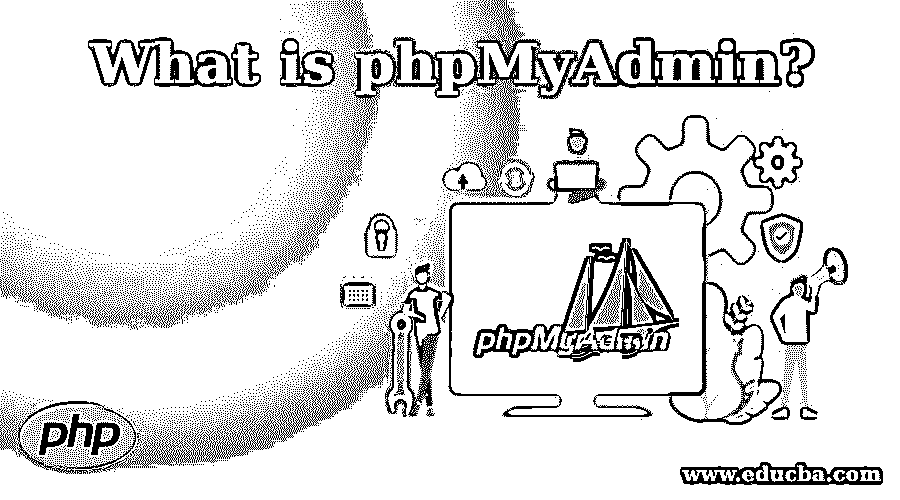

# phpMyAdmin 是什么？

> 原文：<https://www.educba.com/what-is-phpmyadmin/>

## phpMyAdmin 简介

phpMyAdmin 是一个用于管理数据库的工具，比如 MariaDB& MySQL 数据库应用系统。该工具可以直接从 phpMyAdmin 网站下载，无需通过任何支付过程，因为它是以开源应用软件的形式使用 PHP 脚本语言编程的，由微软工具“MySQL–web admin”发起。这个工具用于使用一个以上的数据库系统或数据库管理系统，以及它们连接的服务器和节点单元。它最初是由 Tobias Ratschiller 开发的，后来以 GitHub 告终。

### 为什么我们需要 phpMyAdmin？

phpMyAdmin 比其他任何数据库管理工具都更受欢迎，原因如下:

<small>网页开发、编程语言、软件测试&其他</small>

*   phpMyAdminadministration 工具包含一个简单的图形用户界面，可以使用户拥有一个方便的查询编辑工具，以便创建、更新、删除和操纵任何 SQL 查询的各种操作。它还允许用户从其他系统复制和粘贴查询，打开或导入包含查询的文件，执行当前或所有查询，监视工具中运行的每个查询的运行时间，显示以查看从正在运行的查询获取的输出等。
*   phpMyAdmin 可以定义为一个基于服务的工具，其中服务在数据库系统和相应的服务器实体之间建立通信。这个工具是使用 PHP 程序创建的，作为前端应用程序与一个装备良好的基于 web 的界面一起工作，以便连接和处理数据库系统。
*   phpMyAdmin 的一个显著的功能特性是，可以使用应用程序支持的灵活的 web 介质来编辑或操作查询。该应用程序还提供了设置数据库的服务器细节，这可以用来连接到需要管理的数据库。
*   phpMyAdmin 允许数据库管理员在执行必要的数据库操作后，从该应用程序中获取结果，将其单独存储或导出为所需的文件格式，如 CSV、CSQL、PDF、Excel、Word、XML 等。在执行管理操作之后，这个工具在检索和存储结果方面表现出了出色的品质。
*   与任何其他数据库管理工具不同，phpMyAdmin 包括存储引擎和访问这些引擎的规定。当用户点击呈现在应用程序界面顶部的引擎选项时，系统导航到显示引擎细节。它显示了能够连接到 phpMyAdmin 的所有存储系统的列表，以及相应的服务器。作为一个预设选项，所连接的存储引擎将显示为 MyISAM，其内存是基于哈希的临时表存储。
*   除了管理工作，这个应用程序还允许用户创建表格，添加或更新列和行，添加或更新表格单元格的内容，等等。需要输入表名、表类型、长度/值、属性、索引、注释等。创建表格，并插入，去，浏览标签等。向表中添加数据和元素。

### phpMyAdmin 的特性

以下是 PHPMyAdmin 数据库管理工具众所周知的特性:

**1。**警惕的应用程序接口是 phpMyAdmin 工具最想要的特性，因为它扮演着让用户与应用程序系统交互的角色。该工具由类似于 MySQL 的属性组成，并且一些这样的属性是浏览网络中已经可用的数据库的选项、创建新的连接并在应用中启用数据库的选项、创建表、访问表、使用查询获取表、检索已经创建的视图、索引、表等的图标/菜单项。

**2。**它还允许将数据/表格从一个位置复制到另一个位置、删除表格内容、删除/截断表格、更新表格和更改表格字段中的数据等。

**3。**在查询管理方面，phpMyAdmin 允许用户使用查询编辑界面创建查询，将不同位置的查询复制粘贴到查询编辑器中的空间，经常使用的&重要查询可以添加书签以备后用，处理远程存储的过程，在查询编辑界面上触发数据库的&功能，以实例查询的形式生成复杂的查询，也就是俗称的 QBE 查询。

**4。phpMyAdmin 工具的另一个最重要的特性是“搜索”选项。当用户提示使用与需要找到的内容相关的关键字进行搜索操作时，它帮助用户浏览整个数据库系统和连接的节点。**

**5。**使用此数据库管理工具获得的任何数据都可以转换为所需格式的输出文件，包括 SQL、XML、PDF、Excel、Word、CSV，甚至是图像或可下载超链接形式的 BLOB 数据(二进制大型对象数据)。

### phpMyAdmin 的优缺点

下面是 phpMyAdmin 的优点和缺点:

**优势**

使用 phpMyAdminsystem 应用程序作为数据库管理工具的一些优点如下:

*   优雅的维护操作，除了拥有数据库管理系统本身所花费的成本之外，没有额外的成本。
*   支持大多数常用的文件格式，并能灵活使用，这对于在数据库管理系统上工作时的文档编制非常方便。
*   用于数据库操作、SQL 查询编辑、状态跟踪等的独立面板。
*   协助显示连接数据库中的所有活动插件。

**缺点**

使用 phpMyAdmin 系统应用程序作为数据库管理工具的一些缺点如下:

*   它不能用于任何数据库，因为它只支持 MySQL 和 MariaDB。
*   尽管它支持传统的服务器和系统，但它的发展与当前行业标准的技术发展并不平行。

### 结论

phpMyAdmin 是一个高效的工具，它提供了与数据库相关的过程，如数据库管理、数据库维护和数据库管理，以及其他与用户界面相关的首选项。当一个应用程序使用 MySQL 时，phpMyAdmin 是支持访问连接的数据库及其各自节点的最灵活的方法。

### 推荐文章

这是一本关于什么是 phpMyAdmin 的指南。.在这里，我们讨论 phpMyAdmin 的简介及其特性和优缺点。您也可以浏览我们推荐的其他文章，了解更多信息——

1.  [Python 中抽象类概述](https://www.educba.com/abstract-class-in-python/)
2.  [PHP 中什么是抽象类？](https://www.educba.com/abstract-class-in-php/)
3.  [用方法](https://www.educba.com/socket-programming-in-php/)在 PHP 中进行套接字编程
4.  [PHP chop() |如何工作？](https://www.educba.com/php-chop/)

