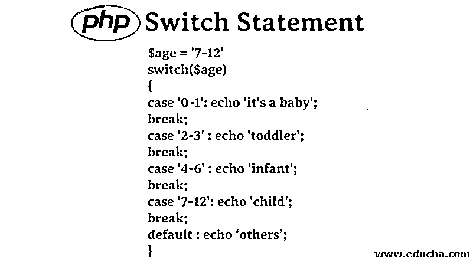
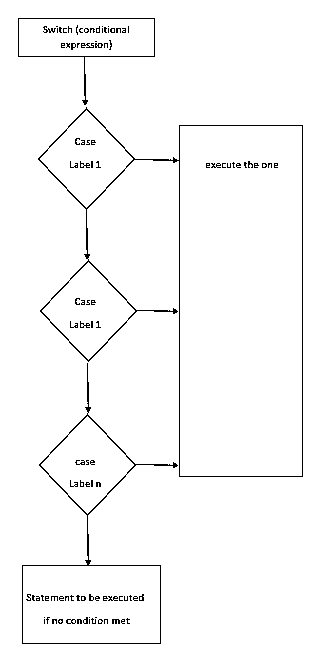

# PHP 开关语句

> 原文：<https://www.educba.com/php-switch-statement/>




## PHP Switch 语句介绍

如果我们使用通用的编码术语，那么作为一个编码新手，您应该已经看到了“If”语句来处理条件检查并对它们的验证进行一些操作，现在让我们举一个例子，您正在为交通灯系统设计编写逻辑，如果您希望继续处理标准的 if 条件，那么您可能会以一个“if”、一个“else if 或 if”和一个“else”语句结束。 如果出现任何其他同义类型的业务逻辑，其中此类标准的数量很高，并且它们属于同一类别，那么代码看起来不会很好，为此，我们有“switch”语句，您只需编写一次该语句，并描述某个公共类别下的某些相关情况以及与该类别相关联的要实现的业务逻辑。

### PHP Switch 语句的详细描述

让我们看一个 PHP 代码片段，其中我们有一个年龄范围，并显示相应的消息来表示这些人的类别。

<small>网页开发、编程语言、软件测试&其他</small>

```
$age = ’7-12’
switch($age)
{
case '0-1': echo 'it's a baby';
break;
case '2-3' : echo 'toddler';
break;
case '4-6' : echo 'infant';
break;
case '7-12': echo 'child';
break;
default : echo ‘others’;
}
```

*   因此，在看到上面显示的示例后，您可能已经有了一个粗略的想法，该示例仅使用一个“switch”语句来实现这样的条件，而不是将我们自己放入多个 if 和 else 语句中。
*   开关将 common criterion 参数作为输入，它将接受一组值，我们需要根据这些值对业务逻辑实现应用条件评估。
*   和上面的例子一样，年龄变量显示所提到的年龄范围与“7-12”相匹配，所以我们将在输出中得到“child”。
*   现在让我们来看看处理的顺序，以及在控制的遍历中将花费多少时间。当 age 变量作为输入提供时，case 表达式值根据测试值进行评估，检查第一个 case，然后不满足条件，控制流向下一个语句，执行同义类型的评估，并继续搜索，直到获得其相关表达式。
*   现在，一旦它的测试值得到评估，echo 'child '语句就会被执行，然后呢？
*   控制流是否也会默认？因为它看起来像是一个默认执行的条件。事实并非如此。您必须看到，在每个 case 语句块中也有一个“break”语句,“break”的任务是将流从 switch 上下文中取出，并继续执行程序文件中的下一条逻辑指令。
*   只有在不满足上述任何条件的情况下，才会执行默认语句，例如，如果我提到年龄为 24 岁，那么输出将显示为“others”。
*   因此，将 default 语句放在文件末尾是合乎逻辑的。
*   当你写代码的时候，这种放置的顺序很重要，你应该很清楚你将主要作为测试条件得到的那种输入数据，最好把那种情况放在最上面，这样尽可能多的用户只需要第一行就能尽早得到结果。这可以在对您正在部署的系统中的数据进行分析之后完成。
*   稍微思考一下事实，为什么默认语句中没有中断，上面的描述虽然带着答案。

**语法**

```
switch (testvalue) {
case label1:
code to be executed if testvalue = label1;
break;
case label2:
code to be executed if testvalue = label2;
break;
case label3:
code to be executed if testvalue = label3;
break;
default:
code to be executed if testvalue is different from above;
}
```

我们已经在上面的章节中分享了一个关于这个逻辑的程序，请参考这个用例以便更好地理解。

### 开关流程图

PHP switch 的流程图与其他编码语言的 switch 语句相同，因为这是每种语言的通用功能。




### 例子

请参考“细节”部分分享的示例，该示例提供了关于工作的详细信息，让我们在这里举一些应用用例，以便更清楚地了解情况。

**用例 1**

假设您正在收集与在日历年的每个月过生日的学生相关的数据，在这里您可以将 month 放入 switch 标准中，并且可以有 12 个不同的数组来存储与不同月份相关的学生数据，因此在满足条件时继续向每个数组添加数据，对于一所学校的 5000 名学生来说，很可能您的所有数组都将被占用。

**用例 2**

让我们来讨论一下小规模计算器的设计，其中您需要执行加法、减法和乘法等运算，在开关中，您可以获取运算的名称，根据大小写标签进行验证，一旦符合，业务逻辑将根据相应的计算返回输出值。

### 结论

我们看到了这样的情况，针对一个类别的条件数量增加，那么最好采用 switch 语句，它使代码更加清晰、可读，并且可以根据数据分析和相应的逻辑布局使代码变得更快[。例如，我们看到了 PHP 实现的语法，以及一些相关的用例。](https://www.educba.com/data-analysis-techniques/)

### 推荐文章

这是一个 PHP Switch 语句指南。这里我们讨论 PHP switch 语句的详细描述，一个 switch 的流程图。您还可以浏览我们推荐的其他文章——

1.  [在 PHP 中覆盖](https://www.educba.com/overriding-in-php/)
2.  [PHP 框架](https://www.educba.com/php-frameworks/)
3.  [PHP 数学函数](https://www.educba.com/php-math-functions/)
4.  [PHP 常量](https://www.educba.com/php-constants/)


