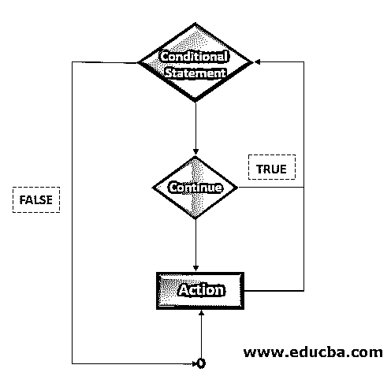
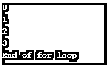
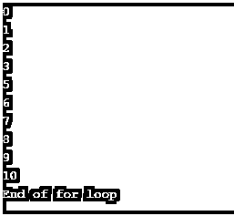
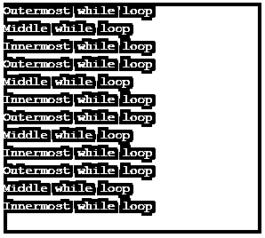
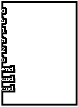

# 继续使用 PHP

> 原文：<https://www.educba.com/continue-in-php/>


## PHP 继续介绍

Continue 语句是在条件语句中使用的语句，用于指示代码跳过正在进行的循环的剩余迭代，并在条件求值时继续执行，然后跳转到下一次执行的开始处。在 PHP 中，在 switch 语句中最常使用 continue 语句的地方。

Continue 采用一个可选的数字参数，该参数定义了执行应该跳过多少级内部循环并转到最后。这意味着如果值为 1，那么它将跳到当前循环的末尾。break 语句用于完全结束一个循环，continue 则用作从当前循环转到下一个循环的快捷方式。两者都为循环上的编码者提供了额外的控制，以他们想要的方式操纵它。

<small>网页开发、编程语言、软件测试&其他</small>

**语法**:

```
while ( condition 1)
{
//declaration statements
if ( condition 2 )
{
//PHP code goes here
continue ;
}
// Operational Statements
}
```

如上所述，我们首先声明了一个 while 循环及其条件。当条件满足时，代码进入循环，直到条件不为真。只有当条件为真时，代码才进入 if 语句循环。这里的 continue 语句跳过这个迭代，不会执行 continue 之后的代码的后面部分。因此，控制转移到具有条件 1 的 while 循环的下一次迭代。

### 流程图

下面是 PHP 中 continue 的流程图:




如流程图所示，continue 总是出现在执行循环的代码内的语句块中。如果 continue 的条件为真，它将跳过后续操作并跳到下一次迭代。

### PHP 中 Continue 的例子

让我们通过下面几个详细的例子来看看 continue 语句的确切工作方式:

#### 示例#1

**代码:**

```
<?php
$a = 0;
for ($a = 0;$a <= 10;$a++)
{
if ($a==4)
{
break;
}
echo $a;
echo "\n";
}
echo "End of for loop" ;
?>
```

**输出:**




在这个程序中，我们首先将变量 a 的值初始化为零。然后，我们使用一个 for 循环将它的值递增 1，直到它的值达到 10。另一个条件语句 if 循环也用来在 a 的值达到等于 4 时中断这个循环。因此，它跳出循环，然后打印“循环结束”,而不是输出值 5。我们在输出中打印每个增加的值，以便更好地理解。如您所见，由于 break 语句，输出在 4 处停止。

现在让我们看看 continue 语句对相同的代码做了什么:

**代码:**

```
<?php
$a = 0;
for ($a = 0;$a <= 10;$a++)
{
if ($a==4)
{
continue;
}
echo $a;
echo "\n";
}
echo "End of for loop" ;
?>
```

**输出:**




正如您在上面的输出中所看到的，程序像前面一样打印了从 0 到 4 的数字。当执行 if 条件语句时，它为真，因为 continue 语句给定，它跳过打印 4，但再次继续循环。因此，在输出中，我们看不到 4，但是从 5 到 10 的递增又开始了，这是 for 循环的条件，然后输出“for 循环结束”,表明它已经退出 for 循环。因此，continue 通常用于从该特定实例跳过，并从下一个实例继续循环。

#### 实施例 2

**代码:**

```
<?php
$a=0;
foreach ($a as $k => $val) {
if (!($k % 2)) { // skip even members
continue;
}
do_something_odd($val);
}
$j = 0;
while ($j++ < 5) {
echo "Outermost while loop\n";
while (1) {
echo "Middle while loop\n";
while (1) {
echo "Innermost while loop\n";
continue 3;
}
echo "This text will never get printed\n";
}
echo "This text also will never get printed\n";
}
?>
```

**输出:**




在上面的代码中，我们在 if 条件循环中使用变量 k，通过使用模 2 函数跳过偶数。我们在这里使用 continue 语句，它跳过了当前的迭代，因此这里没有输出。

在循环的第二部分，我们使用变量 j，首先将它初始化为零。然后我们使用 3 个 while 循环:最外面的，中间的和最里面的循环。最外层的循环有一个条件，当变量 j 小于 5 并且 j 一直递增 1 时执行。中间和内部循环是无限的，这意味着它们在没有任何条件的情况下继续执行。

就像 break 语句一样，我们也可以在 continue 语句中传递数字参数。如上例所示，我们传递数字 3，这意味着它跳过了 3 次循环迭代。因此，永远不会打印的文本显示在代码中。当我们给 continue 2 时，相同的代码将跳过最里面和中间的 while 循环，并打印最后的文本。同样，continue 1 将只跳过最里面的循环。但是，请注意，continues 0 不是要执行的有效语句，即使它以前是有效的，因为它被认为与 continue 1 相同。

#### 实施例 3

Continue 也可以用在 switch 语句中，如下所示:

**代码:**

```
<?php
echo"\n";
echo"\n";
for ( $a = 0; $a < 5; $a++ ) {
switch ($a)
{
case 0:
echo $a . "\nb\n";
continue 2;
echo $a . "\na\n";
case 1:
echo $a . "\nb\n";
continue 2;
echo $a . "\na\n";
case 2:
echo $a . "\nb\n";
break;
echo $a . "\na\n";
}
echo "end\n";
}
echo"\n";
echo"\n";
?>
```

**输出:**




可以看出，在 switch 语句中，break 和 continue 语句的工作方式相同。但是在循环中，它们被用来停止循环迭代并继续下一个循环。通过使用 continue 2，我们可以跳出循环内部的开关，继续下一个外部循环迭代。

### PHP 中继续的重要性

1.  continue 语句的主要目的是在循环内部跳过编码者想要的特定迭代实例。
2.  在 do-while 循环中，continue 语句控制 while 循环的条件语句部分。
3.  即使在 while 循环中，continue 也会再次控制 while 循环的条件。
4.  在 for 循环中，递增或递减操作在 continue 语句之后执行。

**PHP 中 Continue 的缺点**

1.  我们不能在循环内的文件名中使用 continue，因为它会导致错误。
2.  使用 continue 会使代码难以理解，看起来也不优雅。

### 结论——继续 PHP

Continue 语句主要用于 PHP 中的各种循环或条件语句。它们基本上停止了正在进行的循环迭代，但并没有终止该循环。语句块中的 Continue 语句只是跳到条件语句中成功的下一次迭代。

### 推荐文章

这是继续使用 PHP 的指南。这里我们讨论 PHP 中 Continue 的语法、流程图、重要性和各种例子。您也可以看看以下文章，了解更多信息–

1.  [PHP 版本](https://www.educba.com/php-versions/)
2.  [继续 C 中的语句](https://www.educba.com/continue-statement-in-c/)
3.  [用于 PHP 中的循环](https://www.educba.com/for-loop-in-php/)
4.  [PHP include_once](https://www.educba.com/php-include_once/)


