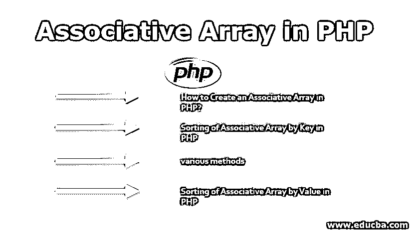
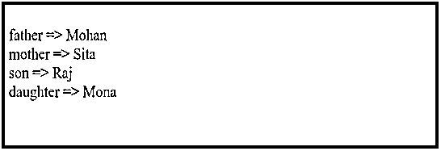

# PHP 中的关联数组

> 原文：<https://www.educba.com/associative-array-in-php/>




## 关联数组简介

数组是相似和不相似数据类型的集合。数组在变量中存储相关数据。我们需要数组来创建和存储这么多的变量值。PHP 中有三种类型的数组。数字数组、关联数组和多维数组。一个[关联数组](https://www.educba.com/associative-array-in-java/)是键-值对的形式，其中键是数组的索引，值是数组的元素。这里的密钥可以由用户定义。它类似于数字数组，但是键和值以键-值对的形式存储。

在这个主题中，我们将学习 PHP 中的关联数组。

<small>网页开发、编程语言、软件测试&其他</small>

**语法**

```
//First Way
$input = array("key1"=>"value1", "key2"=>"value2", "key3"=>"value3");
//Second Way
$input["key1"] = value1;
$input["key2"] = value2;
$input["key3"] = value3;
```

其中$input 是数组名，key1 是数组元素的索引，value1 是数组元素的值

### 如何在 PHP 中创建一个关联数组？

使用 array 关键字声明了关联数组[。数组中的键值使用“= >”箭头声明。有两种方法可以创建关联数组。](https://www.educba.com/associative-array-in-javascript/)

下面是一些例子。

**代码:**

```
<?php
// create associative array
// first way
$family = array("father" => "Mohan", "mother"=>"Sita", "son"=> "Raj" ,"daughter"=> "Mona");
// second way
$family["father"] = "Mohan";
$family["mother"] = "Sita";
$family["son"] = "Raj";
$family["daughter"] = "Mona";
?>
```

### 如何使用各种方法在 PHP 中遍历关联数组

有两种方法可以遍历关联数组。一个是 foreach 循环，第二个是 for 循环。

#### 方法 1

在本例中，一个数组被声明并命名为$family。该数组采用键-值形式，其中键是关系的名称，如父亲、母亲、儿子、女儿。每个键保存关系的名称，比如第一个值代表父亲是 Mohan，第二个值代表母亲是 Sita，第三个值代表儿子是 Raj，第四个值代表女儿是 Mona。为了遍历这个数组，我们使用了一个 foreach 循环，其中我们将两个键打印为父、母、子、女，并将值打印为数组的 Mohan、Sita、Raj 和 Mona。

**代码:**

```
<?php
//example of the associative array
$family = array("father" => "Mohan", "mother"=>"Sita", "son"=> "Raj" ,"daughter"=> "Mona");
//first method to traverse the associative array
foreach($family as $key=>$value) {
echo $key .' is '.$value;
echo '<br>';
}
?>
```

#### 方法 2

在本例中，我们将使用与上例相同的数组族，并使用 for 循环进行遍历。此外，我们将使用 array_keys 函数来获取数组的键，即父亲、母亲、儿子和女儿。这些键以数组的形式返回。array_keys 函数将一个输入数组作为参数，并输出一个索引数组。现在，为了遍历这个循环，我们将使用 for 循环，并根据需要打印键和值。

**代码:**

```
<?php
// Example to demonstrate for loop
$family = array("father" => "Mohan", "mother"=>"Sita", "son"=> "Raj" ,"daughter"=> "Mona");
$length = count($family);
$keys = array_keys($family);
// for loop to traverse associative array
for($i=0; $i<$length; $i++) {
echo "<br>". $keys[$i] . " => " . $family[$keys[$i]];
}
?>
```

**输出:**




### PHP 中关联数组的优势

1.  有不同的函数可以合并两个关联数组。
2.  它类似于用户列表、堆栈、队列等。
3.  使用数组中的索引，这有助于记住数据
4.  这些索引是用户定义的，可以相应地更改。
5.  像$_POST、$_GET、$_SESSION 这样的超全局数组也支持关联数组。

### PHP 中关联数组的按值排序

关联数组有两种排序方式:基于键和基于值。在这里，我们将学习如何按值对关联数组进行排序。有两个内置的 php 函数，如 asort()和 arsort()，用于按字母顺序按值对关联数组进行排序。

让我们用一个例子来学习这个。

**1。asort():** 按照值的升序对关联数组进行排序

**代码:**

```
<?php
// example to demonstrate asort() function on associative array by value in ascending order
$family = array("father" => "Mohan", "mother"=>"Sita", "son"=> "Raj" ,"daughter"=> "Mona");
print_r($family);
asort($family);
echo "<br>";
print_r($family);
?>
```

**输出:**


**2。arsort():** 按照降序对关联数组进行排序

**代码:**

```
<?php
// example to demonstrate asort() function on associative array by value in descending order
$family = array("father" => "Mohan", "mother"=>"Sita", "son"=> "Raj" ,"daughter"=> "Mona");
echo "<br>Before Sort";
print_r($family);
arsort($family);
echo "<br>After Sort";
print_r($family);
?>
```

**输出:**


### PHP 中关联数组的键排序

因为关联数组可以按值升序排序。以类似的方式，关联数组可以按字母顺序按键进行升序和降序排序，如下例所示。

**1。ksort():** 按照键的升序对关联数组进行排序

**代码:**

```
<?php
// example to demonstrate ksort() function on associative array by key in ascending order
$family = array("father" => "Mohan", "mother"=>"Sita", "son"=> "Raj" ,"daughter"=> "Mona");
echo "<br>Before Sort";
print_r($family);
ksort($family);
echo "<br>After Sort";
print_r($family);
?>
```

**输出:**


**2。krsort()** :按照关键字降序对关联数组进行排序

**代码:**

```
<?php
// example to demonstrate krsort() function on associative array by key in descending order
$family = array("father" => "Mohan", "mother"=>"Sita", "son"=> "Raj" ,"daughter"=> "Mona");
echo "<br>Before Sort";
print_r($family);
krsort($family);
echo "<br>After Sort";
print_r($family);
?>
```

**输出:**


### 结论

程序从语法开始，创建数组，遍历数组。此外，还提到了关联数组的优点以及如何对关联数组执行排序。

### 推荐文章

这是一个 PHP 关联数组的指南。在这里，我们讨论如何创建一个关联数组，在 PHP 中遍历关联数组，并按值和键对数组进行排序。您也可以阅读以下文章，了解更多信息——

1.  [PHP 中的会话](https://www.educba.com/sessions-in-php/)
2.  [PHP 中的回文](https://www.educba.com/palindrome-in-php/)
3.  PHP 中的[对象](https://www.educba.com/object-in-php/)
4.  [PHP 中的重载](https://www.educba.com/overloading-in-php/)
5.  [c#排序完整指南及示例](https://www.educba.com/sorting-in-c-sharp/)
6.  [C++数据类型](https://www.educba.com/c-plus-plus-data-types/)
7.  [Python 重载](https://www.educba.com/python-overloading/)
8.  [JavaScript 中的回文](https://www.educba.com/palindrome-in-javascript/)
9.  [对 Hive 数据类型中的两种类型进行分类](https://www.educba.com/hive-data-types/)
10.  [C #多维数组的前三个例子](https://www.educba.com/c-sharp-multidimensional-arrays/)


