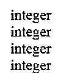
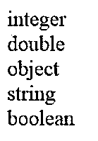

# PHP gettype()

> 原文：<https://www.educba.com/php-gettype/>

## PHP gettype()简介

PHP 出来了 gettype 的函数，用来获取给定变量的类型。无论我们用什么变量来获取它的类型，我们都使用 PHP 中的 gettype()函数。PHP 中定义的所有东西，每个变量，都有一些类型，通过了解变量的类型，我们可以很容易地定义过程或处理特定变量的功能。PHP gettype()函数用于相同的目的。这个版本出现在 PHP 4.0+稳定版之后，现在广泛用于编程目的。

**语法:**

<small>网页开发、编程语言、软件测试&其他</small>

gettype()函数的语法是:

`String gettype(variable_name)`

它接受单个参数作为输入，类型需要找出该参数。

函数的返回类型是输入函数持久化的可能数据类型。

一些返回值是:

*   **布尔。:**只有两个值(真/假)
*   **整数。:**所有整数
*   **数组:**数组值
*   **双精度:**十进制数值
*   **对象:**类型对象
*   **Null:** Null Data
*   资源
*   未知类型

### gettype()函数的工作原理

gettype()将一个参数作为实参，我们需要找出它的数据类型，取出后，它将与定义的数据类型相匹配，以匹配用户作为输入给出的特定数据类型。在内存空间中定义了一个表，它是给定类型的数据结构。匹配类型，结果作为输出返回。

匹配的数据类型作为特定函数的输出返回。

**举例:**

**代码:**

`Gettype(‘PHP’)`

*   PHP 获取该值并在容器中检查映射对象的数据类型，因为它是一种字符串类型。
*   一个字符串作为输出返回。

### PHP gettype()的例子

下面给出了 PHP gettype()的例子:

#### 例子#1:整数

这给出了函数中给定变量的整数类型。

**代码:**

`<!DOCTYPE html>
<html>
<body>
<?php
$a = 3;
echo gettype($a) . " ";
$a = 4;
echo gettype($a) . " ";
$a = 5;
echo gettype($a) . " ";
$a = 6;
echo gettype($a) . " ";
?>
</body>
</html>`

这个 PHP 示例代码返回 Integer 作为输出，因为给定变量的类型是 Integer。

**输出:**

#### 示例 2:布尔型

这给出了函数中给定变量的布尔类型。

**代码:**

`<!DOCTYPE html>
<html>
<body>
<?php
$a = false;
echo gettype($a) . " ";
$a = true;
echo gettype($a) . " ";
?>
</body>
</html>`

这个示例 PHP 代码返回 Boolean 作为输出，因为给定变量的类型是 Boolean。

**输出:**
T3】

#### 示例#3:数组

这给出了函数中给定变量的类型数组。

**代码:**

`<!DOCTYPE html>
<html>
<body>
<?php
$a = array();
echo gettype($a) . " ";
?>
</body>
</html>`

这个 PHP 示例代码返回 Array 作为输出，因为给定变量的类型是 Array。

**输出:**
T3】

我们也可以将值放入数组中，然后计算结果。

#### 例 4:双精度

这为函数中的给定变量提供了双精度类型。

**代码:**

`<!DOCTYPE html>
<html>
<body>
<?php
$b = 3.2;
echo gettype($b) . " ";
$b = 6.2;
echo gettype($b) . " ";
$b = 8.2;
echo gettype($b) . " ";
?>
</body>
</html>`

这个 PHP 示例代码返回 Double 作为输出，因为给定变量的类型是 Double。

**输出:**

#### 示例 5:对象

这给出了函数中给定变量的类型对象。

**代码:**

`<!DOCTYPE html>
<html>
<body>
<?php
$var6 = new stdClass;
echo gettype($var6)
?>
</body>
</html>`

这个示例 PHP 代码返回 Object 作为输出，因为给定的变量是 Object 类型的。

**输出:**

#### 示例 6:空

这使得函数中给定变量的类型为 Null。

**代码:**

`<!DOCTYPE html>
<html>
<body>
<?php
$f = NULL;
echo gettype($f) . " ";
$f = NULL;
echo gettype($f) . " ";
?>
</body>
</html>`

这个示例 PHP 代码返回 Null 作为输出，因为给定变量的类型是 Null。

**输出:**

#### 例子#7:资源

这为函数内部的给定变量提供了类型资源。

**代码:**

`<!DOCTYPE html>
<html>
<body>
<?php
$f = tmpfile();
echo gettype($f) . " ";
?>
</body>
</html>`

这个示例 PHP 代码返回 Resource 作为输出，因为给定的变量属于 Resource 类型。

**输出:**
 **

** 

我们还可以通过创建一个包含随机数据集的数组来检查变量的类型。

PHP 中的 foreach 循环就是这样工作的。

**代码:**

`<!DOCTYPE html>
<html>
<body>
<?php
$arr = array(210, 2.39, new stdClass, "hello,PHP", true);
foreach ($arr as $value) {
echo gettype($value). " " ;
}
?>
</body>
</html>`

创建了一个具有随机数据类型的示例数组元素，并使用上面代码中的 gettype 函数进行循环。

**输出:**

### 结论

从上面的文章中，我们看到了函数 gettype 在 PHP 中的使用。我们试图通过各种例子和分类来了解 gettype()函数在 PHP 中是如何工作的，以及它在编程级别上的用途。我们还看到了内部工作原理以及拥有我们为各种编程目的定义的数据类型的优势。此外，语法和示例帮助我们更精确地了解函数。

### 推荐文章

这是 PHP gettype()的指南。在这里，我们分别讨论 introduction、gettype()函数和示例。您也可以看看以下文章，了解更多信息–

1.  [PHP 对象到字符串](https://www.educba.com/php-object-to-string/)
2.  [PHP XML 阅读器](https://www.educba.com/php-xml-reader/)
3.  [PHP 输出缓冲](https://www.educba.com/php-output-buffering/)
4.  [PHP mail()](https://www.educba.com/php-mail/)

