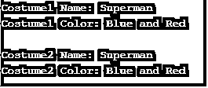
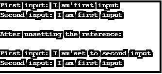

# PHP 参考

> 原文：<https://www.educba.com/php-references/>

## PHP 参考资料介绍

PHP 引用是符号表别名，通过它一个变量的内容可以被不同的名字访问。显式定义的引用变量前面需要有&符号。PHP 引用的功能可以用窗口的快捷方式来解释。PHP 引用可以在 PHP 编程中以各种方式定义。

### 创建 PHP 引用的方法

创建 PHP 引用的常用方法讨论如下:

<small>网页开发、编程语言、软件测试&其他</small>

#### 1.使用关键字“全局”

在方法中，可以在被引用的变量前使用关键字“global”来创建引用。将引用声明为全局变量会将变量添加到$GLOBAL array，并使用户能够访问函数范围内的全局变量。基本上有两种方法可以将 PHP 引用定义为全局变量，例如:

`function Function_name() {
global $globalVar;
}
OR
function Function_name() {
$globalVar =& $GLOBALS["globalVar"];
}`

**例子**

下面的代码片段旨在演示同一个变量在局部范围和全局范围的值之间的不同。

`<?php
function functionname() {
$inputvar = "within function scope";
echo '$inputvar in global scope: ' . $GLOBALS["inputvar"] . "\n";
echo '$inputvar in current scope: ' . $inputvar . "\n";
}
$inputvar = "Outside function scope";
$othervar= $GLOBALS["inputvar"]; //Creating inputvar in GLOBAL array
functionname();
echo '$othervar : ' . $othervar . "\n";
?>`

**输出**

Othervar 是全局数组中 inputvar 的引用集。它没有绑定到函数的局部作用域中定义的 inputvar 变量。

#### 2.使用$这个变量

$this '变量是函数对象的默认引用，其中$this 变量被引用。

**例子**

下面的代码演示了如何使用$this 变量从所选的类对象中访问任何类属性的值。

`<?php
class Thisclass {
var $clsproperty = 300;
function classmethod() {
$this->clsproperty = 500; // $this is a reference to the object
}
}
$clsObject = new Thisclass();
$clsObject->classmethod();
echo "The displayed value is: ". $clsObject->clsproperty;
//display the value updated using $this property
?>`

**输出**

clsproperty 的值是根据使用$this 变量设置的值显示的。

#### 3.传递对象

在 PHP 编程中，对一个类对象执行的任何操作，如赋值、返回或传递等；操作总是参照对象而不是其副本来执行。

创建 PHP 对象引用的标准语法如下:

`class ClassName {
//Body of the class
}
$classObj1 = new ClassName ();
$classObj2= $classObj1;`

在这里，classObj2 对象指的是包含在 classObj1 中的相同内容。

**例子**

下面的代码片段旨在为实际对象创建引用对象并访问其属性。

`<?php
class Costume {
// Declaring the class properties
public $name;
public $color;
// Declaring the class methods
function set_name($name) {
$this->name = $name;
}
function get_name() {
return $this->name;
}
function set_color($color) {
$this->color = $color;
}
function get_color() {
return $this->color;
}
}
//Creating the object
$constume1 = new Costume();
$constume1->set_name('Superman');
$constume1->set_color('Blue and Red');
//Creating the object reference
$constume2=$constume1;
echo "Costume1 Name: " . $constume1->get_name();
echo "\n";
echo "Costume1 Color: " .  $constume1->get_color();
echo "\n";
echo "\n";
echo "Costume2 Name: " . $constume2->get_name();
echo "\n";
echo "Costume2 Color: " .  $constume2->get_color();
?>`

**输出**

引用对象“客户 2”引用与实际对象“客户 1”的属性“名称”和“颜色”中包含的值相同的值。

### PHP 编程的不同操作

在 PHP 编程中，不同的操作是通过 PHP 引用来实现的。一些主要操作将在下节课中讨论:

#### 1.按引用传递

为了使函数能够修改在其作用域之外定义的变量，值需要通过引用传递给函数。

**例子**

下面的代码片段使用对变量的引用来更改在被调用函数范围之外定义的变量的值。

`<?php
function Afunction(&$input) //passing the input argument by reference
{
$input*=10;
}
$outVar=5;
echo "Before the function is called: ".$outVar;
echo "\n";
Afunction($outVar);
echo "After the function is called: ".$outVar;
?>`

**输出**

变量 outvar 的值由函数 AFunction()改变。

#### 2.返回引用

该操作使调用函数能够找到引用要绑定到的变量。建议仅在有任何技术要求时使用，否则不会增加程序的性能。

**例子**

下面的代码片段旨在将函数父函数的返回值作为引用传递给已定义的类父类。

`<?php
class parentclass {
public $parentvar = "I am set at parent class";
public function &parentfunction()
{
return $this->parentvar;
}
}
$parentobj = new parentclass;
$newvar = &$parentobj->parentfunction();
echo $newvar;
echo "\n";
$parentobj->parentvar= "I am set outside of the class";
echo $newvar;
?>`

**输出**

#### 3.取消设置 PHP 引用

用户可以使用 unset()方法打破变量和引用之间的绑定。

**例子**

下面的代码片段演示了如何使用 unset()方法从 secondinput 中解除引用变量 firstinput 的绑定。

`<?php
$firstinput = "I am first input";
$secondinput =& $firstinput;
echo "First input: ". $firstinput;
echo"\n";
echo "Second input: " . $secondinput;
unset($firstinput);
echo"\n";
echo"\n";
echo "After unsetting the reference: ";
echo"\n";
$firstinput = "I am set to second input";
echo"\n";
echo "First input: ". $firstinput;
echo"\n";
echo "Second input: " . $secondinput;
?>`

**输出**

### 结论

PHP 引用是 PHP 脚本中包含的重要特性。PHP 引用不是指针，因为它可以被描述为“C ”,它也占用内存来创建重复的元素。相反，PHP 引用只是引用实际变量内容的不同别名。如果 PHP 中的一个对象需要复制一个对象，可以用关键字' clone '来完成。

### 推荐文章

这是一个 PHP 参考指南。在这里，我们讨论了介绍和 PHP 参考如何与不同的例子一起工作，并编码其实现。您也可以看看以下文章，了解更多信息–

1.  [PHP 最终类](https://www.educba.com/php-final-class/)
2.  [PHP 序列化](https://www.educba.com/serialize-in-php/)
3.  [在 PHP 中验证](https://www.educba.com/validation-in-php/)
4.  [PHP 日志错误](https://www.educba.com/php-log-errors/)

