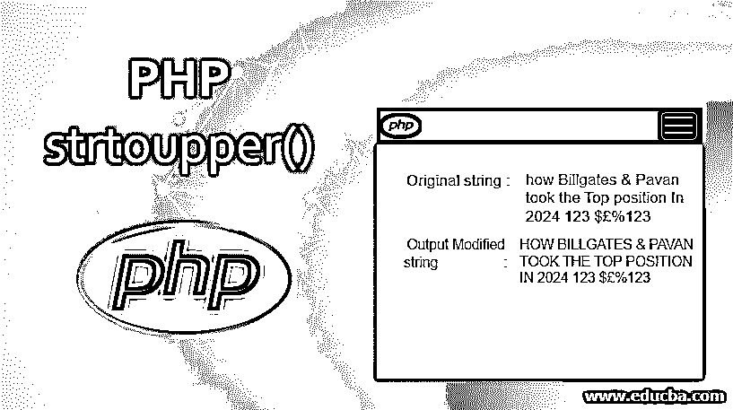

# php strtoupper()

> 原文：<https://www.educba.com/php-strtoupper/>




## PHP strtoupper()简介

PHP 中的 strtoupper()函数只是用来转换任何类型的字符串，其中的字母被转换成大写字母格式(大写字母格式)。strtoupper()函数只接受一个字符串参数，主要用于将所有小写英文字母转换为大写英文字母。即使使用了 strtoupper()函数，像数值、特殊字符这样的剩余字符也将保持不变，因为它只是大写字母。它不同于 ucwords()函数。它将所有的字母/字符大写。

**语法:**

<small>网页开发、编程语言、软件测试&其他</small>

```
string strtoupper ( $string_variable );
```

**参数:**

主要只需要一个参数。它只是$string_variable。除此之外，strtoupper()是一个函数，用于将$string_variable 中出现的所有小写字母转换为大写字母。

### PHP strtoupper()如何工作？

PHP strtoupper()函数在 PHP 4，PHP 5，PHP 7 版本中有效。该函数仅兼容上述 PHP 版本。它的工作原理是将混合了字符的字符串转换成大写字母，但它只对字母进行转换。

### 实现 PHP strtoupper()的示例

下面列出的例子是为了说明 strtoupper()函数的一些小属性和一些编程方法，以便知道如何使用它。

#### 示例#1

```
<?php
// original string which is assigned to the str1 variable
$str1 = "educba is a leading global provider of skill based education";
// The string which will be converted to the upper case
$capstr1 = strtoupper($str1);
echo $capstr1;
?>
```

**输出:**


#### 实施例 2

这是 PHP 语法的例子，它将字符串变量的字符变成大写字母。

```
<?php
// original string which is assigned to the str1 variable
$str1 = "how Billgates & Pavan took the Top position in 2024 123$#%123";
echo "Original string : \n".$str1."|||";
// Now the string which is assigned to the str1 variable will be converted to upper case/capital letters
$str2 = strtoupper($str1);
echo "\n Output/ Modified String : "  ;
echo $str2;
//The above echo prints : HOW BILLGATES & PAVAN TOOK THE TOP POSITION IN 2014 123$#%123
?>
```

**输出:**


#### 实施例 3

设置本地功能是正确的设置。它会用一个德语元音变音的例子来达到目的，因为事实并非如此。这里用 mb_strtoupper()函数代替 strtoupper()函数来大写甚至一些特殊字符。

Setlocale()函数非常重要，如果在你的 PC/系统上的特定/指定/特定区域中找不到它，它可能会自动失败。所以应该总是检查它的主返回值。将会有各种拼写组合来使用像“de_AT”、“de”等这样的区域设置..,

如果没有找到一个特定的/合适的区域设置配置，那么只需再次检查你的系统配置，我的意思是检查系统范围内的区域设置，PHP 现在只是从 PC/笔记本电脑/任何其他设备的操作系统中获取它们。在 windows 中，区域设置将通过使用控制面板来设置，但在 Linux 操作系统中，它只取决于您的 Linux 操作系统的传播/分发。

在 Linux 中，您可以简单地尝试 sudo，然后在 space dpkg 之后重新配置基于 Debian 的特定操作系统发行版上的语言环境，或者使用手动方法进行配置。在 Ubuntu OS 上，您必须复制以下 URL 位置/usr / share /i18n /SUPPORTED 中的条目，然后将其扩展到/ var/ lib /locales/ supported。d/当地。之后，进行 dpkg-重新配置/重新配置。完成后，只需重新启动网络服务器和网络浏览器有时。

```
<?php
setlocale(LC_CTYPE, 'de_DE.UTF8');
$str2 = strtoupper('Umlaute1 äöü in uppercase  ||| '); ;
echo  $str2;// outputs "UMLAUTE1 äöü IN UPPERCASE" LETTERS
$str3 = mb_strtoupper('Umlaute1 äöü in uppercase', 'UTF-8');
echo $str3; // outputs "UMLAUTE1 ÄÖÜ IN UPPERCASE" LETTERS
?>
```

**输出:**


#### 实施例 4

**语法:**

```
<?php
// PHP program in order to illustrate how to modify some data and capitalize it
// Progam to search and replace some specific data/matter and then to capitalize the modified data
// preg_replace () function used
$string1 = 'November 01, 2018';
$pattern1 = '/(\w+) (\d+), (\d+)/i';
$replacement1 = '${1} 02, $3';
// prints output of function below using the echo builtin function
echo " 1.Modified String :: ";
echo preg_replace($pattern1, $replacement1, $string1);
echo " ||| "; // Outputs/Prints "|||" in browser
echo "\n"; // Outputs/ Prints the Line Break to execute/display the next program later
$string2 = preg_replace($pattern1, $replacement1, $string1);
$string3 = strtoupper($string2);
echo " 2.Capitalized Modified String :: ";
echo $string3;
//Outputs the modified capitalized string
?>
```

**输出:**


### 推荐文章

这是一个 PHP strtoupper()的指南。这里我们讨论实现 PHP strtoupper()的例子以及输出和它是如何工作的。您也可以看看以下文章，了解更多信息–

1.  [PHP 调用函数](https://www.educba.com/php-call-function/)
2.  [PHP if 语句](https://www.educba.com/php-if-statement/)
3.  [PHP 中断](https://www.educba.com/break-in-php/)
4.  [PHP 日志错误](https://www.educba.com/php-log-errors/)


