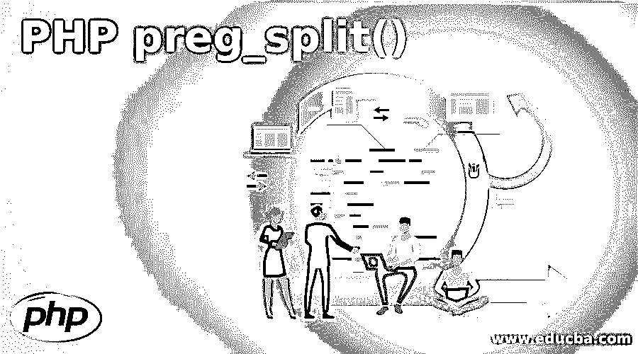

# PHP preg_split()

> 原文：<https://www.educba.com/php-preg_split/>

## PHP preg_split()简介

下面的文章提供了关于 PHP preg_split()的概述。preg_split()是一个预定义的内置函数，有助于将指定的字符串转换为数组。这个预定义的函数将给定的字符串分割成较小的/子字符串，这些字符串具有由系统用户指定的长度。这个函数也很方便，比如将小字符串或子字符串限制到通过数组返回的某个限度。它类似于 explode()，但唯一的区别是[正则表达式使用](https://www.educba.com/regular-expression-in-ruby/)作为分隔符，而不是 explode()。

### 带参数的语法

以下是带有参数和解释的语法<:>语法:

<small>网页开发、编程语言、软件测试&其他</small>

`array preg_split( $pattern, $subject, $limit, $flag )`

**参数:**

正如上面的语法所提到的，preg_split()函数通常接受四个参数。

**1。** **模式:**preg _ split()函数中使用的值的类型是字符串类型，在该类型中，模式将作为字符串进行搜索，否则它将分隔元素。

**2。subject:**$ subject 参数是通常有助于存储输入字符串的变量。

**3。** **极限:**极限参数将表示 preg_split()函数的极限。如果函数的极限被定义，那么小字符串或子字符串将只返回到极限。如果限制为“0”或“-1”，限制参数将被指定为“无限制”，然后由“$strflag”(标志)使用。

**4。****Flag:**Flag/flags 参数有助于发出信号，Flag 的变量 type/types 用于指示两个状态真或两个状态假，以便控制程序。

它有不同的旗帜组合:

*   **PREG_SPLIT_NO_EMPTY:** 如果 flag 参数/变量设置为“PREG_SPLIT_NO_EMPTY”，PREG_SPLIT()函数将只返回非空的片段。
*   **PREG_SPLIT_DELIM_CAPTURE:**如果 flag 参数设置为“PREG _ SPLIT _ DELIM _ CAPTURE”，将返回并捕获带括号表达式的分隔符模式。
*   **PREG_SPLIT_OFFSET_CAPTURE:**如果 flag 参数被设置为“PREG _ SPLIT _ OFFSET _ CAPTURE”，则对于每个出现的匹配字符串偏移量将被返回，并且还有助于改变数组的返回值，其中匹配字符串偏移量将被设置为“0”值，输入字符串偏移量被设置为“1”值。

### preg_split()函数在 PHP 中是如何工作的？

*   当分割边界匹配时，preg_split()函数将有助于返回数组。
*   preg_split()函数将只在原始数组或字符串的限制超过时返回数组元素，因为条件为真，否则将为假。
*   Preg_split()函数的工作原理是从提供的原始字符串文本中分离出一些术语/文本/特殊字符，然后存储在一个具体提到的变量名称的索引值中，该值只是一个数组。
*   人们可以调用所有那些使用数组的索引值拆分的值，如 array[0]等..

### PHP preg_split()的例子

下面是一些例子:

#### 示例#1

这是说明 PHP 编程语言的 preg_split()函数的例子。在下面的语法中，创建了一个变量“$inputstrVal1”并为其分配了一个字符串“PavanSake”。然后，通过使用语法中提到的四个基本参数将 preg_split()函数赋给变量“$result1”来创建变量。这里“//”是模式参数，给定的输入字符串值是要拆分的主题参数，“-1”是限制值，这意味着它没有限制，拆分将进行到字符串的末尾，并且通常根据我们的要求使用正常的标志参数。然后“$result1”变量值将在“print_r()”函数的帮助下打印出来。

**语法:**

`<?php
$inputstrVal1  = 'PavanSake';
$result1 = preg_split('//', $inputstrVal1 , -1, PREG_SPLIT_NO_EMPTY);
print_r($result1);
?>`

**输出:**

#### 实施例 2

这也是 PHP 编程语言的 preg_split()函数的例子之一。这里短语将被逗号的数量分割。通常空格字符是“\r”、“t”、“n”、“f”。在下面的示例中，通过分配 preg_split()函数创建了变量“$result11”。通过直接给出字符串输入“Pavan Kumar Sake ”,它只包含 2 个参数。然后“$result11”的结果将在“print_r()”函数的帮助下打印出来。

**语法:**

`<?php
$result11 = preg_split("/[\s,]+/", "Pavan Kumar Sake");
print_r($result11);
?>`

**输出:**

#### 实施例 3

这是 PHP 语言中 preg_split()函数的示例说明。在下面的例子中，首先通过分配一个字符串值来创建一个变量，这个字符串值实际上是一个提供字符串输入的超链接。然后，再次给出一个带有一些文本和特殊字符的模式字符串值。然后，通过为 preg_split()函数分配 4 个特定的参数变量来创建结果变量。然后使用 print_r()函数显示字符串中的数组元素。在输出中，您将获得数组元素中的文本及其索引，方法是从输入字符串值中过滤上述模式字符串元素。

**语法:**

`<?php
$inputstrVal1 = "http://profitloops.in/pavan/kumar/sake.php";
$patternstrVal1= "/[http:\/\/|\.]/";
$result12 = preg_split($patternstrVal1, $inputstrVal1, 0,
PREG_SPLIT_NO_EMPTY | PREG_SPLIT_OFFSET_CAPTURE);
print_r($result12 );
?>`

**输出:**

#### 实施例 4

这个例子展示了如何使用 preg_split()函数分割 id 地址。起初，PHP 标签中使用 echo 语句只是为了在程序执行时打印一些文本。然后，通过分配包含 ip 地址的字符串值来创建变量“$ip1”。然后再创建一个变量来为 preg_split()函数赋值。这将使字符串在拆分后成为数组元素。然后，通过使用 print 语句，我们将使用索引值打印数组元素。

**语法:**

`<?php
echo "Application :: This is the program of splitting the ip address";
$ip1 = "111.422.732.001";
$iparr1 = preg_split ("/\./", $ip1);
print "$iparr1[0]  ";
print "$iparr1[1]  " ;
print "$iparr1[2]  "  ;
print "$iparr1[3]  "  ;
?>`

**输出:**

### 结论

在这里，我们看到了关于 PHP preg_split()函数及其带参数语法的介绍，preg_split()函数如何在 PHP 中工作，以及实现 preg_split()函数的各种示例。

### 推荐文章

这是 PHP preg_split()的指南。在这里，我们讨论的介绍，如何 preg_split()函数在 PHP 中的工作与各自的例子。您也可以看看以下文章，了解更多信息–

1.  [PHP 序列化](https://www.educba.com/serialize-in-php/)
2.  [HTML 中的 PHP 标签](https://www.educba.com/php-tag-in-html/)
3.  [PHP 日期时间函数](https://www.educba.com/php-date-time-functions/)
4.  [PHP 分页](https://www.educba.com/php-pagination/)

