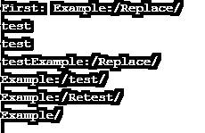

# PHP substr_replace()

> 原文：<https://www.educba.com/php-substr_replace/>

## PHP substr_replace()简介

substr_replace()是 PHP 的另一个内置函数，用于将一个字符串替换为另一个字符串。基于需要索引的输入参数，必须使用该索引来完成字符串的替换。我们还可以提供更换所需的索引长度。为了替换每个字符串，我们可以提供一个字符串数组作为函数的输入参数的一部分。

### PHP substr_replace()的语法

下面是一个语法:

<small>网页开发、编程语言、软件测试&其他</small>

**语法:**

`substr_replace($str, $replace, $st, $len)`

如以上语法所示，该函数接受 4 个参数，其中前 3 个参数是必需的，最后一个参数是可选的。它们如下:

**1。$str:** 这是一个强制参数，这是需要替换的输入字符串。

**2。$replace:** 这是另一个强制参数，这是替换$str 参数的输入字符串。

**3。$st:** 这也是一个强制参数，表示需要开始替换的索引位置。

*   如果$st 参数是正数，则从输入字符串开头的给定位置开始替换。
*   如果$st 参数是负数，则从输入字符串末尾的给定位置开始替换。
*   如果此$st 参数为 0，则从指定字符串的第一个字符开始替换。

**4。$len:** 这是一个可选参数，它给出了应该替换的字符数。如果没有给出这个$len 参数，那么替换将在$str 的末尾自动停止。

*   该参数描述了$len 为正数时需要替换的$str 段的长度。
*   这给出了当$len 为负时，需要从字符串末尾停止替换的字符总数。
*   如果$len 值为 0，则执行替换，而不是插入。

**返回值:**返回值是按照上述参数替换后生成的字符串。如果是字符串数组，则返回整个数组。

### 实现 PHP substr_replace()的示例

下面是提到的例子:

#### 示例#1

**代码:**

`<?php
echo substr_replace("Example for ","substring",8);
?>`

**输出:**

**解释:**在这个基本示例中，我们可以看到，通过使用 substr_replace 函数，我们将第一个字符串“Example for”替换为“substring ”,具体位置由第三个参数给出，即第 8 个位置。因此，在第 8 个位置之后的输出中，单词“for”被替换为“substring”单词。

#### 实施例 2

**代码:**

`<?php
echo substr_replace("Example for","substring",-3);
?>`

**输出:**

**解释:**在这个例子中，我们展示了 position 参数中-3 的功能。这个减号表示函数应该从后面开始替换单词。因此，这将从第三个位置开始，用第二个参数代替第一个字符串，从后开始计数。

#### 实施例 3

**代码:**

`<?php
$replace = array("1: Try","2: Try","3: Try two");
echo implode("\n",substr_replace($replace,'Done',3,3));
?>`

**输出:**

**解释:**在这个例子中，我们一次替换数组内部声明的多个字符串。使用 substr_replace 函数，我们在开始的前 3 个位置用单词“Done”替换单词“Try”。

#### 实施例 4

**代码:**

`<?php
echo substr_replace("Example insert", "to ", 8, 0);
?>`

**输出:**

**解释:**在这个例子中，我们展示了如何使用 substr_replace 来执行插入，因为 replace 参数被设置为 0。因此，在本例中，只进行插入，不会替换输出中显示的字符串。第二个参数“to”将插入指定的位置，即从第 8 个位置开始。

#### 实施例 5

**代码:**

`<?php
echo substr_replace("dress", "gu", 0, 2);
?>`

**输出:**

**解释:**在这个例子中，我们将指定长度参数为 2，因此 substr_replace 将从＄start 参数开始替换输入字符串，从 0 到 2。因此，从“衣服”这个词，前两个字母将被“古”取代，从而成为“猜测”。

#### 实施例 6

**代码:**

`<?php
$str = 'Example:/Replace/';
echo "First: $str\n";
// The below 2 displayy the replacement of our input string with 'test'
echo substr_replace($str, 'test', 0) . "\n";
echo substr_replace($str, 'test', 0, strlen($str)) . "\n";
// Here we are inserting the word test at the starting of the string
echo substr_replace($str, 'test', 0, 0) . "\n";
// The below 2 will replace the string "Replace" from input string in $str with 'test'
echo substr_replace($str, 'test', 9, -1) . "\n";
echo substr_replace($str, 'test', -6, -1) . "\n";
// Here we are deleting "Replace" from the input string
echo substr_replace($str, '', 7, -1) . "\n";
?>`

**输出:**

**解释:**在这个例子中，我们首先声明一个输入字符串$str，函数的所有操作都将在这个字符串上执行。在操作的第一部分，我们用给定的字符串完全替换该字符串，因为我们将两个 starts 都指定为 0。在第二部分中，我们将输入字符串的“替换”替换为“测试”。

#### 实施例 7

**代码:**

`<?php
$ip = array('1: PPP', '2: RRR', '3: SSS');
// A basic example where we are replacing all 3 letters of input string with TTT
echo implode('; ', substr_replace($ip, 'TTT', 3, 3))."\n";
// Another case where we are replacing the input string with the different inputs as given below
$replace = array('DDD', 'EEE', 'FFF');
echo implode('; ', substr_replace($ip, $replace, 3, 3))."\n";
// In this case we are replacing all the input characters with 3 different characters
$length = array(1, 2, 3);
echo implode('; ', substr_replace($ip, $replace, 3, $length))."\n";
?>`

**输出:**

**解释:**在这个例子中，我们展示了使用 substr_replace 函数替换输入$ip 中所示的多个字符串。

### 结论

因此，该函数用于根据指定的参数将一个字符串替换为另一个字符串。当$start 和$length 参数以 0 或负值给出时，同样可以根据需要插入字符串。

### 推荐文章

这是一个 PHP substr_replace()的指南。这里我们讨论 PHP substr_replace()的介绍，用 7 个不同的例子来更好的理解语法。您也可以浏览我们的其他相关文章，了解更多信息——

1.  [PHP bin2hex()](https://www.educba.com/php-bin2hex/)
2.  [PHP 正则表达式](https://www.educba.com/php-regular-expressions/)
3.  [PHP 推动器()](https://www.educba.com/php-strtoupper/)
4.  [PHP 中的 trim()](https://www.educba.com/trim-in-php/)

