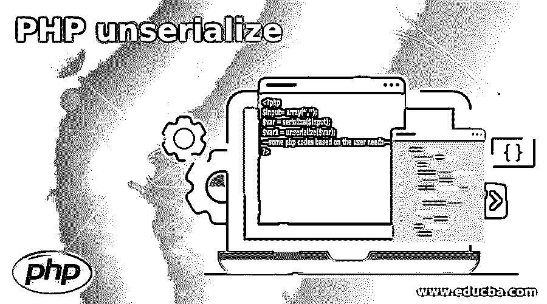
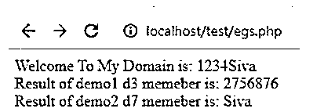
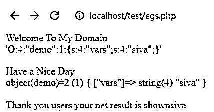

# PHP 非序列化

> 原文：<https://www.educba.com/php-unserialize/>

## PHP 非序列化简介

PHP unserialize 是可用于将序列化数据转换为实际用户输入数据的函数之一；这是一个与序列化功能相反的过程，它主要关注数组、映射集合，它将计算每个元素的数组索引(大尺寸或一些其他复杂的数据结构),我们使用一些默认方法来操作数据，如果用户输入不是不可序列化的，unserialize()方法将返回布尔值，因此在输出控制台上会返回 false。对象是为 unserialize 功能单独创建的。

**语法:**

<small>网页开发、编程语言、软件测试&其他</small>

PHP 有自己的变量、关键字和函数语法，用于创建更复杂的基于 web 的应用程序。一般 PHP 序列化格式不像 serialize()函数那样有很好的文档记录；它支持序列化的整数，浮点数，布尔值，字符串，数组。对象，它还包含其他引用以支持取消序列化实现。

`<?php
$input= array(‘’,’’);
$var = serialize($input);
$var1 = unserialize($var);
---some php codes based on the user needs---
?>`

以上代码是在 PHP 中使用 serialize()和 unserialize()函数的基本语法。它支持所有的数据类型和其他默认功能。

### PHP 中的非序列化函数是如何工作的？

*   unserialize 函数依赖于 serialize 函数；无论在该函数上调用和使用什么数据，都将使用键进行完全序列化。如果我们想访问数据，我们想在代码中反序列化或反序列化数据。然后只有我们访问了数据；它也用于文件概念。使用这些 serialize 和 unserialize()函数总是返回布尔条件，它将在非序列化对象上得到保护，或者我们可以称之为不可信数据。因此，它将避免其他一些恶意软件，从机器外部的病毒。它还保护了代码注入，甚至数据库端，它将避免一些不受信任的恶意软件网站的 sql 注入攻击。
*   一般 unserialize()函数带两个参数，str 和 optionsstr 是它包含等待反序列化的序列化字符串的参数之一，options 是它包含的用于控制某些函数行为的数组之一，它只接受有效用户，特别是像 allowed_classes 这样的内置类。它只接受指定的类名，特别是一些方法，如 _wakeup()和 _ destruct()；这些方法是通过使用序列化对象实现的；当我们使用这个方法时，它会在对特定对象调用 unserialize()函数时自动执行。

### PHP 非序列化的例子

下面给出了 PHP 非序列化的例子:

#### 示例#1

**代码:**

`<?php
$inputs = serialize(array('Siva', 'Raman', 'Sivaraman', 'wdigb', 'dwiugv', '87dhg', 'wdhgv', 'edhgfv', 'hfe', 'wgieufv', 'ehoije', 'iwuoegf', 'wuieguv','jdgv', 'wqgdjf', 'khwdjgh','jdhfdkswi', 'uqiwuke', 'iqweyf', 'oiuqiwleyugu' ));
echo  $inputs . ' ';
$vars = unserialize($inputs);
var_dump ($vars);
echo $vars;
?>`

**输出:**

在上面的例子中，我们在相同的代码中使用了 serialize 和 unserialize()函数。每当用户向应用程序提供输入时，它将把它存储在一个单独的变量中，这个变量是序列化的，它也将通过使用 echo 语句在控制台上打印出来。我们希望通过使用 unserialize()函数来取消数据的序列化，它将存储在一个单独的变量中，并且还将通过使用相同的 echo 语句来打印。如果我们想在控制台上打印结果，我们将使用其他默认方法，如 print、echo 等。这是一些在 PHP 脚本中使用的方法。

#### 实施例 2

**代码:**

`<?php
class demo {
public $vars;
}
class demo1 {
public $vars1;
}
class demo2 extends demo {
public $vars2, $vars3;
}
class demo3 extends demo2{
public $vars4;
}
class demo4 extends demo3 {
public $vars5;
}
class demo5 extends demo4 {
public $vars6;
}
class demo6 extends demo5{
public $vars7;
}
class demo7 extends demo6 {
public $vars8,$vars9, $vars10;
}
$c1 = new demo();
$c1->vars = 1234;
$c3 = new demo2();
$c3->vars2 = "Siva";
$c2 = new demo1();
$c2->vars1 = 2756876;
$d1 = serialize($c1);
$d2 = serialize($c2);
$d5 = serialize($c3);
$d3 = unserialize($d1, ["allowed_classes" => true]);
$d6 = unserialize($d5, ["allowed_classes" => true]);
$d4 = unserialize($d2, ["allowed_classes" => ["demo", "demo1"]]);
$d7 = unserialize($d5, ["allowed_classes" => ["demo", "demo1", "demo2"]]);
echo "Welcome To My Domain is: " . $d3->vars, $d6 ->vars2;
echo " ";
echo "Result of demo1 d3 memeber is: " . $d4->vars1;
echo " ";
echo "Result of demo2 d7 memeber is: " . $d7->vars2;
?>`

**输出:**

在第二个例子中，我们使用了相同的序列化和非序列化概念。不过，这里我们使用了一些类。此外，每个类的父子关系有自己单独的变量，公共访问修饰符在类外使用相同的变量；通过使用这样的对象，我们可以初始化独立变量的值。它们将序列化并存储在一个单独的变量中；之后，我们可以反序列化变量值，并将它们单独存储。我们可以添加 n 个具有独立值的变量来序列化和反序列化数据。我们使用 allowed_classes 来验证代码中的序列化数据。

#### 实施例 3

**代码:**

`<?php
class demo
{
public $vars;
}
$vars1= new demo();
$vars1->vars= "siva";
$vars2= serialize($vars1);
echo "Welcome To My Domain  '$vars2'";
echo "  ";
$vars3= unserialize($vars2);
echo "Have a Nice Day  ";
echo  var_dump($vars3);
echo "   ";
echo "Thank you users your net result is shown" . $vars3->vars;
?>`

**输出:**

在最后一个例子中，我们同时使用了 serialize 和 unserialize 函数，因为我们使用了键值对来取消 PHP 中数组和对象的序列化。我们使用了一个值为“Siva”的变量，它将是一个纯文本字符串，然后被转换回序列化和非序列化值的对象。

### 结论

在 PHP 中，我们使用默认函数、变量和关键字来创建用户友好的 web 应用程序。这样，它可以使用一些默认的类和方法来创建一些基于 web 的应用程序中的高级技术，所以我们使用了一些技术，如 serialize()和 unserialize()来更安全地存储和检索数据。

### 推荐文章

这是一个 PHP 非序列化的指南。这里我们讨论一下入门，PHP 中函数工作如何去序列化？和示例。您也可以看看以下文章，了解更多信息–

1.  [PHP 对象到字符串](https://www.educba.com/php-object-to-string/)
2.  [PHP 自定义异常](https://www.educba.com/php-custom-exception/)
3.  [PHP 表单验证](https://www.educba.com/php-form-validation/)
4.  [PHP 梁()](https://www.educba.com/php-strlen/)

